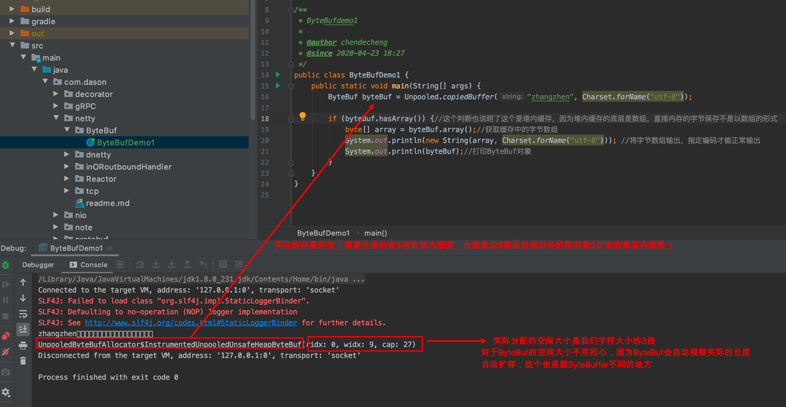
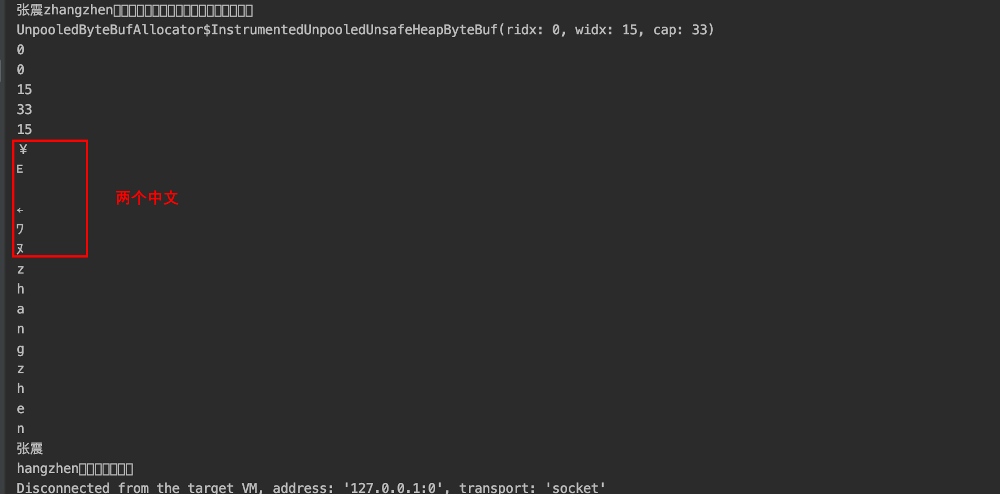
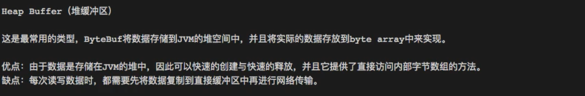

# 关于的ByteBuf

*这篇文章从NIO的ByteBuffer一些简单的回顾，引入netty的ByteBuf，然后对ByteBuf进行一些比较要的点的学习总结*

### 1.关于NIO的ByteBuffer     todo-补充完整

> 这里只是提及一下，更细致的应该自己去学习了解
>
> 对于ByteBuffer，其实就是在NIO中的非常重要的模块了，NIO中进行数据的传输就是从Channel将数据读取到ByteBuffer中或者讲ByteBuffer的数据写入到Channel中就可以进行服务端跟客户端的传输了，当然还需要进行连接之后，通过Selector进行处理的（好像对NIO忘的差不多了，需要看看代码了解一下）
>
> 服务端：
>
> ```java
> package com.dason.netty.dnetty.nio.demo;
> 
> import java.net.InetSocketAddress;
> import java.nio.ByteBuffer;
> import java.nio.channels.*;
> import java.util.Iterator;
> import java.util.Set;
> 
> /**
>  * nio服务器端
>  * 连接过程
>  * 1》预先工作，先是服务器端创建一个通道用于给客户端连接，然后也需要将这个创建通道注册到Selector中
>  * 2》服务器端ServerSocketChannel创建一个客户端socketChannel
>  * 3》客户端的通道socketChannel的register方法注册到Selector中，生成一个selectedKey，这个是跟通道关联起来的
>  * 4》调用Selector的select方法，获取现在发生的事件的通道个数
>  * 5》如果事件发生的数量大于0说明有事件发生
>  * 6》通过selector的selectedKeys方法获取所有的(有事件发生的的通道)连接到selector的通道的selectedKey
>  * 7》遍历selectedKeys获取通道，然后进行对应的操作，根据对应类型进行对应操作
>  * */
> public class NioServer {
> 
>     public static void main(String[] args) throws Exception {
> 
>         //创建ServerSockerChannel
>         ServerSocketChannel serverSocketChannel = ServerSocketChannel.open();
> 
>         //创建Selector
>         Selector selector = Selector.open();
> 
>         //绑定ServerSocketChannel的端口
>         serverSocketChannel.socket().bind(new InetSocketAddress(6666));
> 
>         //设置为非阻塞模式，因为使用的nio的ServerScoketChannel所以需要配置成非阻塞
>         serverSocketChannel.configureBlocking(false);
> 
>         //这个整个流程的ServerSocketChannel也需要注册到Selector中
>         serverSocketChannel.register(selector, SelectionKey.OP_ACCEPT);
>         System.out.println("注册后的当前的SelectionKey的数量为：" + selector.keys().size());
> 
>         while (true) {
>             if (selector.select(1000) == 0) {
>                 System.out.println("等待1秒，没有连接的事件发生");
>                 continue;
>             }
>             //如果存在事件，获取该Selector所有的的selectionKey（包括没有事件的）
>             Set<SelectionKey> selectionKeys = selector.selectedKeys();
>             System.out.println("获取的selectionKeys 数量 = " + selectionKeys.size());
>             //添加set的迭代器，方便下面遍历
>             Iterator<SelectionKey> keyIterator = selectionKeys.iterator();
> 
>             //遍历所有的selectionKeys
>             while (keyIterator.hasNext()) {
> 
>                 SelectionKey next = keyIterator.next();
> 
>                 //当前的SelectionKey如果是连接事件，注意Acceptable是指连接事件，read是读取事件，write是写入事件
>                 if (next.isAcceptable()) {
>                     //通过ServerSocketChannel创建该事件的socketChannel
>                     SocketChannel socketChannel = serverSocketChannel.accept();
>                     System.out.println("客户端连接成功 生成了一个 socketChannel " + socketChannel.hashCode());
>                     //设置非阻塞
>                     socketChannel.configureBlocking(false);
>                     //注册该socketChannel到该线程selector中，指定为读取类型，并且创建一个字节缓冲块
>                     socketChannel.register(selector, SelectionKey.OP_READ, ByteBuffer.allocate(1024));
>                     System.out.println("客户端连接后 ，注册的selectionkey 数量=" + selector.keys().size()); //2,3,4..
>                 }
> 
>                 //如果是读取的事件
>                 if (next.isReadable()) {
>                     //通过当前的SelectionKey 获取通过
>                     SocketChannel channel = (SocketChannel)next.channel();
>                     //通过当前的SelectionKey 获取客户端发过来的缓冲字节块
>                     ByteBuffer byteBuffer = (ByteBuffer) next.attachment();
>                     //将数据写入该通道中
>                     channel.read(byteBuffer);
>                     System.out.println("form 客户端 " + new String(byteBuffer.array()));
> 
>                 }
>                 //迭代器中移除该SelectionKey，避免重复遍历
>                 keyIterator.remove();
>             }
>         }
>     }
> }
> ```
>
> 客户端：
>
> ```java
> package com.dason.netty.dnetty.nio.demo;
> 
> import java.net.InetSocketAddress;
> import java.nio.ByteBuffer;
> import java.nio.channels.SocketChannel;
> 
> public class NioClient {
> 
>     public static void main(String[] args) throws Exception{
> 
>         //获取一个SocketChannel
>         SocketChannel socketChannel = SocketChannel.open();
> 
>         //设置非阻塞
>         socketChannel.configureBlocking(false);
> 
>         //指定服务器端的地址以及端口
>         InetSocketAddress inetSocketAddress = new InetSocketAddress("127.0.0.1", 6666);
> 
>         //判断如果是还没有连接上
>         if (!socketChannel.connect(inetSocketAddress)) {
>             //如果没有完成连接这里还是可以进行其他的事情操作的证明
>             while (!socketChannel.finishConnect()) {
>                 System.out.println("在等待连接，这里也是可以利用线程做其他的事情");
>             }
>         }
> 
>         String sendData = "张震测试";
>         //使用ByteBuffer的wrap的方法来根据实际的数据长度以及值创建字节流
>         ByteBuffer byteBuffer = ByteBuffer.wrap(sendData.getBytes());
>         //写到服务器
>         socketChannel.write(byteBuffer);
> 
>         //执行的时候暂时停留在这个位置
>         System.in.read();
>     }
> 
> }
> 
> ```
>
> 从上面的NIO的demo其实就可以了解整个NIO的大概了，就是创建连接，然后阻塞等待客户端发送数据，然后根据情况起线程进行相关的业务处理，客户端跟服务端的数据交互就是ByteBuffer

上面的demo只是简单提及了一下NIO的使用，但是ByteBuffer并不是这么简单的，每当我们去往ByteBuffer写数据的时候，然后再进行数据读取还需要flip()方法的处理，还有怎么分配空间，怎么重置空间，还有一些常用的操作，可以去看一下Buffer的`java.nio.Buffer`的接口javadoc文档，说的非常的细致，基本有哪些方法，每个方法有什么用都有说明，以及每个方法的实际操作是怎么样的，还有ByteBuffer的四个位置指数：mark>position>limit>capacity这几个非常重要的标志参数的使用


还有需要比较重点提醒的是，ByteBuffer有很多操作方法读写操作，这都是有相对操作跟绝对操作的，相对操作就是使用ByteBuffer提供的方法进行读取操作，类似`isReadable()`这些方法就是会每次读取后一个的数据看是否还有，也有事直接获取的，因为底层还是我们java几个基础类型的数组，所以可以使用数组的绝对位置的方法进行读取数据，使用绝对方法读取数据position的位置不会移动，ByteBuffer的四个指标都不会有变化（害，之前没有记录的意识，导致现在基本上都忘了ByteBuffer的底层原理了，怎么读取数据的，每次读写之后要做什么操作，底层的不一样，还有一些特定的Buffer类似只读Buffer或者读写Buffer的区别）

还有跟Netty的性能相关的直接缓存DiractBuffer跟堆内存缓存HeapBuffer的区别，这个在零拷贝中有说明对效率的提升重要性，重要的是直接缓存跟堆内缓存的区别，什么时候用堆内内存什么时候用直接缓存

这篇文章非常重要，是一个参与者的回答，可以去深入分析一下：[文章地址](https://www.zhihu.com/question/57374068 "Java NIO中，关于DirectBuffer，HeapBuffer的疑问？")

以上是一些关于NIO的ByteBuffer的记忆，更多的需要去学习回顾，之前学习的没记录下来，不太好，在这里立个flag，以后每一个重要点都输出，这里的ByteBuffer更具体看以后有没有机会再整理一篇文章出来，之后需要用到的话先直接去看官方的javadoc文档吧，使用肯定没有问题的了，只是使用的话官方文档包你能使用

### 2.netty的ByteBuf

先看一下ByteBuf的创建，这里简单展示了一下非池化的方式创建一个ByteBuf对象

```java
/**
 * 简单展示了netty封装的byteBuf的常用操作
 * 整个ByteBuf的操作，都跟一个封装对象有关就是Unpooled（非池化）
 */
public class NettyByteBufDemo {

    public static void main(String[] args) {
        //分配十个字节大小的字节缓冲区
        ByteBuf buffer = Unpooled.buffer(10);
        //直接创建一个字节缓冲区并且，将我们要字节化的数据处理（实际转换成字节对象的长度一般情况下是大于实际的字符串的）
        ByteBuf byteBuf = Unpooled.copiedBuffer("张震", CharsetUtil.UTF_8);

        //ByteBuf的读写，是通过标识readerindex 和 writerIndex来实现的，所以不需要flap这个读写之间需要变更position操作
        for(int i = 0; i < 10; i++) {
            buffer.writeByte(i);
        }
        for(int i = 0; i < buffer.capacity(); i++) {
            System.out.println(buffer.readByte());//这个方法会自动变更下标，每次加1 
          //byte b = buffer.getByte(i); 绝对方法，不会变更下标
        }

    }

}
```

##### ByteBuf的javadoc

学习技术最终还是要回答技术的最根本代码，也就是直接读取ByteBuf的官方javadoc文档`io.netty.buffer.ByteBuf`，我们先来说一下ByteBuf的一个对象可以直接进行读写的主要原因是：ByteBuf有单独的读写标识，0-readerIndex-writeIndex-capacity，能够分别对读写的位置标识，跟NIO的ByteBuffer不一样的是它可以直接读写而不是每次需要`flip()`之后才能读写切换


> 注意上图的几个标识，分别是无法读取的（无用字节），可读空间，可写空间，读索引，写索引，容量

- 关于ByteBuf的创建，建议使用`Unpooled`方式进行创建一个缓存对象，不建议使用构造方法的方式

- 关于随机读取ByteBuf的数据，可以使用`byte b = buffer.getByte(i);`方式，这个也就是绝对访问的方式

- 除了随机读取的方式还有一个就是顺序访问读取数据的：`buffer.readByte()`，这个是相对方式进行读取，每次读取数据`readerIndex`的值就会加1

  > 

- 有相对读取数据，就有相对写入数据`buffer.writeInt()`,这样写入数据对应的writeIndex的值就会加1

- 然后就是`discardReadBytes()`方法的使用，就是用来释放discardReadBytes这些空间的，将数据进行移动，然后扩大可写空间

  >  
  >
  > 具体可以看上图，展示了discardReadBytes()方法的用途，具体实现可以直接进入discardReadBytes()的源码查看，其实原理也是非常简单，将数据移动到前面，然后将读写index移动位置即可

- 然后就是`clear()`方法的用途，用于清理整个已经读写的空间重置，同样实际原理看源码，具体看下图javadoc文档

  > 

- 然后就是在ByteBuf中查询数据，指定范围查询等方法，还有就是对ByteBuf创建一个字节的视图，类似数据的视图，指定某个空间创建一个视图，然后里面有对应的readerIndex跟writeIndex，capacity，我们可以读写其中的数据，其实对应的就是BtyteBuf的数据了

  > 

- 最后就是在ByteBuf中有超多的方法的，需要用的时候就去仔细看看，大部分都是顾名思义加上有方法注释，其实可以很清晰了

  > 简单看几个比较常见的方法的实际实现在io.netty.buffer.AbstractByteBuf中
  >
  > ```java
  > @Override
  > public boolean isWritable() {
  >     return capacity() > writerIndex;
  > }
  > ```
  >
  > ```java
  > @Override
  > public ByteBuf clear() {
  >     readerIndex = writerIndex = 0;
  >     return this;
  > }
  > ```
  >
  > 
  >
  > 具体实现可以看代码或者javadoc文档

##### ByteBuf类型以及编码

1.ByteBuf基于内存类型的话有两种：堆上内存跟直接内存；基于是否池化的分类的话：池化的缓存跟非池化缓存；两者组合一起的话，一共有四种类型的ByteBuf：PooledHeapByteBuf ,PooledDirctByteBuf ,UnpooledHeapByteBuf ,UnpooledDirctByteBuf ;

2.关于ByteBuf的编码，这个要注意一下回顾前面的字符编码的问题，一个字符串如果用不同的编码转换成字节得到的长度是不一样的，所以对于ByteBuf也是一样的，因为是字节缓存底层保存的还是字节，在创建对象的时候需要指定编码，获取数据的时候也要根据编码类型获取数据才能获取到准确的数据。

> 简单说明一下字符编码的问题，就是不同的语言，从英语到各国语言都是可以用不同的编码类型表示的，类似汉字就是会有不同编码，使用不同的编码获取一个汉子读取的字节数是不一样的，像是英文的话只需要二进制的7位数就可以表示完整了，也就是说一个字节（8个二进制）就能够表示了，所以能够使用ascii编码就能够表示，但是汉语这种比较多字的，想要完整表示所有汉子的话需要gb18030 编码吧才能完整表示所有的汉子，这里是用3个字节也就是24个2进制的位数来表示全部的汉字，字符的编码方式不一样，从ByteBuf中读取汉字的时候每一个字符的读取字节长度也不一样，所以我们将字符串转成ByteBuf需要指定编码，获取的时候也是，不然就会出现乱码



> 关于图中的自动扩展空间大小，扩展方式是发现存不下数据了，就会创建一个新的ByteBuf将旧的数据已过去

```java
public class ByteBufDemo1 {
    public static void main(String[] args) {
        ByteBuf byteBuf = Unpooled.copiedBuffer("张震zhangzhen", Charset.forName("utf-8"));

        if (byteBuf.hasArray()) {//这个判断也说明了这个是堆内缓存，因为堆内缓存的底层是数组，直接内存的字节保存不是以数组的形式
            byte[] array = byteBuf.array();//获取缓存中的字节数组
            System.out.println(new String(array, Charset.forName("utf-8"))); //将字节数组输出，指定编码才能正常输出
            System.out.println(byteBuf);//打印ByteBuf对象


            //一些比较重要的标识打印
            System.out.println(byteBuf.arrayOffset());
            System.out.println(byteBuf.readerIndex());
            System.out.println(byteBuf.writerIndex());
            System.out.println(byteBuf.capacity());

            int length = byteBuf.readableBytes();
            System.out.println(length);

            for (int i = 0; i < length; i++) {
                System.out.println((char) byteBuf.getByte(i));//没有中文，仅仅是英文可以的，但是如果有中文的话，这里就会出现问题
            }

            //上面的循环每次是读取一个字节的，如果是英文就没关系可以直接获取，但是涉及中文3个字节的就需要指定编码才能正常显示，不然会乱码
            System.out.println(byteBuf.getCharSequence(0, 6, Charset.forName("utf-8")));
            System.out.println(byteBuf.getCharSequence(7, length, Charset.forName("utf-8")));

        }
    }
}
```




### 3.三种缓存的区别

这三种缓存是什么呢？

> 第一种：Heap buffer ，最常用的类型，有java的jvm分配的类型，底层是Byte数组
>
> 第二种：direct buffer ，操作系统分配的内存，jvm中有指向它的位置标识，不是jvm管控的，由系统管控
>
> 第三种：composite buffer复合缓冲区nio所没有的不是jvm提供的，netty自己设计的缓冲区，就是一个容器(同样是一种视图角色的存在，就是将多个缓冲区可以是堆缓冲还可以是直接缓冲合并成一个缓冲区进行操作处理，创建的方式推荐使用：ByteBufAllocator.compositeBuffer() or Unpooled.wrappedBuffer(ByteBuf...) 这两种方式而不是构造方法创建)

堆缓存就是jvm提供的机遇数组的缓存，是能够进行比较全面的控制的，但是进行传递的时候会比较慢，需要复制转移



直接缓存就是操作系统底层提供的缓存，这种的话跟堆缓存互补，传输的时候比较高效能够直接传输，但是创建以及管理比较复杂，创建过程比较慢（这个就是池化出现的原因了，将一定的空间固定出来不用每次创建）


需要注意一点的就是直接缓冲区的底层不是byte array，所以直接缓冲区不支持数组的方式访问，也就是为什么前面，判断是不是堆内存可以通过 byteBuf.haveArray()；

关于使用选择

> 1.后端业务比较多的情况下，推荐使用heapByteBuf也就是堆缓存，这个在jvm中比较可控，操作比较方便
>
> 2.如果是作为传输比较多的情况，或者说基本上都是用来传输的没什么业务操作的推荐使用直接缓存，这样文件传输的过程减少拷贝，提升效率


### 4.ByteBuf比ByteBuffer优势

关于ByteBuf的扩容

> netty的字符串缓存，ByteBuf里面有一个默认的扩容机制，当容量达到定义的大小的时候，会自动扩容，我们开发人员是无感知的，不像nio的ByteBuffer是需要我们手动扩容然后复制旧数据的，最大扩容字段是整数的最大值；
>
> 
>
> 这个是NIO的ByteBuffer对象抽象类，这里的hb就是我们用来存放数据的底层数组，是用final修饰的，所以使用NIO的ByteBuffer对象的时候，不存在扩展的属性，每次固定下来就固定了，但是ByteBuf就不是了，具有自动扩容的功能，这个扩容发生节点在往ByteBuf写入数据的时候`writeByte()`方法进行的，显示判断一下长度够不够，不够的话会根据一定的算法根据我们的业务情况进行预估然后帮我们扩容之后将就数据复制过来，扩容的最大值是整数的最大值
>
> 
>
> 我们找到ByteBuf的方法`writeByte()`方法，然后跟进去源码看看
>
> ```java
> @Override
> public ByteBuf writeByte(int value) {
>     ensureWritable0(1);//扩容方法
>     _setByte(writerIndex++, value);
>     return this;
> }
> ```
>
> ```java
> final void ensureWritable0(int minWritableBytes) {
>     ensureAccessible();
>     if (minWritableBytes <= writableBytes()) {
>         return;
>     }
> 
>     if (minWritableBytes > maxCapacity - writerIndex) {
>         throw new IndexOutOfBoundsException(String.format(
>                 "writerIndex(%d) + minWritableBytes(%d) exceeds maxCapacity(%d): %s",
>                 writerIndex, minWritableBytes, maxCapacity, this));
>     }
> 
>     // Normalize the current capacity to the power of 2.
>     int newCapacity = alloc().calculateNewCapacity(writerIndex + minWritableBytes, maxCapacity);
> 
>     // Adjust to the new capacity.
>     capacity(newCapacity);
> }
> ```
>
> 所以在我们创建ByteBuf的时候如果不指定长度的话，就会默认分配一个长度，然后在写入数据的时候判断是否还有容量，没有的话就帮我们扩容

关于NIO的ByteBuffer跟ByteBuf的不同

> 

整体来说，ByteBuf跟ByteBuffer两者之间主要的优化在于，读写方便了很多以及自动扩容这两个是最明显的我们能感受到的直接使用好处，正因为这个也就能够是我们简化很多开发工作，除此之外netty的ByteBuf还有很多简化开发的方法封装，直接看javadoc就知道了。我们知道ByteBuf那么好，而且是属于netty的，但是它跟netty没有什么强关联的，它仅仅是对ByteBuffer进行了比较好的优化，所以我们可以在别的项目中直接使用的，就是仅仅使用他的ByteBuf这个对象，用来存储我们的字节数组（更具体的使用场景还没想过）

### 5.引用计数

在ByteBuf的类对象中，可以看到实现了一个接口：`io.netty.util.ReferenceCounted`，这个接口就是netty的一个引用计数接口，这个的用处有点类似我们jvm的回收算法的一个引用计数算法，这个的主要用处就是记录ByteBuf的使用方，一个引用就加一，如果使用完毕就减一，如果为零的话，这个ByteBuf对象就不可用

在netty的前面有个，对出入站简化开发的`SimpleChannelInboundHandler`这个类就已经有一个操作，就是对传过来的对象转换成我们目标对象后，进行相关操作完成就会自动释放（当然这里可能会出现一些问题，如果在重写的channelRead0方法中有异步方法的话，还没完全使用完那个对象这里引用计数将其引用归零，存在一定的出错可能所以使用的时候稍微煮一下）

```java
@Override
public void channelRead(ChannelHandlerContext ctx, Object msg) throws Exception {
    boolean release = true;
    try {
        if (acceptInboundMessage(msg)) {
            @SuppressWarnings("unchecked")
            I imsg = (I) msg;
            channelRead0(ctx, imsg);
        } else {
            release = false;
            ctx.fireChannelRead(msg);
        }
    } finally {
        if (autoRelease && release) {
            ReferenceCountUtil.release(msg);//引用计数减一
        }
    }
}
```

##### 1.ReferenceCounted文档

回归到我们最实用的了解一个点的最简单方式了，读官方javadoc文档，这个文档比较简单，主要是一个引用计数的实例开始的时候值为1，然后调用方法retain()一次增加1，调用一次release()减1，如果减少到0之后该实例对象就不可用了


接口方法只有几个，除了获取引用计数的总数`refCnt()`，就是增加计数跟减少计数方法了，`touch()`方法用来调试的，没有实际用处


##### 2.`retain()`方法

选一个`io.netty.util.ReferenceCounted`的实现类`io.netty.buffer.AbstractReferenceCountedByteBuf#retain()`来分析它的retain()方法，这个抽象类也是我们的`ByteBuf`的子类，ByteBuf的功能实现在AbstractByteBuf中，然后引用计数的实现在AbstractReferenceCountedByteBuf这个抽象类中

关于引用计数，因为一个对象可以多个地方同时引用，在并发的请求的中会出现一个问题，多个方法同时使用引用计算的retain（）方法或者release（）方法的话，就会有典型的数据脏读之类的一系列并发会有的问题，导致数据不准确，所以引用计数也一样的，所以在retain()方法中做了相关的限制保证每一次调用retain（）方法都是增加1

```java
@Override
public ByteBuf retain(int increment) {
    return retain0(checkPositive(increment, "increment"));
}

private ByteBuf retain0(int increment) {
    for (;;) {
        int refCnt = this.refCnt;
        final int nextCnt = refCnt + increment;

        // Ensure we not resurrect (which means the refCnt was 0) and also that we encountered an overflow.
        if (nextCnt <= increment) {
            throw new IllegalReferenceCountException(refCnt, increment);
        }
        if (refCntUpdater.compareAndSet(this, refCnt, nextCnt)) { //核心方法，通过AtomicIntegerFieldUpdater的原子增加方法进行原子整数操作
            break;
        }
    }
    return this;
}
```

看一下`refCntUpdater.compareAndSet(this, refCnt, nextCnt)`这个方法的用处，对于前面的refCntUpdater，这个对象是一个原子整数更新器提供的实例创建方法`AtomicIntegerFieldUpdater.newUpdater()`来创建的一个整数原子更新方法对象，然后调用该对象的`compareAndSet()`方法来进行一个原子操作的整数操作

```java
private static final AtomicIntegerFieldUpdater<AbstractReferenceCountedByteBuf> refCntUpdater =
        AtomicIntegerFieldUpdater.newUpdater(AbstractReferenceCountedByteBuf.class, "refCnt");//通过入参我们想要原子更新的类的类对象，以及需要原子更新的属性名称，特别名称不能写错
```
这个原子对象递增的工具类，跟AtomicInteger对象一样都是java 的并发包里面的用来处理原子操作的对象，当然也可以在这种情况使用原子对象来实现原子操作，但是因为这是一个属性整个类对象都需要用到的，如果使用AtomicInteger的话反而不方便，使用AtomicIntegerFileUpdater工具类的话，更方便操作


看看AtomicInterFieldUpdater的javadoc说明：这是一个用于支持原子更新的内存可见的（volatile）属性的类型，主要是为了多个属性都需要原子操作的时候，这个工具类使用起来比较方便，或者多个方法同时对一个整数进行原子操作的时候一样更加方便，但是这个工具类不能确保所操作的整数一定是原子性，因为通过其他非原子（非AtomicIntegerFieldUpdater提供的方法进行操作）同时对我们需要原子操作的属性进行值变更的话，是无法控制的，所以这个的原子性是有弱点的不是强制性的，钥匙想作用的类型的的该属性一定是原子的就是需要确保所有的操作都是使用同一个updater（on the same updater）


然后再看一下该更新器的原子更新方法：`compareAndSet(T obj, int expect, int update)`,该方法三个入参，一个就是我们创建的时候指定的泛型对象，其实就是我们要进行原子操作的当前对象，然后一个就是我们期待的更新后得到的值一个就是我们要进行更新的值（一个举例，我们现在引用计数的值为3，更新后期待结果是4，这样的话更新的时候会进行校验，判断期待结果是不是等于真实结果，如果等于就正常更新如果不等就返回false）


这也是netty的引用计数中需要用到的原理，在更新的时候会有一个死循环，每次进行指定的原子更新，如果其中有并发先更新了，导致期待结果跟实际结果不一致的时候就会返回false，然后就会根据时false的话就不退出继续死循环等待，一直到操作成功之后才返回true推出循环，确保每一次操作都是原子性的而且加强成功的保证


上面的那个，其实也就是一种设计方法，便于开发实现的一个技巧吧，叫做自旋锁，为了独自占用cpu的运行来执行，防止其他线程并发抢了变量，这样的话跟期待的不一样就返回false或者报错跟着就再次执行，直到成功才退出出自旋锁，就是循环进行操作成功了就退出循环不然不退出，一种开发技巧吧（spring中好像有相关的用到了这个技巧）

关于`retain()`的具体实现详解

> 
>
> 
>
> 
>
> 上图的变量引用的方式获取当前对象的引用，而且该属性是内存可见的，如果同时有另外的线程进行该属性的操作，我们使用方是可见的，使用引用而不是赋值处理，就是为了原子性，实际操作获取的时候都是能感知实时变化的直接读取值不一定能获取最新的数据

##### 3.`release()`方法

这个方法跟retain()是相反的，retain是加1（当然可以指定增加的数量），release()是减1，唯一不太一样的是当*release*()到引用计数值为0的时候，会自动释放资源了


关于空间回收`deallocate()`具体的实现的话，如果是堆缓存，因为是jvm管理的，所以就是通知jvm，然后等jvm下一次垃圾回收的时候会进行相关的空间回收，netty只是标志一下；如果是直接缓存DireactBuffer，这个的底层是一个ByteBuffer来存储数据的，然后数据回收，因为直接缓存都是基于实际内存的，所以回收是使用UnSafe对象来处理的，调用底层的空间清理来清理缓存不过在*netty*中，netty优化了直接缓冲，如果是使用池化的对象，通过对象缓存池来处理，不用每次创建都是执行一次空间分配，类似线程池的原理，释放的话也就是将空间放回对象池中，当然如果不是使用池化的对象的就是每次需要就创建空间，用完就直接释放，这就是Pool跟Unpool两种方式的区别；池化会更好，因为创建内存空间使用完释放的话，整个过程比较占用资源而且回收不一定会及时，导致空间占用过多。池化缓存空间当然不止有直接缓存以后，在堆内缓存也有同理的这样会能够减少创建缓存空间以及释放空间的过程，提升效率。所以我们在创建ByteBuf的时候，根据自己需要来创建不同类型的缓存在一些高频的使用方式用池化会更好，低频用完就不使用的话就可以使用非池化的（关于池化，空间大小以及怎么配置这是个问题，没有深入研究过 todo）。

##### 4.AtomicIntegerFieldUpdater

在前面的retain()方法中说了一下AtomicIntegerFieldUpdater这个并发包提供的整数原子更新器的使用，这里再补充说明一下，这个对象是jdk的并发包提供的用来原子更新指定的对象的指定的属性的整数的操作，可以理解为一个原子增加工具类，针对的是指定的一个类的某个整数的对象，如果使用这个方法的话（但是需要都是用该对象的值增加方法才行，如果是其他线程使用非这种方法改变我们对象的该属性值就不能保证原子性操作了，意味着都要用他们提供的方法才行）


> 但是这个对象不能保证指定的属性的都是原子更新的，因为如果我们不通过它们提供的方法来操作的话，就不是原子的了（就是直接=来赋值了），所以要想保证，就要所有该属性的变更都要是使用它们提供的方法

有时间还可以研究一下并发包的这些原子操作提供的类，是对整数，Long，布尔等类型进行原子更新的，具体怎么用可以看一下官方的javadoc文档


> 上面有几个Updater，这些的使用方式跟Integer的都是差不多的，都是使用`compareAndSet()`方法，期待值跟实际值的比较之后，没问题就确认添加，进行原子操作
>
> 还有AtomicInteger，AtomicLong这些对象都是并发包提供的用于处理原子数量增减的，可以大概看看怎么使用，能确定的是会非常简单，大概看了一下整数的AtomicInteger的使用就是使用其提供的构造方法创建一个对象，然后该对象里面很多增减之类的方法可以给我们进行计算的加减,如下的构造方式以及原子操作方法，使用时非常简单的，对于底层的话，就涉及到一些比较底层的不安全操作对象进行处理
>
> ```java
> public AtomicInteger(int initialValue) {
>     value = initialValue;
> }
> /**
>      * Atomically sets the value to the given updated value
>      * if the current value {@code ==} the expected value.
>      *
>      * @param expect the expected value
>      * @param update the new value
>      * @return {@code true} if successful. False return indicates that
>      * the actual value was not equal to the expected value.
>      */
> public final boolean compareAndSet(int expect, int update) {
>   return unsafe.compareAndSwapInt(this, valueOffset, expect, update);
> }
> /**
>      * Atomically sets to the given value and returns the old value.
>      *
>      * @param newValue the new value
>      * @return the previous value
>      */
> public final int getAndSet(int newValue) {
>   return unsafe.getAndSetInt(this, valueOffset, newValue);
> }
> ```

在jdk中我们进行原子操作更多的是使用AtomicInteger对象来实现，为什么在`AbstractReferenceCountedByteBuf`中不使用呢？

> 全局所有的method操作都是通过这个封装好的原子更新器进行操作，不用每个方法都是调用AtomicInteger的方法来处理原子增减，就是巧妙简化开发成本,直接使用AtomicInteger来进行处理也是可以的，这里就是简化开发（不用每个方法里面每次使用都创建一个原子对象，然后都拥有一个AtomicInteger对象，用来对refCnt进行原子操作，这里就一个更新器对象就可以了），创建过多对象有一点点性能损耗

并发使用中一个变量的修饰词volatile的使用是非常重要的，很多并发相关的都会使用这个关键字，那么这个关键字有什么用处？

> - 变量的内存可见性，同一个变量在多线程的情况下被操作，如果不用volatile的话，每一个线程都是保存该变量的一个副本，a线程变更了值，b线程不知道，因为是内存不可见的，所以会导致变更的结果冲突，导致并发的操作的结果出错
> - 保证方法在jvm的执行顺序是按照我们编写的方式执行，因为jvm在执行的时候不一定会按照我们写的代码顺序执行，会根据jvm自动优化后的执行顺序执行，在个别情况下可能会出现因为执行顺序调整了出现问题的情况，这个时候有volatile进行修饰后就可以

AtomicIntegerFieldUpdater使用要点

> - 更新器更新的对象的属性必须是int类型，就连Integer包装类型都不行（操作的时候会有判断）
> - 更新的对象的属性必须是关键字volatile修饰的，并发处理要保证线程可见性
> - 原子操作的int对象不能是static修饰的，因为底层的更新操作不支持static类型的变量
> - 更新器更新的变量必须是对它可见的，不能是更新器不可见的（就像是private修饰的变量，通过反射不可达到的？就是更新器无法读取额变量值）
> - 如果更新的整数不是int而是Integer类型的话，可以使用AtomicReferenceFiledUpdater引用对象更新器进行更新

AtomicIntegerFiledUpdater测试demo

> ```java
> /**
>  * 测试对象person
>  *
>  * @author chendecheng
>  * @since 2020-04-25 11:19
>  */
> public class Person {
> 
>     public int getAge() {
>         return age;
>     }
> 
>     public void setAge(int age) {
>         this.age = age;
>     }
> 
>     //private volatile int age = 1;//这个是不行的，因为更新器不可达（不可见）导致执行出错
>   	volatile int age = 1;
> 
> }
> ```
>
> ```java
> public class AtomicIntegerFiledUpdaterTest {
> 
>     private static final AtomicIntegerFieldUpdater<Person> refCntUpdater =
>             AtomicIntegerFieldUpdater.newUpdater(Person.class, "age");
> 
>     public static void main(String[] args) {
> //        unAtomicOpration();
>         atomicOpration();
>     }
> 
>     /**
>      * 反面案例，非原子操作
>      */
>     private static void unAtomicOpration() {
>         Person person = new Person();
>         for (int i = 0; i < 10; i++) {
>             Thread thread = new Thread(() -> {
>                 try {
>                     Thread.sleep(2);
>                 } catch (InterruptedException e) {
>                     e.printStackTrace();
>                 }
>                 person.setAge(person.getAge()+1);
>                 System.out.println(person.getAge());
>             });
>             thread.start();
>         }
>     }
> 
>     /**
>      * 原子操作正面案例
>      */
>     private static void atomicOpration() {
>         Person person = new Person();
>         for (int i = 0; i < 10; i++) {
>             Thread thread = new Thread(() -> {
>                 try {
>                     Thread.sleep(2);
>                 } catch (InterruptedException e) {
>                     e.printStackTrace();
>                 }
>                 System.out.println(refCntUpdater.getAndIncrement(person));
>             });
>             thread.start();
>         }
>     }
> ```
>
> 上面两个demo结果如下，如果不使用原子操作并发的时候会出现数据异常，使用了数据正常但是输出顺序不太准确执行速度过快的话
>
> 
>
> 

### 6.前面5节小结

由netty使用的来ByteBuf对象来说明来一下，ByteBuf跟netty的不一样之处，以及两个ByteBuf的底层一个数组一个是直接内存空间，然后就是说到ByteBuf实现了引用计数的接口，所以就说了一下引用计数的接口的用处就是用来标记一个对象被谁引用了，被引用了就refCnt加上1，一直加上去，如果是0的话，该对象就不可用了，就会被释放了，也是优化存储空间的用处，然后继续说了，这个引用的实现在ByteBuf的一个实现类中有体现，这个添加引用计数是怎么来的，是怎么保证每次都是原子添加的，通过原子更新器的方式进行添加的，然后这个原子更新器的使用以及类似的对象使用（long类型跟引用类型的），继续对比一下为什么不用AtomicInteger这个对象来进行原子操作的原因，同时介绍了配合原子处理器使用volatile修饰词的用处，就这样一条线下来，总之起源就是ByteBuf的实现类实现了引用计数的接口，为了对象回收提高效率，然后netty是怎么处理原子添加的这样一个路，但是在我们使用ByteBuf的时候，其实对这些应用计数加减1好像是没有接触到的，因为这个已经在我们的ByteBuf的实现子类中进行相关的操作的时候就会默认封装了引用计数的加减处理，我们只是接口抽象层调用即可，如下图


### 7. how reference counting in Netty works using ByteBuf

[文档引用计数对象使用地址](https://netty.io/wiki/reference-counted-objects.html)

文章中说了很多关于引用计数的使用问题，怎么关闭，怎么使用，什么时候应该关闭，总之就是很**详细**的引用计数在netty中*ByteBuf*使用。其中跟我们目前开发直接相关的提到了在Handler中使用，最详细的也是最官方的ByteBuf引用计数使用文档了

在netty中，ByteBuf是使用引用计数去提升分配以及内存回收性能的非常典型的有效的实现（计数为0就可以进行空间回收了）下面对于该文章进行简单的说明（ps：*assert* 断言关键词是判断后面的语句为true就往下执行，否则就会抛异常 ）

- 刚创建的直接内存的引用计数值为1

> ```java
> ByteBuf buf = ctx.alloc().directBuffer();
> assert buf.refCnt() == 1;
> ```

- 当一个对应的引用计数减少为0的时候，ByteBuf对象就会被回收或者返回对象缓存池中

> ```java
> assert buf.refCnt() == 1;
> // release() returns true only if the reference count becomes 0.
> boolean destroyed = buf.release();
> assert destroyed;
> assert buf.refCnt() == 0;
> ```

- 当一个对象的引用计数为0之后，再去使用该缓存ByteBuf对象，就会抛：*IllegalReferenceCountException*异常

> ```java
> assert buf.refCnt() == 0;
> try {
>   buf.writeLong(0xdeadbeef);
>   throw new Error("should not reach here");
> } catch (IllegalReferenceCountExeception e) {
>   // Expected
> }
> ```

- 关于在handler中应该在哪里进行引用计数的*release()*呢

> 一个ByteBuf对象，在a组件中创建了的话，如果a将该ByteBuf传输到b组件的话，a就不需要release()操作，如果b是a传过来的ByteBuf消费端，经过b之后不会再往下一个组件中传输进行相关操作的话就应该在b中将其摧毁
>
> ```java
> public ByteBuf a(ByteBuf input) {
>     input.writeByte(42);
>     return input;
> }
> 
> public ByteBuf b(ByteBuf input) {
>     try {
>         output = input.alloc().directBuffer(input.readableBytes() + 1);
>         output.writeBytes(input);
>         output.writeByte(42);
>         return output;
>     } finally {
>         input.release();
>     }
> }
> 
> public void c(ByteBuf input) {
>     System.out.println(input);
>     input.release();
> }
> 
> public void main() {
>     ...
>     ByteBuf buf = ...;
>     // This will print buf to System.out and destroy it.
>     c(b(a(buf))); //a将ByteBuf传给了b，b没有将其传输给c了所以b将该缓存release()，b产生的在c中release()
>     assert buf.refCnt() == 0;
> }
> ```

- 关于一个ByteBuf对象的衍生ByteBuf对象，就是之前所说的`ByteBuf.duplicate()`, `ByteBuf.slice()` and `ByteBuf.order(ByteOrder)` 创建的一个ByteBuf的实例对象的部分视图，这个视图可能就是截图基础的一部分进行展示操作，但是都会应用到基础缓存中的。基础ByteBuf跟衍生的都是共用一个引用计数的，也就是说基础ByteBuf跟器衍生的ByteBuf的引用计数总是相等的

  因为这样一个情况，如果我们一个基础的ByteBuf创建了一个衍生的ByteBuf之后，将衍生的传递给下一个组件的时候，因为是最后一个操作基础ByteBuf会将其*release()*但是它们引用计数是一样的，所以必须要先给传递的子视图的缓存引用计数加1不然后面就会被回收了

  ```java
  ByteBuf parent = ctx.alloc().directBuffer(512);
  parent.writeBytes(...);
  
  try {
      while (parent.isReadable(16)) {
          ByteBuf derived = parent.readSlice(16);
          derived.retain();
          process(derived);
      }
  } finally {
      parent.release();
  }
  ...
  
  public void process(ByteBuf buf) {
      ...
      buf.release();
  }
  ```

##### 1.ChannelHandler中使用

既然说到在ChannelHandler中使用，那肯定就是会涉及出入栈了，同理这里也是分出入栈的情况，对于入栈会比较复杂一些，因为有可能会将ByteBuf传输或者转换，但是出栈的话就很简单了就是在*write()*的前转换成ByteBuf，写出去后就release()

###### Inbound messages

- 最简单的场景就是，我们入栈的时候在解码器或者说第一个接收的Handler中将解码的对象转换成ByteBuf对象后，处理完了ByteBuf对象，一般是获取到值之后将其转换成我们的java对象，然后执行业务逻辑后，就将ByteBuf进行释放

> ```java
> public void channelRead(ChannelHandlerContext ctx, Object msg) {
>     ByteBuf buf = (ByteBuf) msg;
>     try {
>         ...
>     } finally {
>         buf.release();
>     }
> }
> ```

- 如果在handler中将ByteBuf传递了，将其传递给pileline的下一个Handler了，这个时候就需要在下一个Handler中release(),当前的就不能释放了

> ```java
> public void channelRead(ChannelHandlerContext ctx, Object msg) {
>     ByteBuf buf = (ByteBuf) msg;
>     ...
>     ctx.fireChannelRead(buf);
> }
> ```

- 在netty中不仅仅ByteBuf这个对象使用了引用计数的，还有一些别的对象，我们在handler将接收的数据转成对应的对象的时候也需要进行release()

> ```java
> // Assuming your handler is placed next to `HttpRequestDecoder`
> public void channelRead(ChannelHandlerContext ctx, Object msg) {
>     if (msg instanceof HttpRequest) {
>         HttpRequest req = (HttpRequest) msg;
>         ...
>     }
>     if (msg instanceof HttpContent) {
>         HttpContent content = (HttpContent) msg;
>         try {
>             ...
>         } finally {
>             content.release();
>         }
>     }
> }
> ```

- 因为我们比较能确定的，将接收的对象转成ByteBuf的时候是需要引用计数减1的，但是像`HttpContent`这种对象，将获取的数据转成这种对象我们不一定知道能不能或者需不需要进行引用计数操作的时候，就使用一个引用计数的通用工具类`ReferenceCountUtil.release(msg)`进行操作即可，实现原理也很简单，就是判断传入的对象是不是引用计数接口子类，是的话就处理不是的话就不处理
- 

> ```java
> public void channelRead(ChannelHandlerContext ctx, Object msg) {
>     try {
>         ...
>     } finally {
>         ReferenceCountUtil.release(msg);
>     }
> }
> ```

- ps 在前面的一个封装的简化开发的，通过泛型进行获取的数据转换的简化开发的封装对象：SimpleChannelHandler就是用钱吗的引用计数工具类进行引用计数减1
- 再补充一下，入栈的消息在哪里转换成我们的ByteBuf对象的呢？

> io.netty.channel.nio.AbstractNioByteChannel.NioByteUnsafe#read 在这个方法中进行转换的
>
> 
>
> 

###### Outbound messages

- 在出栈的场景前面也说了，相对简单很多，因为场景比较简单我们进行业务操作的时候都是通过java的对象的，所以只需要在最后一步也就是write之后减1，创建数据ByteBuf对象的时候默认就是1在写出去的时候减1即可；
- 既然出栈那么简单我们应该怎么做呢？

> 答案是什么都不用做，出栈的操作是netty应用帮我们处理的，我么进行业务操作就可以了，netty中的pipeline链路中有一个头尾head跟tail两个固定的Handler，在最后一个tail的handler中就帮我们进行最后的释放缓存的操作了，所以不需要我们手动进行释放，简而言之就是出栈不用管；在handler处理链中最后一个tail，这里会调用一个释放事件的引用计数的法:io.netty.channel.DefaultChannelPipeline.TailContext#userEventTriggered
>
> 
>
> 在heap这个头处理器中，执行完毕之后会调用flush()方法，也会在执行完的时候会对消息对象进行引用计数的释放动作（还没有研究这个链路的头部handler操作释放的用处）

> ```java
> // Simple-pass through
> public void write(ChannelHandlerContext ctx, Object message, ChannelPromise promise) {
>     System.err.println("Writing: " + message);
>     ctx.write(message, promise);
> }
> 
> // Transformation
> public void write(ChannelHandlerContext ctx, Object message, ChannelPromise promise) {
>     if (message instanceof HttpContent) {
>         // Transform HttpContent to ByteBuf.
>         HttpContent content = (HttpContent) message;
>         try {
>             ByteBuf transformed = ctx.alloc().buffer();
>             ....
>             ctx.write(transformed, promise);
>         } finally {
>             content.release();
>         }
>     } else {
>         // Pass non-HttpContent through.
>         ctx.write(message, promise);
>     }
> }
> ```

- 最后提一下，项目开发中建议使用工具类的方式进行内存释放，比较简单方便*ReferenceCountUtil*

##### 2.关于内存泄漏 todo 这个需要好好整理

最后就是：介绍了一下netty提供的检查内存泄漏的方法，这里没有怎么介绍


总之就是netty提供了文章这个内容下的，都是教我们检测内存泄漏的，就是哪里没有进行引用计数的释放操作能够帮我们检测出来建议动手学习操作一遍，也可以网上找些资料了解一下（该调用retain跟该调用release的检测），最好就是根据文档进行内存泄漏检测使用；；；；；在netty的日志打印中可以进行内存泄漏检测的，配置好之后设置日志等级，就可以查看了（前提是先配置，先了解）


配置好日志打印内存泄漏的情况后，一旦出现泄漏日志的一个关键字LEAK


所谓内存泄漏，主要是针对池化的ByteBuf和堆外内存。ByteBuf对象被JVM GC掉之前，没有调用release()把DirectByteBuffer或byte[]归还到池里，会导致池越来越大。而非池化的堆上ByteBuf，会由jvm自动释放。

 认真研究一下内存泄漏的问题，感觉还是蛮严重的，主要是检测内存泄漏的地方+是不是所有的用到ByteBuf的地方都要去手动出来引用计数的值https://blog.csdn.net/u013202238/article/details/93383887特别要注意的一点，也是开发中会遇到的不可避免的：我们在使用ByteBuf的时候什么时候retain（）什么时候release（），之前写的代码demo中都是没有的，视频也说了，需要自己探索去想，去认证，因为之前的代码都是使用ByteBuf都没去处理引用计数的问题，不会出现内存泄漏因为都是一些很小的量，很简单的值，实际开发的时候这些操作是不可避免的！！！动手验证自己所想的，有疑问的


