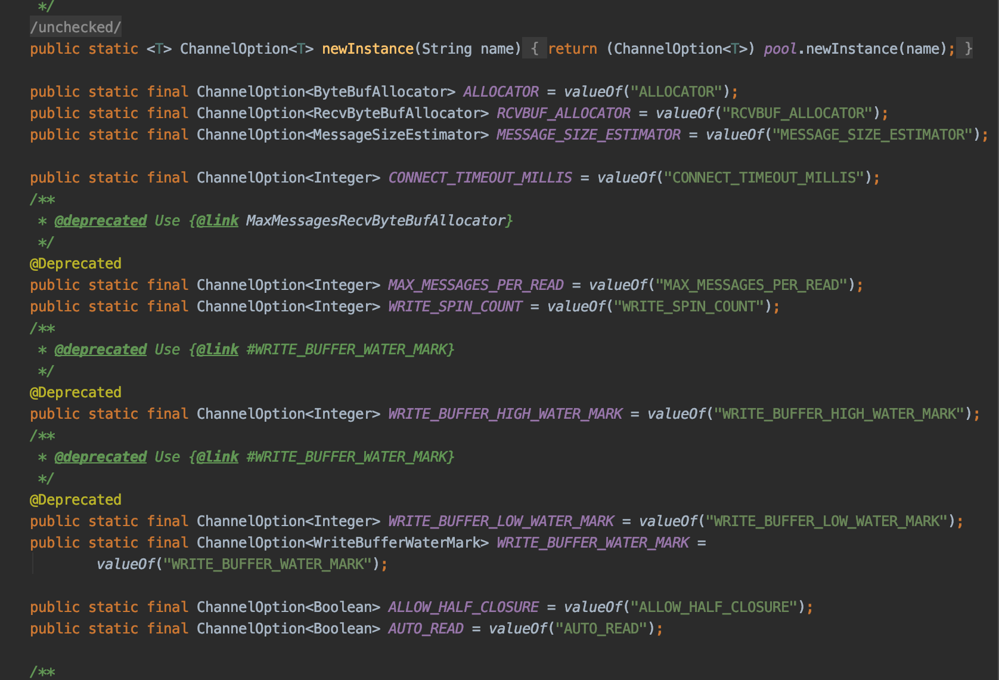
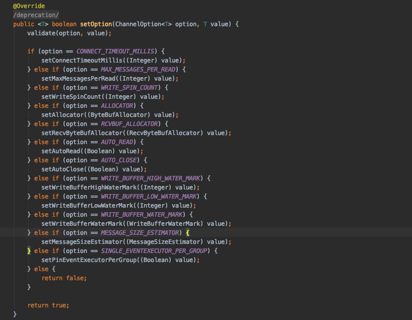
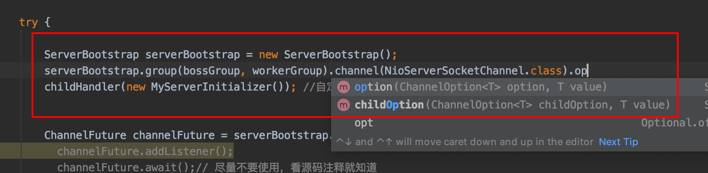
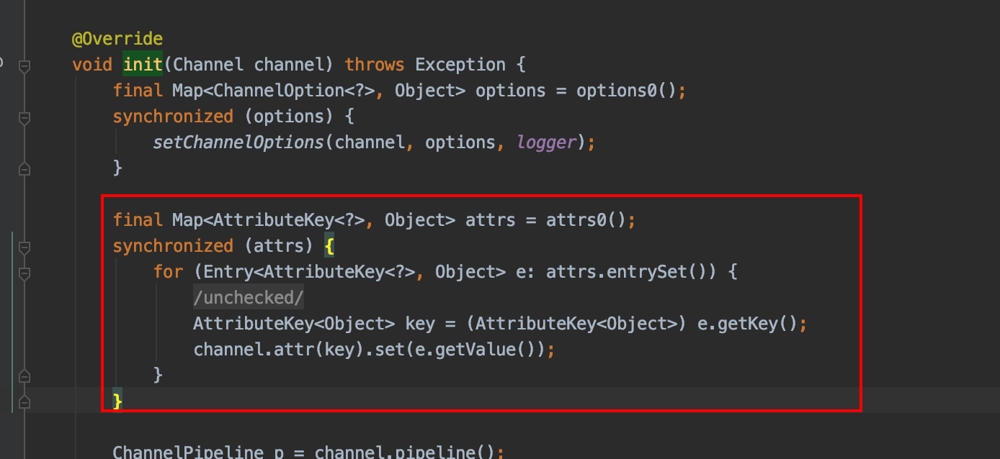
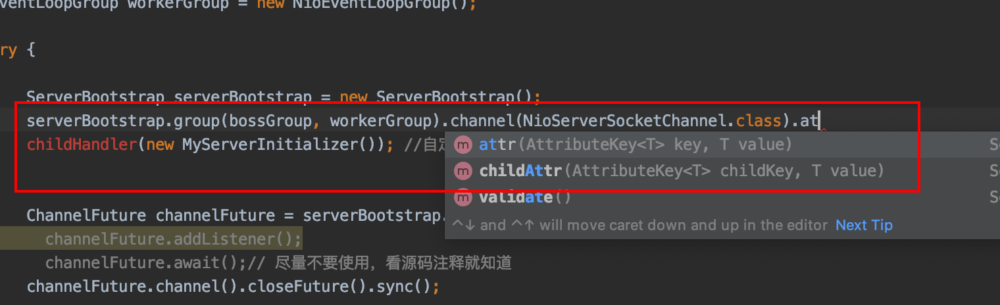
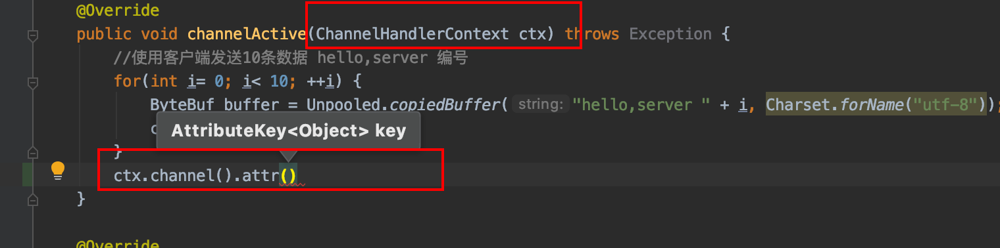
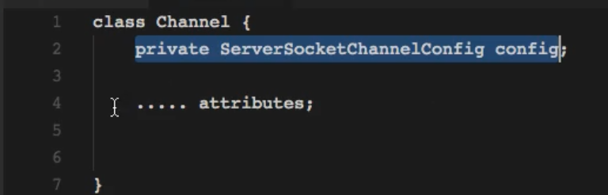

# 关于Channel

### Channel是什么

**整个netty贯穿了着Channel这个组件，不管是ChannelHandlerContext，ChannelPipeline，还是ChannelHandler，其中重要性不言而喻，它就是一个组件主要的作用是用来提供一些我们网络操作的必要属性以及能力**

##### Channel的主要用途

根据Channel的源码对象类说明得知（io.netty.channel.Channel）

- 获取到当前的channel状态，其实就是课前的连接的状态（就是跟客户端交互的状态），e.g 连接状态还是关闭状态等
- 获取到Channel的所有的配置参数，就是我们给客户端的这个连接配置的一些属性（ChannelOption这个参数的配置，或者一些AttributeKey的配置信息）e.g 连接超时时间配置
- 获取到当前的Channel支持的IO操作类型 e.g write() read() bind()
- 最重要的一点就是提供的ChannelPipeline这个对象，用来处理所有的IO事件的连接管道，将事件跟Channel关联起来，Channel是跟客户端的对应通道，然后使用对应的Pipeline的handler进行处理对应的事件，在创建Channel的时候同时会创建对应的一个ChannelPileline，实际的值是DefaultChannelPileline

##### Channel一些常识

- 在netty中所有的IO操作都是异步的，所以请求都是马上返回结果的，但是不能保证对应的IO操作能完成，可以通过ChannelFuture 来获取实际的处理结果
- 一个Channel对象可以拥有对应的父实例，在Channel的自带方法中就可以调用parent()方法进行获取，就像SocketCHannel是可以通过ServerSocketChannel.accept()来进行获取，所以可以认为其的parent就是ServerSocketChannel
- 其实说到底，Channel就是一个连接客户端的通道，可以理解为客户端的连接对象的基本信息合集，我们可以通过channel来记录获取一些客户端的连接信息，每一个Channel都是注册到EventLoop中的
- Channel，ChannelHandlerContext，ChannelPipeline，ChannelHandler 是netty的四大核心组件

### ChannelOption 配置Channel

我们跟服务端的bind()方法进去，可以发现在`io.netty.bootstrap.ServerBootstrap`#init这个方法的时候，会获取当前的Channel的ChannelOption的Map集合，然后将其相关属性赋值给当前的Channel，用来配置Channel，那么这个对象的主要用途是干什么的呢？怎么实现的呢？同理还有对应的Attribute给Pipeline中的Handler设置的属性是干什么的？

```java
void init(Channel channel) throws Exception {
  
    final Map<ChannelOption<?>, Object> options = options0();
    synchronized (options) {
        setChannelOptions(channel, options, logger);
    }

    final Map<AttributeKey<?>, Object> attrs = attrs0();
    synchronized (attrs) {
        for (Entry<AttributeKey<?>, Object> e: attrs.entrySet()) {
            @SuppressWarnings("unchecked")
            AttributeKey<Object> key = (AttributeKey<Object>) e.getKey();
            channel.attr(key).set(e.getValue());
        }
    }
  
          ChannelPipeline p = channel.pipeline();

        final EventLoopGroup currentChildGroup = childGroup;
        final ChannelHandler currentChildHandler = childHandler;
        final Entry<ChannelOption<?>, Object>[] currentChildOptions;
        final Entry<AttributeKey<?>, Object>[] currentChildAttrs;
        synchronized (childOptions) {
            currentChildOptions = childOptions.entrySet().toArray(newOptionArray(childOptions.size()));
        }
        synchronized (childAttrs) {
            currentChildAttrs = childAttrs.entrySet().toArray(newAttrArray(childAttrs.size()));
        }
  //......省略部分代码
}
```

##### netty常量池

我们想知道`setChannelOptions(channel, options, logger);`这步是干什么的，就需要知道对应的options这个Map对象是什么意思，该Map对象的key是ChannelOption对象，值是Object对象。该方法进去`setChannelOptions`可以看到实际上就是给Channel的ChannelConfig对象赋值的，顾名思义就是给Channel对象配置属性的。那么这个ChannelOption这个对象的实际用途，我们跟随源码进去发现其实它是`io.netty.util.Constant`这个常量的子类，该常量的id是int，name才是我们要的key。从Constant的注释知道其是netty的常量池`io.netty.util.ConstantPool`创建以及管理

`io.netty.util.ConstantPool` 的主要用途就是用来创建或者管理`io.netty.util.Constant` 常量对象的。给常量添加id，底层就是java并发包的ConcurrentMap

##### ChannlOption

在ChannelOption内部中保存了一个io.netty.util.ConstantPool的对象，用来存储一些我们常用的配置Channel的配置属性，该对象存储了我们能够配置的channel的属性



然后这些属性能干嘛呢？因为ChannelOption并不保存任何数据的，只是用来记录数据类型的，所以这些Channel的配置都预先在这个对象中配置了对应的值的数据类型。例如这个

```java
public static final ChannelOption<Boolean> SO_KEEPALIVE = valueOf("SO_KEEPALIVE");
```

这个记录channel的TCP配置是否是保持连接`SO_KEEPALIVE`，然后这个配置的对应的类型是`Boolean` ，然后我们配置的时候配置了该属性作为option()的值传进来，我们在`io.netty.channel.DefaultChannelConfig#getOption`这里可以看到一个ChannelConfig的配置实现，我们配置了Channel的这个属性`SO_KEEPALIVE` 在传进来给channel实际的配置对象赋值的时候，会根据该配置的名称返回对应的实际的类型



对于使用：



我们可以给ServerBoostrap的对象指定对应的channl的这些配置属性，也可以给工作线程的channel制定相关属性

##### AttributeKey

我们看`io.netty.bootstrap.ServerBootstrap#init`这个方法在配置好channel对象后，也还有一个配置attrs的属性



这个配置的对象`AttributeKey`也是跟Channel的配置ChannelOption是类似的,也是`io.netty.util.Constant`的子类，不同的是这个对象的目的是用来传输一些我们要给Handler携带的自定义的属性的：类似，我们要自定义一个属性的key：AttributeKey为money，对应的属性值是Attribute值为19999，我们定义好后在后面的Handler对象就可以获取到这个属性以及这个值了

上面途中的地方就是获取所有的主线程的配置的Attribute，然后添加到Channel中，跟前面的ChannelOption是不一样的，前面是配置Channel的这个对象的，这个是用来channel中的handler使用的，数据传输的

使用方式：



同样的是，可以配置主线程的属性也可以配置工作线程的属性，然后在后面的handler中可以获取到对应的channel对象后，然后获取其中的attr()



### ps

- 我们给Channel的所有的配置，要么直接设置在ChannelConfig这个Channel的配置对象中，要么就是各种各样的方式进行来注入的，最终的结果还是来给ChannelConfig这个对象赋值的包括但不限于attr，channelOption这些对象的方式

- 

  

