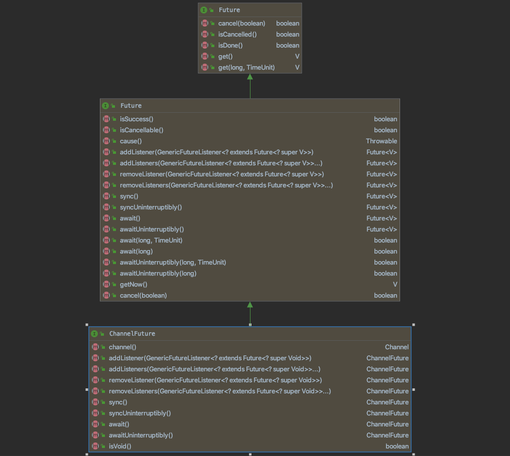

# 关于ChannelFuture

**ChannelFuture 在netty中是一个非常重要的存在，用于获取异步获取结果，而且还绑定了对应的Channel**

ChannelFuture继承于netty的Future，netty的Future继承于java.util.concurrent.Future，我们可以看到java的并发的Future的并发包里面的Future类说明，一共有5个方法，顾名思义：一次是取消任务 ，是否在结束前取消了任务，任务是否已完成，获取任务的执行结果，get(timeout，unit)这个方法是在一定时间获取执行结果否则抛异常；大概看了一下concurrent包的Future对象的方法之后，看看Netty重写的Future对原来的Future做了什么扩展，以及为什么要这样扩展，还有就是该怎么使用

## java.util.concurrent.Future 

**这个是java并发包的异步获取结果的接口，这个接口有非常多的扩展，很多使用到一异步或者多线程的框架都会对其进行自己实现的封装，netty也其中一个，这个接口的定义非常简单几个方法，但是相关实现非常多**

## io.netty.util.concurrent.Future

**netty的Future对java的并发Future做了扩展，其中主要的扩展在于添加几个方法：isSuccess()，addListener()，removeListener()，还有await()这几个方法以及相关类似方法**

> 大部分方法都是可以顾名思义的，或者直接去看下源码的方法说明即可，需要简单说下，就是isSuccess()这个方法跟父类的Future的isDone()是类似的结果，但是不一样，isDone是指任务结束，但是结束的情况有取消执行，出问题抛异常了，以及完成了，所以在实际使用的时候无法区分是哪种情况，isSuccess能够确定是正确执行完整返回ture
>
> 对于addListener，addListeners，removeListener，removeListeners，这个是最重要的扩展了，就是类似观察者模式，异步执行完任务之后通知我们监听器，不需要我们手动去get获取去判断是否完成，如果是比较复杂的io操作的时候，这个获取是否完成的时间点我们不好把握，所以这个接口是为了回调通知执行结果的，跟await方法不一样的是，await是阻塞方法，会一直阻塞在等待，使用不好容易出问题，还可能出现死锁

## io.netty.channel.ChannelFuture

**来到我们的主角了，ChannelFuture在netty中是非常重要的存在，用于监听执行结果的，具体的使用说明我们可以看下该接口的源码文档说明，这里大概说一下**

1.因为在netty中所有的io操作都是异步的，所以无法确定所有的执行都是正确的完成的，对于执行结果我们需要通过ChannelFuture对象去获取对应的实际执行结果

2.对于一个io任务的执行情况只有两种，一就是completed以及uncomplered两种情况，其中未完成的情况就是在执行过程，除了正在执行就是执行完成了，所以完成有几种情况：正常完成，取消，出异常结束；

3.我们想要知道一个线程的运行结果不能直接通过concurrent的Future的接口的方法来确定，因为完成的情况有太多了，所以ChannelFuture对这个接口进行扩展，我们通过java并发的isDone()方法加上我们ChannelFuture的isSuccess()，cause()，isCancelled()这几个方法来确定一个io操作的执行结果，如下图描述

4.值得一说的是添加监听器，这个是Netty对Future的非常重要的引入，就是定义一个Listtener用来异步获取任务执行结果，不然我们只能用await方法来获取，这个方法是阻塞的而且我们不知道什么时候去调用比较合适，通过观察者模式引入listener方便我们异步获取执行结果，跟await的方式相比，非常灵活而去非阻塞

5.使用ChannelFuture的时候还需要区分一下，io超时以及等待超时的使用，具体可以看看ChannelFuture的接口描述的分析案例

6.实际使用ChannelFuture方法的简单demo

