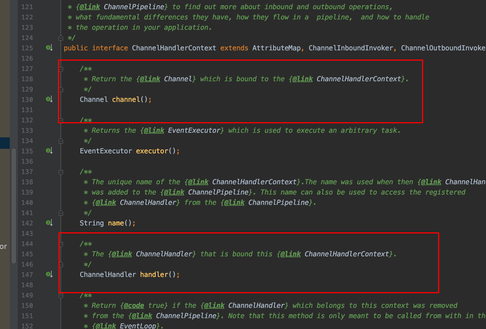
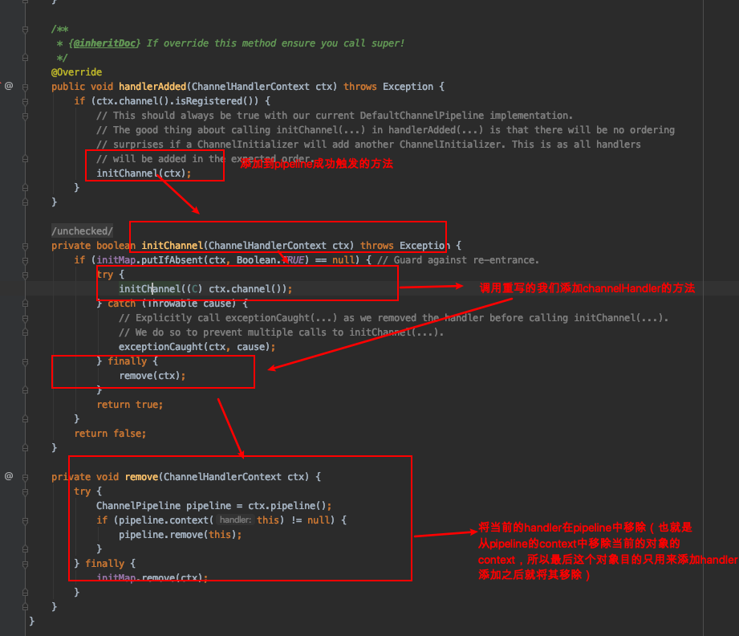
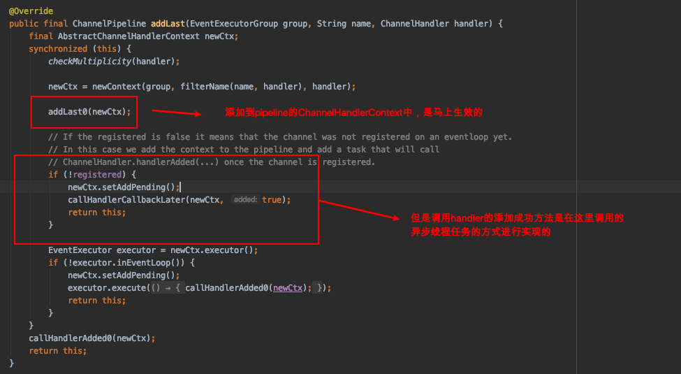
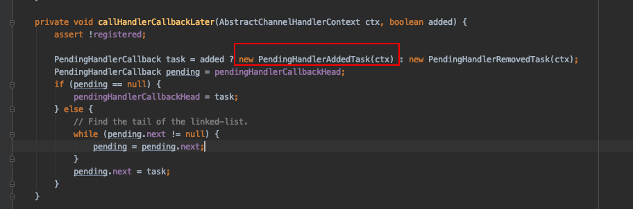
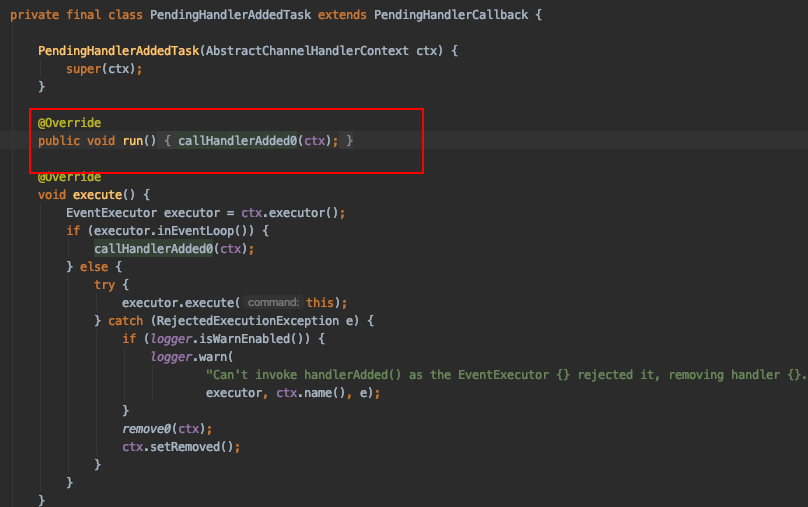
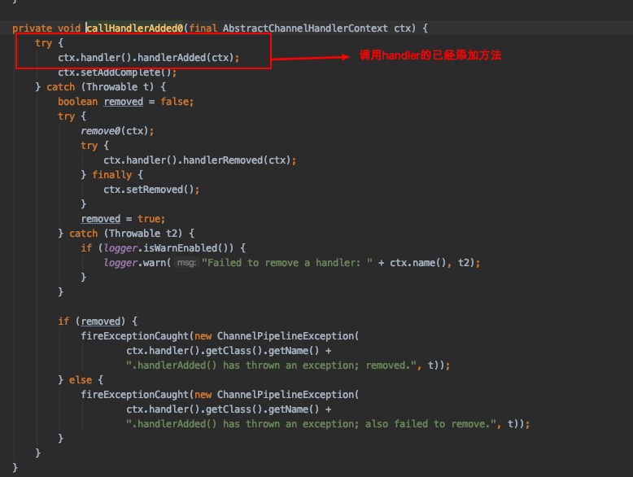

# ChannelHandlerContext

**目前为止，我们知道netty有四大金刚（四大核心对象）：Handler，Channel，ChannelPipeline，ChannelHandlerContext ，这四个对象都是非常重要的，但是他们之间是什么关系呢？怎么串联起来的呢？**

### 创建

`ChannelHandlerContext`对象的创建，是在我们往pipeline对象中添加handler的时候触发的，在我们添加handler的时候，就会创建一个对应的`ChannelHandlerContext`对象，然后将其添加进pipeline的创建的时候生成的两个默认的context中，一个是**tail**另一个是**head**其中创建ChannelPipeline的代码

```java
//在对象io.netty.channel.DefaultChannelPipeline 里面
final AbstractChannelHandlerContext head;
final AbstractChannelHandlerContext tail;
//....省略代码
protected DefaultChannelPipeline(Channel channel) {
    this.channel = ObjectUtil.checkNotNull(channel, "channel");
    succeededFuture = new SucceededChannelFuture(channel, null);
    voidPromise =  new VoidChannelPromise(channel, true);

    tail = new TailContext(this);
    head = new HeadContext(this);

    head.next = tail;
    tail.prev = head;
}
```

然后这个就是整个Pipeline容器的头尾，我们在调用pipeline.addLast()接口的时候，就会对应生成一个`ChannelHandlerContext`对象，然后加进去对应的`tail`以及`head`中，怎么生成的呢？进入到addLast()方法的实际调用处：io.netty.channel.DefaultChannelPipeline#addLast(io.netty.util.concurrent.EventExecutorGroup, java.lang.String, io.netty.channel.ChannelHandler)

```java
@Override
public final ChannelPipeline addLast(EventExecutorGroup group, String name, ChannelHandler handler) {
    final AbstractChannelHandlerContext newCtx;
    synchronized (this) {
        checkMultiplicity(handler);
				//创建一个AbstractChannelHandlerContext对象，参数filterName(name, handler) 是生成对应的一个handler名称，也可以在添加的时候指定，否则就是自动生成
        newCtx = newContext(group, filterName(name, handler), handler);
      	//将创建的CHannelHandlercontext添加到pipeline中，如下
        addLast0(newCtx);
        // ....省略
}
  
  //实际调用的添加到pipeline的方法，这个方法是在我们在服务端调用bind()方法的时候内部调用的方法，所以是在初始化第一个handler实际调用的方法（io.netty.bootstrap.ServerBootstrap#init 里面的p.addLast(new ChannelInitializer<Channel>() {}），其他的往pipeline添加handler都是一致的，往pipeline的这个对象的tail以及head链表中添加一个ChannelHandlerContext对象
  private void addLast0(AbstractChannelHandlerContext newCtx) {
    AbstractChannelHandlerContext prev = tail.prev;
    newCtx.prev = prev;
    newCtx.next = tail;
    prev.next = newCtx;
    tail.prev = newCtx;
  }

```

### 作用

前面说是我们往pipeline添加handler的时候创建了一个对应的ChannelHandlerContext对象，但是并没有往其中添加一个Handler对象，那怎么说pipeline往handler添加了对象呢？我们看一下ChannelHandlerContext接口的源码



根据对应的addLast()方法以及对应的源码可以知道，每添加一个Handler对象就会创建一个ChannelHandlerContext对象的，然后将其添加进我们对应的pipeline的链表中，又因为每次添加产生的`ChannelHandlerContext`对象里面都有该handler对应的引用，以及也有对应的Channel的引用，所以我们可以理解为ChannelHandlerContext是对Handler对象的引用。我们添加handler进去其实就是添加对应handler对象的ChannelHandlerContext，然后里面有handler的引用

除了上面的，ChannelHandlerContext作为一个包装handler对象的类之外，还承载着获取Handler相关的上下文，就是相关的很多信息的存在，例如可以获取当前Channel对象，当前对应的Pipeline对象，Handler对象，还有对应的执行器等，就是Handler的上下文。

需要注意的一点就是：在netty4.01版本之后的netty的Channel的属性Attr的值是跟ChannelHandlerContext的attr属性是一致的。就是可以存放我们自定义的属性，然后在handler之间传递

### 四大金刚的作用+关系

- Channel 某种意义上就是用来连接客户端跟服务端的通道，netty就是一个网络传输框架，所有的数据都是基于网络的，所以基本上上所有的交互都是跟channel相关

- ChannelHandlerContext 这个简而言之就是handler的上下文，包装handler需要或者相关的信息，在调用添加handler的时候就会自动在netty中创建

- ChannelHandler 这个就是我们所谓的处理器了，进行业务处理的业务对象

- ChannelPipeline 这个就是管道，也可以认为是存储handler的容器（实际上是存储的ChannelHandlerContext），然后是一个链表结构，能够按照添加的顺序进行执行里面的handler
- 关系的话，Channel是其他三个组件的基础，其他三个组件都是基于对应的Channel来进行相关的处理的；ChannelHandlerContext是将ChannelHandler跟跟Pipeline关联起来的一个对象，等于handler的包装类是一个上下文的存在，Pipeline通过ChannelHandlerContext将handler加到pipeline中的，其实ChannelHandlerContext就已经将4大金刚关联在一起了；然后pipeline作为一个管道存在，跟Channel是一对一的关系，每一个客户端的Channel就有一个对应的Pipeline管道；对于Handler，其实是相对独立的一个组件，就是用来处理业务的，netty的各种功能就是通过一个个Handler进行拼接而成的
- Ps1 需要注意的是，同一个Handler可能会有多个ChannelHandlerContext，因为这个是每调用一次pipeline.addLast()就会生成一个，然后也会添加到pipeline中，就是会重复添加的，也允许重复添加，只是在链表中就会多几个，会进行多次的该handler处理
- Ps2 一个特殊的Handler就是`ChannelInitializer`，在netty中bossEventGroup会在调用bind()方法的时候，默认给Pipeline添加一个ChannelInitializer对象，这个对象其实也是一个Handler，不过是一个特殊的Handler，改造成我们只需要重写一个`initChannel()`方法，然后在其中将我们要添加到Pipeline的Handler添加进来，在添加进来之后，会触发`ChannelInitializer`对象的handlerAdded()方法，该方法调用ChannelInitializer的抽象方法initChannel()只要是重写该对象就需要实现的方法，也就是用来进行我们的往Pipeline添加handler的操作，一个特殊的封装来添加handler的handler对象，添加添加到pipeline成功后会将其移除，然后后面会异步将所有的handler添加到实际的pipeline中
- 

> 需要注意的一点就是，我们使用pipeline调用addLast()的方法的时候，会马上将添加的handler添加到pipeline的ChannelHandlerContext中，但是不会马上执行添加成功handler对应的这个回调方法，会添加一个异步的任务，在后面执行当前添加的handler的handleradded()方法，通过穿过去的ChannelHandlerContext获取到当前的handler对象然后调用添加成功方法；具体实现参看
>
> 
>
> 具体的异步调用就暂时不写出来了，代码跟进去大概流程
>
> 
>
> 
>
> 

