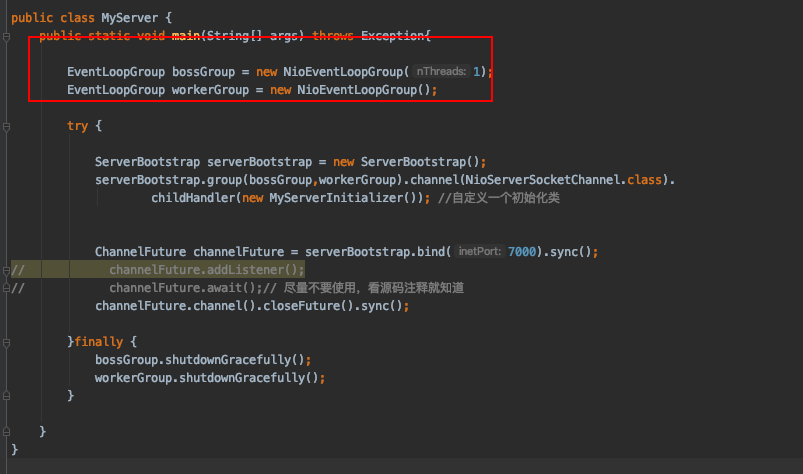
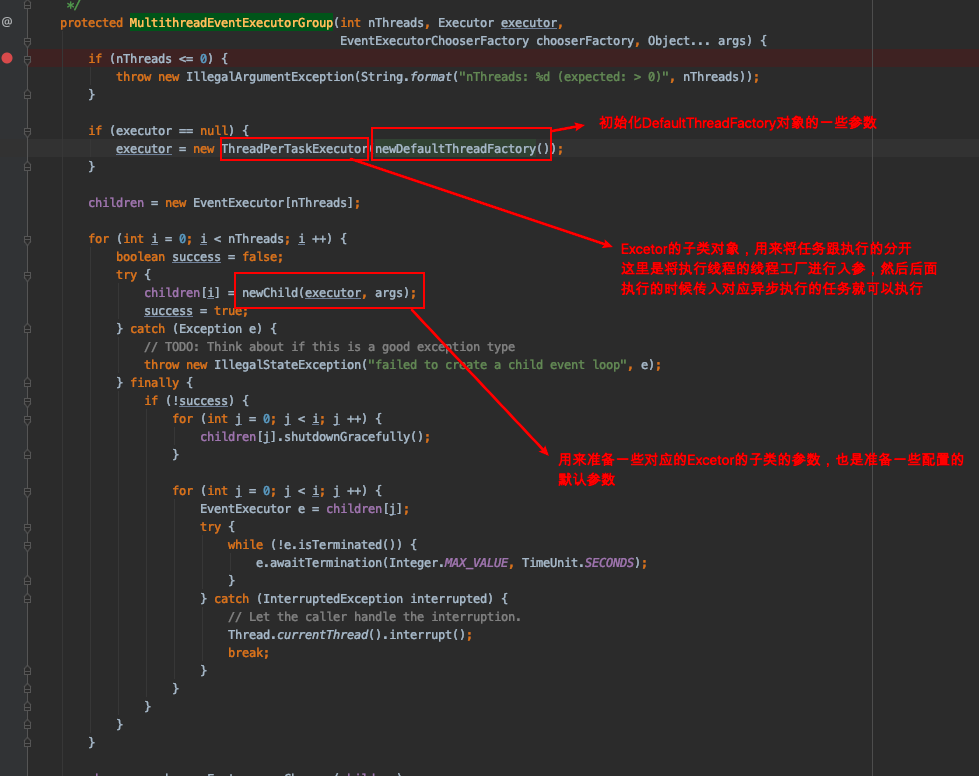

# 关于EventLoopGroup

**EventLoopGroup接口 主要是用来注册channel，是一个事件循环组，存在一个死循环用来等待客户端的连接用来创建连接或者处理对应的事件请求**



### EventLoopGroup接口

是EventExecutorGroup的子类（EventExecutorGroup是用来产生EventExecutor，是ScheduleExccutorService的子接口，说明是处理并发相关），用于处理channel的注册以及处理selection的循环事件，主要的方法有next()，以及register()方法，next是获取下一个循环组，register是用来将channel注册到EventLoop中

### NioEventLoopGroup

这个是EventLoopGroup的实现类，也是netty的事件循环组的实现类，使用nio的方式进行通道的注册，类似于nio的selector功能，用来注册相关的channel

```java
EventLoopGroup bossGroup = new NioEventLoopGroup(1);
EventLoopGroup workerGroup = new NioEventLoopGroup();
```

如上的构造方法我们可以断点或者直接源码跟下去，可以发现整个流程就是就行参数的准备，都是一些默认的参数设置，并没有进行什么实际的操作，需要注意的几个点就是，创建EventLoopGroup实体的时候，NioEventLoopGroup的构造方法我的入参是1，或者可以其他数字又或者不传参都是没问题的，如果不传参跟下去会发现它也会默认给我们设置一个值为：cpu线程数*2，例如我的四核八线程，创建的事件循环组的线程数是16。跟下去NioEventLoopGroup的构造就会发现，默认给我们设置了很多的启动相关的参数，最后来到io.netty.util.concurrent.MultithreadEventExecutorGroup#MultithreadEventExecutorGroup(int, java.util.concurrent.Executor, io.netty.util.concurrent.EventExecutorChooserFactory, java.lang.Object...)这个方法



对与上图的84行进行勘误

```java
children[i] = newChild(executor, args);
```

这一步不是用来初始化Excetor的参数的，我们跟下去发现，是准备一些EventLoop的一些参数的，就是创建EventGroup的一些属性

### 总而言之

EventLoopGroup的两个构建方法只是初始化了一些我们创建对象的一些默认属性，做的事情都是准备工作，准备了两个事件循环组对象，就是线程池准备，然后我们后面使用的时候就会有一些默认的属性，唯一比较有意义的事线程数的入参这个，我们主线程一般设置值为1，然后工作线程默认值就行，因为主线程就是用来接收请求，然后将请求跟给工作线程处理；两个初始化的对象都是一样的，只是准备该线程启动的时候一些默认属性，方便后面使用的时候用来处理相关的任务，类似那个线程执行对象ThreadPerTaskExecutor，这个最后也只是准备好了线程工厂，后面我们使用线程组去执行任务的时候，将对应的任务传进去

做的事情比较少，准备一些默认参数以及一些需要线程组之后用到的方法的构造方法参数赋值，就是为了执行线程事件做的准备，实际的分配工作还是要后面指定