# Handler以及编解码器

前面说了那么多，其实很多都是理解netty的，对于我们实际使用netty的时候做的最多的就是编写一个个处理业务相关的处理器Handler，这是对于开发者而言学习netty最切合实际的用处了；在各种各样的Handler中，有一个比较有重要的存在就是编解码器，基本上是进入netty跟出去netty都要做的一件事

### 1.关于netty的Handler

netty之所以那么强大，除了它的简化我们NIO的流开发之外还有就是它自身根据各种情况内置很多非常实用的Handler，可以轻松的使用这些处理器处理大部分的我们开发的工作，我们只需要关注我们的业务开发即可，基本上其他的事情Netty都帮我们考虑到了（当然也存在很多netty没有考虑到的场景，需要我们自自定义Handler进行处理，尽管是自定义netty也进行了一定的抽象类提供我们使用）。

- netty的处理器可以分成两类：出栈处理器，入栈处理器

- 入栈处理器的顶层是：ChannelInboundHandler，出栈的顶层是：ChannelOutboundHandler

- 各种常用的编解码器也是Handler的一种

- 我们在网络上传输的都是二进制字节，但是我们在程序处理的时候是将入栈的字节转换成我们要的各种对象这个就是解码，将我们的对象数据传输到另一个端的时候需要将其转换成二进制字节这个是编码，编解码统称codec

- 编码是出栈处理器一般是XXXEncoder，解码是入栈处理器一般是XXXDecoder

- 一个handler既可以是入栈处理器也可以同时是出栈处理器，我们实现一个handler既是出栈处理器又是入栈处理器的两种方式：第一个就是同时实现出栈跟入栈的接口，第二个就是通过接口泛型入参两个对象一个是出栈一个是入栈，如下图，不过一个handler同时是入栈出栈的可能性很小也不建议，功能唯一性原则而且简单开发原则

  > 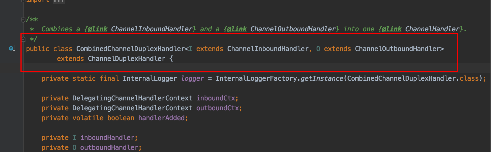

在netty的Handler之间是通过pipeline进行一个个传递的，从a到b的时候，如果a的结果不是b的入参的话会直接跳过b进入c，这是netty的处理流程

### 2.编解码器

##### 2.1 编解码器说明

关于怎么实现一个解码器，我们可以参考一下官方提供的各种编解码器，就会发现各种编解码器一般都会继承一个基础的编码器或者解码器类似这种：*ByteToMessageDecoder，MessageToByteEncoder，MessageToMessageDecoder*等一些基础的编解码器，很多都顾名思义，就像我们要实现一个解码器，那么我们就继承一个ByteToMessageDecoder然后重写其*decode()*方法进行我们的解码操作即可

我们先来看一下*ByteToMessageDecoder*的javadoc文档，看一下官方的使用说明，最基础的就是将我们接收的文件流转换成我们的目标对象，注意对于接收到的Byte字节流netty会帮我们封装进ByteBuf中，我们只需要处理ByteBuf就可以了，应该是接收到byte之后直接创建一个ByteBuf对象将其放进去了，出栈的时候也一样，我们只只能传输两种格式的出去，一个就是ByteBuf一个就是文件流的指定对象，其他的对象传输都是进不了编码器的会被直接忽略

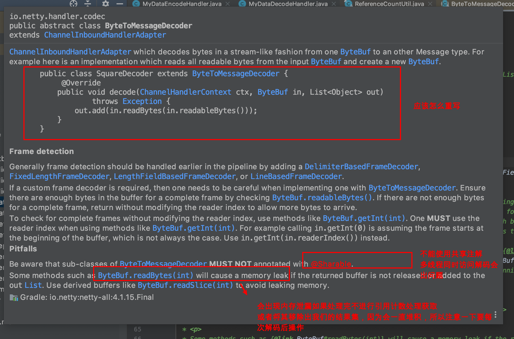

处理上面图片标识的注释之外，还有一些就是我们获取到ByteBuf之后需要简单判断一下获取的字节长度是不是够我们的一个完整的对应目标对象的长度，如果不够就不要解码了等待接收完整之后再解码，不然会出现无法解码或者乱码的情况，这个就涉及到字节传输的一个问题了：粘包拆包；这里提到了一下，我们需要用帧处理器进行一下处理，到底怎么处理呢？后面会有专门的介绍，其实基本上就是在传输的时候进行一个传输头，注明了一个消息的长度，然后按照该长度一进行解码，不够的话等待下一个请求的数据到来再进行拼接，这个后面会进行比较详细的讲解

这个文档强调了一点就是，所有的ByteToMessageDecoder子类，都不能使用@Shareable注解，这个注解的意思是：允许多个pipeline同时使用一个对象实例，但是在这里解码是不允许的，同时出现a和b两个请求请求一个解码造成解码出错（同理多线程并发处理），还有就是ByteToMessageDecoder有很多状态的，多线程进来状态乱，所以就是不可共享

然后来到*MessageToByteEncoder*编码器的抽象类的说明了，这个是跟前面的解码器抽象类*ByteToMessageDecoder*相对应的，简单看一下javadoc文档：

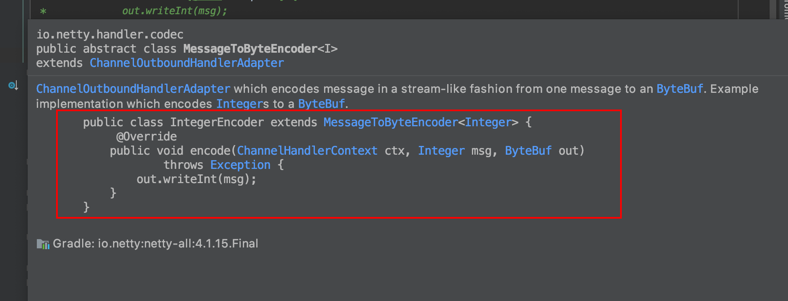

这个文档相当简单，就是举了一个例子简单明了，就是将我们的对象通过ByteBuf对象的方法将对应的属性的对象转换成ByteBuf对象，跟解码器有一个不一样的地方就是，编码器是指定泛型类型的

那么为什么跟解码不一样，编码是需要指定泛型的呢？

> 因为在解码的时候，我们的解码结果是使用一个List来暂时存放的，这个解码结果是一个集合，无法通过泛型来指定（这里也有一点困惑，抽空确定一下原因）

解码器的结果是一个List集合，那么是不是每一次解码结果都是一个list呢？

> 不是的，接收的数据具备不确定性，解码的结果如果多个就List先存放着如果是一个也就是一个，对于请求的解码结果，只是根据解码的长度解码出的对象用一个list暂时存放着，但是在List<Object> out中每一次*out.add()*解码后的对象添加调用就会将结果一次传输给pipeline中的下一个handler进行处理，实际的情况就是：***解码出对象a->out.add(a)->调用pipeline的一个链式handler进行处理->解码出b->out.add(b)->...******这样的一个流程*** 并不是以集合的形式进行传输，这是因为netty对io传输的优化，多次传多个过来，服务端一次获取，例如客户端循环发送10次Long数字长度是8，服务端一次接收一共10个Long类型的过来接收数据长度一共是80；
>
> 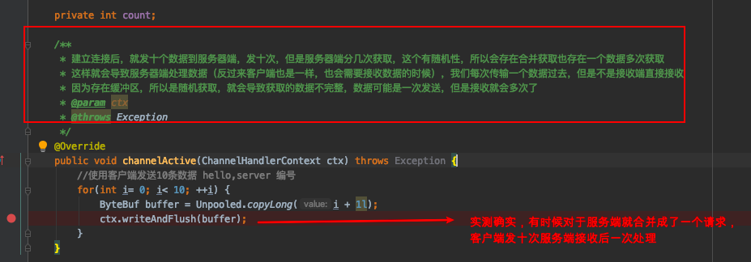
>
> （之所以使用List存放解码结果，这个估计是为了大客户端的大量数据传输过来，我们可以将其全部先放在list中，然后后面的一个个handler会一个个进行处理，这也是为什么入栈解码的抽象类提醒需要注意内存泄漏，list会不断叠加所以每次后面我们使用完之后要注意移除，还有byteBuf每次都是一个新的对象请求多了数据量大的话，没有进行释放*release()*掉就会造成内存堆积，会泄漏的）
>
> 如果是一般的自定义协议，我们没有做长度的限制的话，直接解析服务端获取的数据当作一个对象进行解析的话，这样解析的结果可能是有粘包拆包的问题，因为假如是String类型是自定义协议类型的话，需要获取的结果是10个长度为8的String类型，直接读取字节对象**in**一次解码的话这里获取的是一个长度80的String对象那么获取的结果就不对了，可是为什么这里是Long类型不是非自定义的协议就能够正确获取10个对象了呢？
>
> 如下图，其实最主要的是ByteToMessageDecoder进行了处理，还有数据就继续调用解码器，尽管是接收数据是一次，但是解码的时候每次获取的是8个字节，然后执行add方法后会判断，如果还有数据继续读取，就会使得我们获取了十个数据
>
> 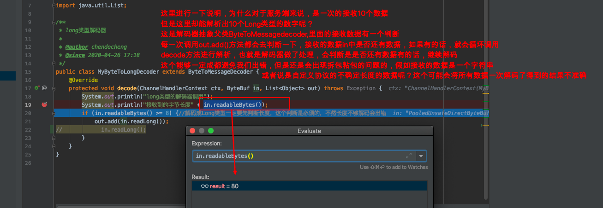
>
> 如上图的中的说明，发送十次的数据，服务端一次接收完毕但是能够正常解码出10个对象，这个是有前提的，这个前提就是java的内置的几个定长的对象才行，或者说是固定长度的对象才行，如果不是定长的对象，类型String类型或者我们自定义协议的数据，就出现一个问题，那就是粘包拆包的问题！这个问题因为是在自定义协议中肯定出现，所以想看详情且看文章：***netty自定义协议***详细解析

##### 2.2 自定义编解码器

不多说了直接贴代码，但是从其中明白一个特别重要的事情，就是前面的Pipeline管道添加Handler的时候，我们说了一下添加的顺序入栈是从上到下，出栈的顺序是从下到上。但是说漏了一个特别重要的事情，添加的最后一个需要是入栈的业务处理器，这样才能在write的时候往出栈写正常。就像这个编解码器，往pipeline添加的时候如果是先添加出栈的编码器最后再加入栈的Handler业务处理就*无法正常调用出栈的编码器*（可以看后面贴的代码，一旦在pipeline中调整了编码跟业务handler之后就无法写出了）

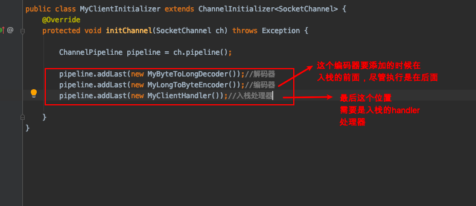

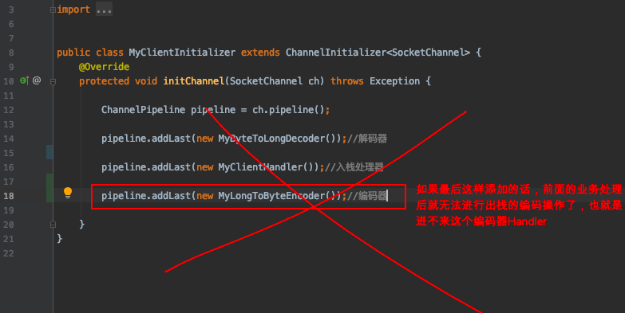

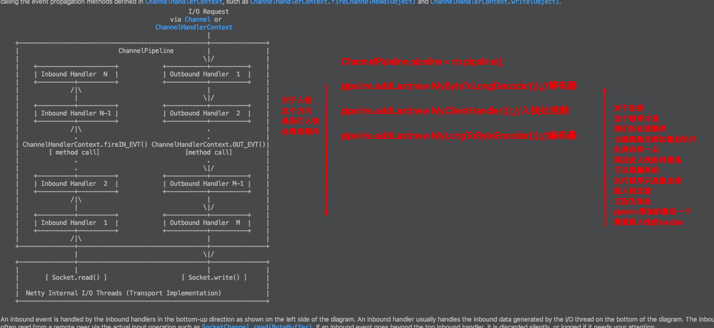

###### **2.2.1客户端主要代码**：

```java
//客户端
public class MyClient {
    public static void main(String[] args)  throws  Exception{

        EventLoopGroup group = new NioEventLoopGroup();

        try {
            Bootstrap bootstrap = new Bootstrap();
            bootstrap.group(group).channel(NioSocketChannel.class)
                    .handler(new MyClientInitializer()); //自定义一个初始化类

            ChannelFuture channelFuture = bootstrap.connect("127.0.0.1", 7001).sync();

            channelFuture.channel().closeFuture().sync();

        }finally {
            group.shutdownGracefully();
        }
    }
}

//pipeline 添加Handler对象
public class MyClientInitializer extends ChannelInitializer<SocketChannel> {
    @Override
    protected void initChannel(SocketChannel ch) throws Exception {

        ChannelPipeline pipeline = ch.pipeline();

        pipeline.addLast(new MyByteToLongDecoder());//解码器
        pipeline.addLast(new MyLongToByteEncoder());//编码器（注意这个不能放在添加的最后，否则无法调用）
        pipeline.addLast(new MyClientHandler());//入栈处理器，这个添加要在出栈处理器的后面，否则出栈处理器获取不到写出去的消息

    }
}

//客户端Handler业务对象
public class MyClientHandler extends SimpleChannelInboundHandler<Long> {

    private int count;

    /**
     * 建立连接后，就发十个数据到服务器端，发十次，但是服务器端分几次获取，这个有随机性，所以会存在合并获取也存在一个数据多次获取
     * 这样就会导致服务器端处理数据（反过来客户端也是一样，也会需要接收数据的时候），我们每次传输一个数据过去，但是不是接收端直接接收
     * 因为存在缓冲区，所以是随机获取，就会导致获取的数据不完整，数据可能是一次发送，但是接收就会多次了
     * @param ctx
     * @throws Exception
     */
    @Override
    public void channelActive(ChannelHandlerContext ctx) throws Exception {

        //使用客户端发送10条数据  这里是没有使用编码器，所以需要我们手动创建ByteBuf对象传输
//        for(int i= 0; i< 10; ++i) {
//            ByteBuf buffer = Unpooled.copyLong(i + 1l);
//            ctx.writeAndFlush(buffer);
//        }

        //这是有编码器，自动帮我们编码
        ctx.writeAndFlush(8888888l);
    }

    @Override
    protected void channelRead0(ChannelHandlerContext ctx, Long msg) throws Exception {
        System.out.println("客户端接收到消息=" + msg);
        System.out.println("客户端接收消息数量=" + (++this.count));

    }

    @Override
    public void exceptionCaught(ChannelHandlerContext ctx, Throwable cause) throws Exception {
        cause.printStackTrace();
        ctx.close();
    }
}


```

###### **2.2.2服务端的代码**：

```java
//服务端启动代码
public class MyServer {
    public static void main(String[] args) throws Exception {

        EventLoopGroup bossGroup = new NioEventLoopGroup(1);
        EventLoopGroup workerGroup = new NioEventLoopGroup();

        try {

            ServerBootstrap serverBootstrap = new ServerBootstrap();
            serverBootstrap.group(bossGroup, workerGroup).channel(NioServerSocketChannel.class).
            childHandler(new MyServerInitializer()); //自定义一个初始化类

            ChannelFuture channelFuture = serverBootstrap.bind(7001).sync();
            channelFuture.channel().closeFuture().sync();

        } finally {
            bossGroup.shutdownGracefully();
            workerGroup.shutdownGracefully();
        }

    }
}

//pipeline添加handler处理器
public class MyServerInitializer extends ChannelInitializer<SocketChannel> {

    @Override
    protected void initChannel(SocketChannel ch) throws Exception {
        ChannelPipeline pipeline = ch.pipeline();

        pipeline.addLast(new MyByteToLongDecoder());
        pipeline.addLast(new MyLongToByteEncoder());//编码器（注意这个不能放在添加的最后，否则无法调用）
        pipeline.addLast(new MyServerHandler());//服务端业务处理器
    }
}

//服务端处理器
public class MyServerHandler extends SimpleChannelInboundHandler<Long> {
    private int count;

    @Override
    public void exceptionCaught(ChannelHandlerContext ctx, Throwable cause) throws Exception {
        ctx.close();
    }

    @Override
    protected void channelRead0(ChannelHandlerContext ctx, Long msg) throws Exception {

        System.out.println("服务器接收到数据 " + msg);

        //服务器回送数据给客户端, 回送客户端发过来的Long  没有编码器需要手动构造ByteBuf
//        ByteBuf responseByteBuf = Unpooled.copyLong(msg+1);
//        ctx.writeAndFlush(responseByteBuf);


        //服务器回送数据给客户端, 回送客户端发过来的Long  有编码器可以直接发送
        ctx.writeAndFlush(msg);

    }
}

```

###### **2.2.3编解码器实现**

```java
/**
 * long类型解码器
 *
 * @author chendecheng
 * @since 2020-04-26 17:18
 */
public class MyByteToLongDecoder extends ByteToMessageDecoder {
    @Override
    protected void decode(ChannelHandlerContext ctx, ByteBuf in, List<Object> out) throws Exception {
        System.out.println("long类型的解码器调用");
        System.out.println("接收到的字节长度" + in.readableBytes());
        if (in.readableBytes() >= 8) {//解码成Long类型一定要先判断长度，这个判断是必须的，不然长度不够解码会出错
            out.add(in.readLong());
        }
    }
}
```

```java
/**
 * Long2Byte编码器
 *
 * @author chendecheng
 * @since 2020-04-26 18:09
 */
public class MyLongToByteEncoder extends MessageToByteEncoder<Long> {

    @Override
    protected void encode(ChannelHandlerContext ctx, Long msg, ByteBuf out) throws Exception {
        System.out.println("进入编码器");
        out.writeLong(msg);
    }
}
```

上面的demo非常简单，但是也是一个完整的处理过程了，不像我们一开始写netty得数据传输的情况了，需要我们每一个对应的Handler构建一个ByteBuf对象，然后直接将其传输另一个接收端，这里的话我们只需要*writeAndFlush()*方法调用写出我们的目标对象即可不需要将其封装到ByteBuf这个传输对象里面了，统一了这个所有传输都需要的编解码的操作

###### 2.3.4 编码器以及witeAndFlush()的一点补充

在我们的编码抽象类的父类中，对于我们的接收上一个Handler处理器的处理结果write(XXX)，其实都会先进行一个检验，因为编码器是泛型的，并不是所有的pipeline请求链路中的上一个Handler过来都会一定接收处理的，在编码器的wirte方法中就进行了判断，如果不是对应的泛型对象，就不进行业务处理直接跳过到下一个Handler，这也是前面将编码器（出栈）添加在入栈Handler业务处理器之后无法执行但是也不报错的原因，netty的策略就是符合就接收处理否则直接下一个直到最后一个Handler如果还是不接受，如果是ByteBuf类型或者FileRegion类型的话就能传输出去否则直接无视了

在io.netty.handler.codec.MessageToByteEncoder#write的这个方法中，也是接收的上一个handler的处理器的wirite相关的方法，将传过来的数据获取，然后将其处理。其中有一个判断，如果是对应的泛型就进入处理，否则就直接调用下一个handler

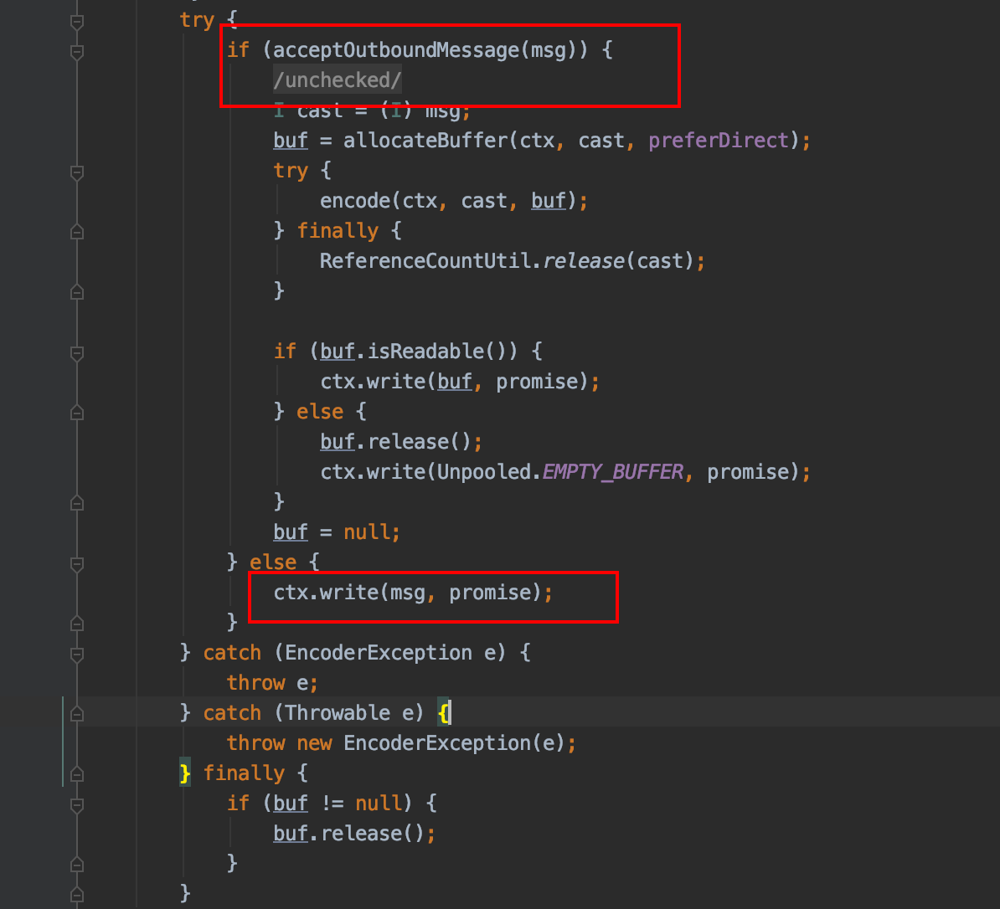

netty能够直接在客户端跟服务端进行传输的数据类型对象只有两种：ByteBuf跟FileRegion，如果不是这两种在写出去的时候就会提示这样一个消息


既然这样说，（以Long类型举例）是不是客户端跟服务端是建立的Long对象的传输，也就是说客户端将Long类型对象传输到服务端的Long类型的接收端解码器，按照前面说的，假如我们想将字符串类型（String）通过前面的Long对象的处理链路将数据传输到服务端，正常来说是不可行的，因为最简单的在编码这一步就会被忽略掉了，继续往下发送的话因为是没有编码过的String对象也不会被发送，直接被忽略了。那我们怎么才能在Long解码器强制将字符串传输到服务端呢？

> 正如我们所知道的，netty只支持两种方式的传输ByteBuf跟FileRegion，那么是否我们在经过编码器之前就直接将我们字符串对象转换成ByteBuf对象，然后正常wirteAndFlush()之后，它就能够直接跳过编码器了，因为写的对象不是Long就会跳过了编码器，然后到了Socket进行字节发送的那一步，这里发现是ByteBuf对象就会进行数据IO传输，这个数据就会到了服务端了。也就是说，我们可以通过直接写ByteBuf的方式跳过编码器直接将不是对应类型的数据强制发送出去
>
> 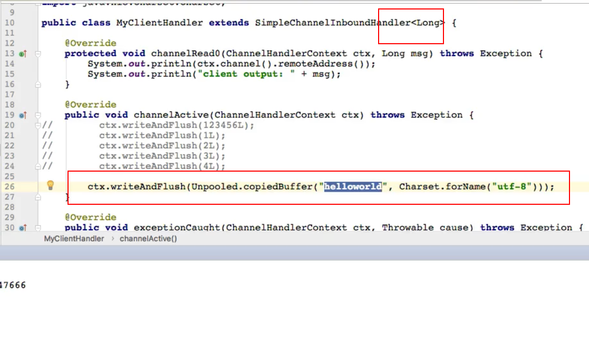
>
> 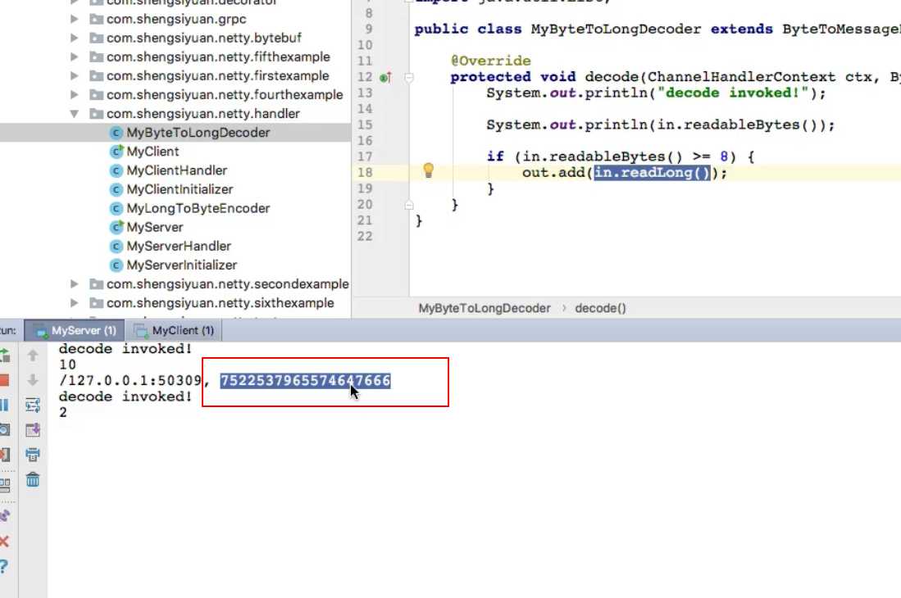
>
> 上面的截图demo就是我们的强制将字符串通过Long类型的编解码传输数据，直接将字符串传输到了另外一个接收端？接收端也是long，能不能接收呢？能，因为大于long的长度8，所以就接收了前8个字节服务端获取后解码就会出现一些我们不确定的数据，因为长度是够的，就获取了对应的Long的字节长度将字节码转成Long，这个结果就涉及到二进制跟编解码的点了，可以看看之前的总结，就能知道为什么是这个结果
>
> 这也是为什么，我们前面一开始学习，为了简单一点直接将我们的数据构造成ByteBuf进行传输，这样的话就少了编码器以及解码器，只是我们手工构造以及手工解码，那样不是工业化的，现在的通过编解码器操作才是工业化操作
>
> 附上之前的不太正确的操作，直接通过非池化的ByteBuf的方法构建ByteBuf对象，然后进行传输，获取到的时候也是我们手动进行解码获取传输的数据
>
> 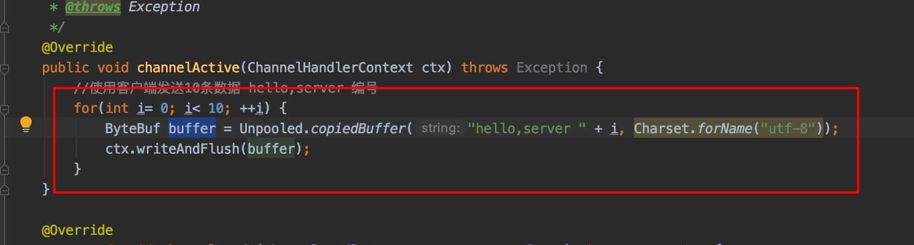
>
> 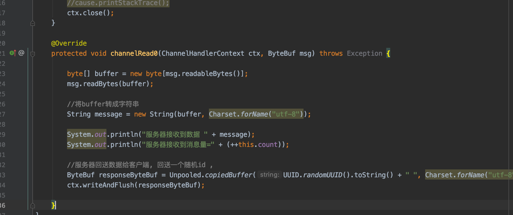

简单总结一下自定义编解码器：

- 不管是编码器还是解码器，或者说再netty的handler中，其所接收的消息类型必须要跟待处理的参数类型一致，否则该编解码器都不会被执行，在其他的handler中也一样如果不是对应要接收的类型就会不进去handler（其实就是前面的说的泛型，编码解码的时候在抽象方法中指定的泛型，调用的时候入参要跟传递的泛型一致）
- 不管是编解码器，必须要类型转换也就是编解码的时候先判断长度是否足够或者判断类型是否符合，不然会产生问题特别是长度一定要先判断长度够不够目的转型的类型

> 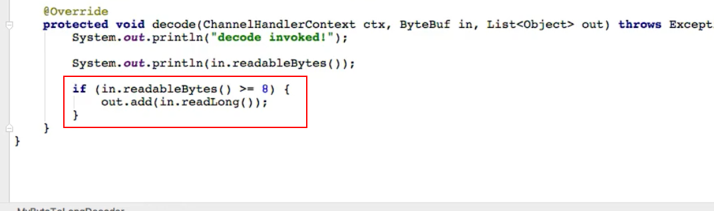

### 3.ReplayingDecoder解码器

###### 3.1简单介绍

前面第二小节说的我们自己写一个编解码器，这个都是基于netty提供的比较基础的编解码类重写的基础类，我们只需要动手判断长度是否足够，然后符合条件就将接收的字节转换成我们的目标对象即可，不需要我们根据各种情况什么的进行编解码的一系列准备获取强壮型的判断。这样已经挺方便的了，但是，netty还提供了一个更方便的我们来编写编解码的抽象类，在这个抽象类中我们连长度是否足够都不用判断，其实编解码更加简化版

基于上面的解码器扩展的更实用的解码器io.netty.handler.codec.ReplayingDecoder，是基础解码器的子类

按照常理，我们进行这个*ReplayingDecoder*对象的学习是从javadoc文档开始，**在netty中一些比较重要的组件在其javadoc文档中就会非常的详细** ，对于这个简化我们自定义编解码的对象也是非常的详细的，说明了这个对象要么非常好用或者重要要么非常具有代表性，我个人以为这个对象不仅仅好用而且也具备代表性：能够简化开发，加上其对相关协议的支持的处理，让我们能够比较好的理解自定义协议的实现

先来使用*ReplayingDecoder*跟不使用的对比：

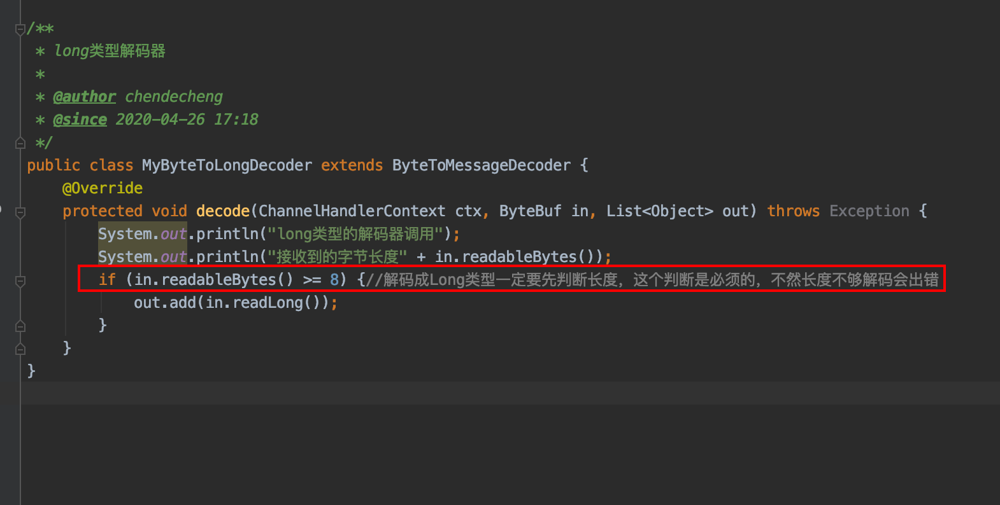

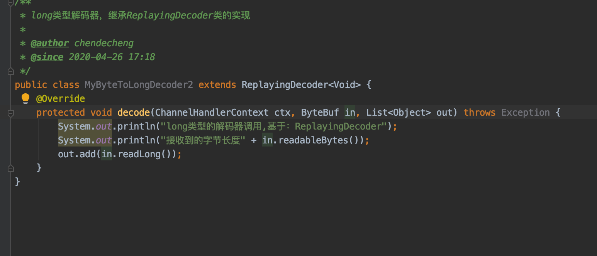

> 可以看到使用跟不使用的主要区别了，主要一点就是我们不用再去理会一些跟解码无关的判断，只需要进行解码操作就行，也是netty抽象出来这个类的原因，简化我们开发的工作

###### 3.2ReplayingDecoder分析

既然这个类在netty中是比较重要的一个存在，那么就来好好读一下这个类的javadoc文档

*ReplayingDecoder是ByteToMessageDecoder* 的一个特殊变种，能够在阻塞IO中进行非阻塞的实现，其中跟默认继承*ByteToMessageDecoder* 最不一样的地方是，我们不需要再去判断接收的字节的长度是否足够，直接获取字节进行解码操作就可以了，就像下面的截图官方demo的两个实现的对比

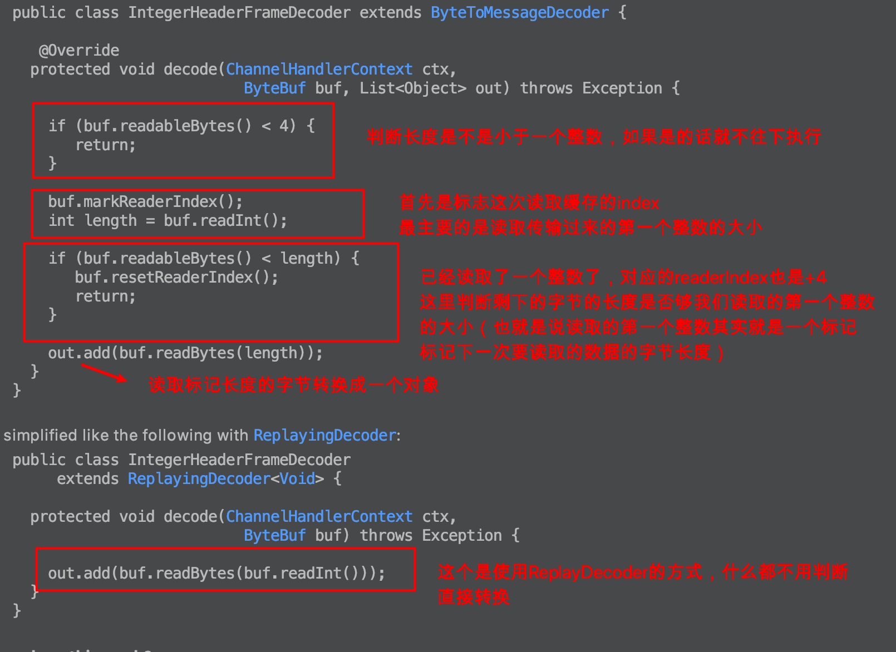

细心一点就会发现，**这里举例也就是第一个不方便的解码器判断，从这里我们可以学到一点东西就是我们自定义协议的实现也是这样一种方式来实现的，首先是读取前面的标识字节，确定下一次读取的内容的长度，这样我们就能确定每次读取的数据是正确的，这个同时也是我们解决粘包拆包的一个思路**

> 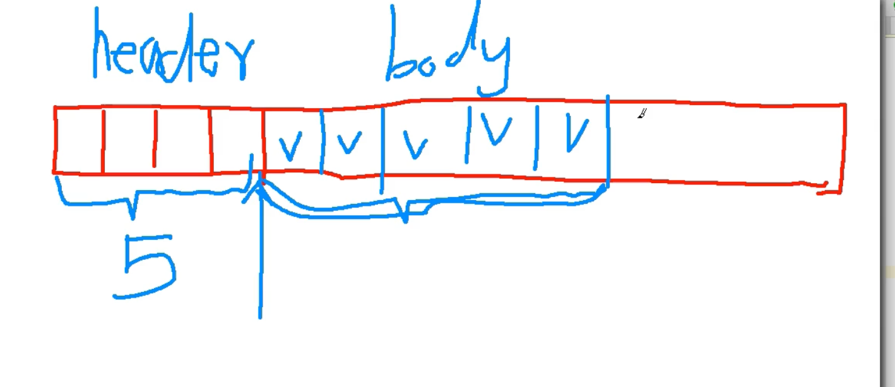
>
> 就跟这个图一样，前面的数据假如头5个字节是后面实际内容的长度描述或者一些额外标注什么的，我们获取到之后，根据数据头的标注来精确获取实际需要接收的数据体，然后将其转成我们要的实际对象，这样就是能确保接收的数据符合要求的，也是我们自定义一个传输协议可以这样做的，数据由协议头+实际数据组成

为什么读取到length之后，判断长度不够会重置索引位置从零开始呢？

> 因为bytebuf会继续接收更多的数据后，再来进行读取操作，不能说不够就将其抛弃了，只是接收更多数据后等待下一次的请求来的时候判断是否够长度，够的话就读取数据

*How does this work?  ReplayingDecoder*是怎么做到不需要我们进行这些长度读的是否足够的判断的呢？

> 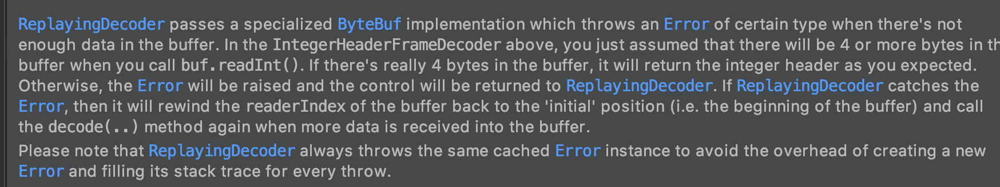
>
> ReplayingDecoder使用的方式就是，接收到第一个整数，然后读取该长度的数据假定为4，如果不够就抛出异常重置索引读取位置，但是这个会被ReplayingDecoder自己捕获然后继续接收数据，直到足够数据之后，再读取出来循环等到读取（通过一个特殊的Bytebuf，还有自定义了一个特殊的异常来处理，其实就是接收数据，如果第一个整数的长度够了就读取该长度的字节往下走，如果不够就抛异常重置ByteBuf，但是这个是自定义的错误，捕捉到之后会继续等待接收更多的数据，直到够了指定的长度，才往下走，等于前面说的一个自旋锁类似，只有满足条件就往下执行，不然就一直等待，就是这么一个原理）

既然使用这么方便，当然是有相对应的不好之处或者说限制，是哪些呢？

> 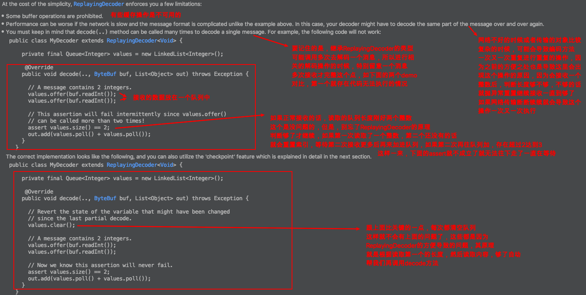

netty是一个追求高性能的框架，所以这种这么影响性能的操作，当然它是不允许的，随后就扔了一个优化后的处理方法出来，用*checkPoint()*方法来锁定我们读取的ByteBuf的索引位置，这样之后，我们第一次读取的时候如果长度够一个整数了，我们就记录下来位置，然后通过枚举或者打一个标签的方式，记录下次读取的时候不需要再读取协议的请求头长度了，直接接着前面读取位置继续读取数据，这样就会减少重复读取数据，就是通过*checkPoint()*来记录读取的缓存位置，下次直接基于已经读取的位置继续往下读

> 再来详细说一下，主要体现的优化在两方面
>
> - 第一个就是如果是单个应用实体的话，我觉得并不会特别明显的优化，主要优化就是记录了数据请求头的长度，下一次进来直接基于原来请求头的长度+标识直接读取内容数据就可以了；
>
> - 第二个优化我觉得是对于大量的或者比较复杂的数据场景，就是一次数据传输不是传输一个对象，而是一个缓存请求传输多个对象，然后一次请求进行多次循环解析，接收多个数据解码多个数据，然后循环加到我们接收数据的List对象中，一个个请求处理器链路（demo没有展示，只是一个自己的个人机遇demo的猜想，是否可以这样处理，很可能是错的）
>
>   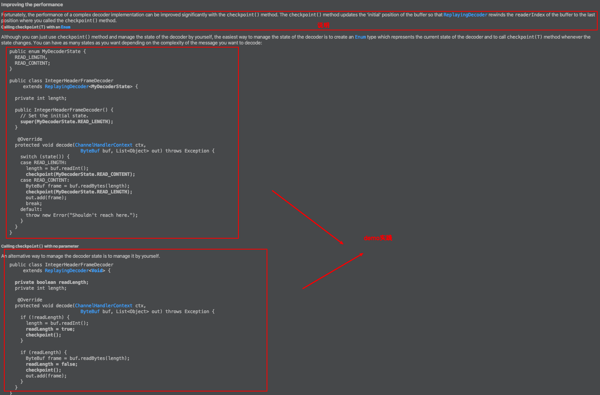

文档最后还提了一下，怎么在pipeline动态替换一个解码器的方式，这个不多说

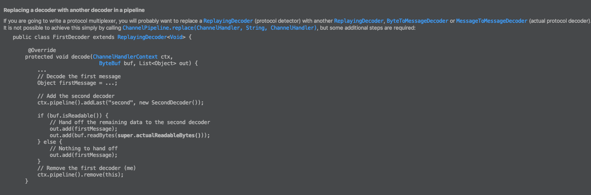

至于ReplayingDecoder的具体实现方式，也就是怎么进行读取第一个整数的长度后，读取内容长度的，然后不够长度是抛异常的对象是哪个？这个异常对象是怎么定义的，是怎么捕捉到这个异常的，捕捉到这个异常后进行了哪些操作？然后是等待接收更多数据的时候是怎么处理的，下一次解码是怎么触发的？等等这个看需求吧如果以后有时间或者用到了可以再去看看源码，基本上就是跟着这几个问题看一下源码，不是很难

### 4.几个比较常用的编解码器介绍

处理上面的那个*ReplyingDecoder*之外，还有一些比较常用的编解码器，其实直接去netty的编解码的包看就可以看到netty内置了一系列的编解码器，当然这是根据不同的使用场景提供的，大部分我们如果不是在对应的业务场景的话基本上都用不着

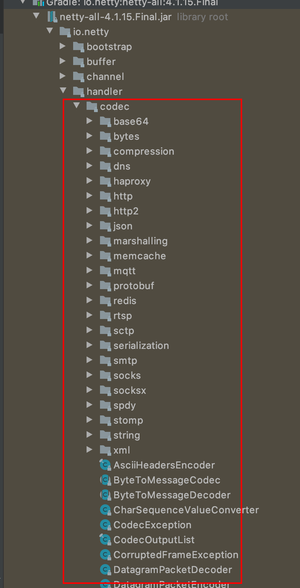

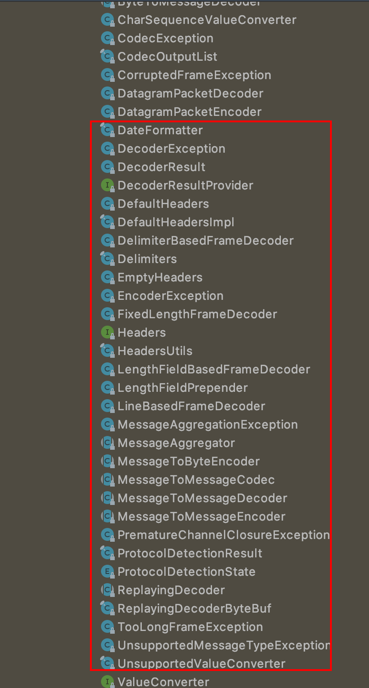

很多都是可以根据名称就能够猜到对应的用处的了，就像*MessageToMessageDecoder*就是将类型转换的解码器，也就是接收到一个对象消息转换成另一个，然后随后就是下一个Handler接收到的消息就是*MessageToMessageDecoder*转换结果的数据，会将转换后的结果对象作为下一个Handler接收的数据入参（就是pipeline流程处理的链式）

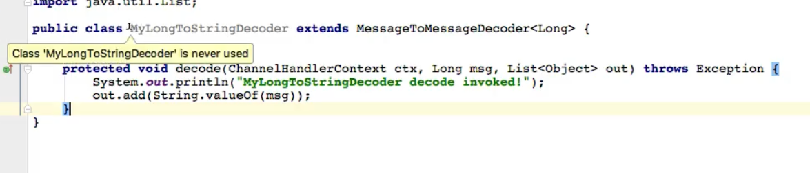

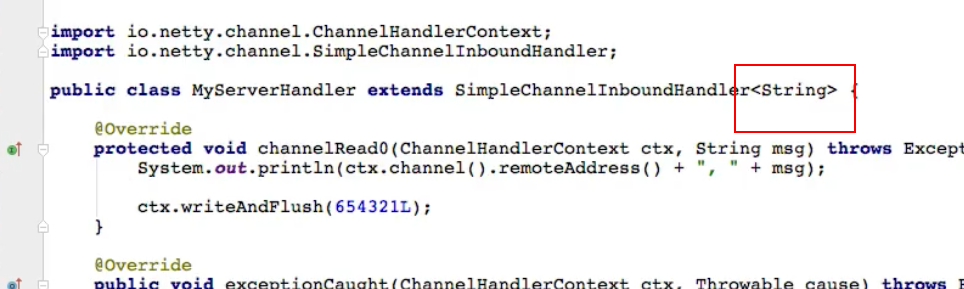

netty内置的还有几个相对比较重要的编解码器如下图，其中最后一个最为重要，在自定义编解码器中使用比较多，建议都去看看官方的javadoc文档了解该对象，这里不细说了，但是强制要求去看一遍那几个解码器

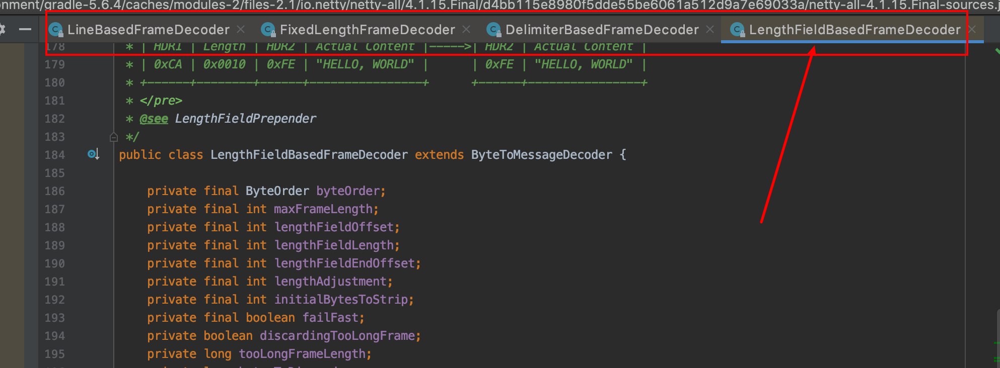

> 现在上面四个解码器是相对比较实用的，或者说比较经典一点的解码器，现在大概说一下其用处，对应文档已经非常清晰了，这里再简单说一下
>
> - *io.netty.handler.codec.LineBasedFrameDecoder* ：就是根据**换行符**进行分隔后对分隔后的结果进行分别分隔后解码，每一行进行一次解码，一换行符确定一次解码的长度
>
> - *io.netty.handler.codec.FixedLengthFrameDecoder* ：这个是**定长解码器**，就是不管传多少数据过来，都是按照固定长度进行分割后然后解码，一次20个字节，构造方法构造了5个字节长度解码成一个对象就会每次切割5个字节解码成我们的目标对象
>
> - *io.netty.handler.codec.DelimiterBasedFrameDecoder* ： 这个是**指定字符**分割解码器，就是我们可以指定一个或者多个字符进行解码结果的切割，每一个指定分割符进行分割的时候，都会解码成一个目标对象，如果是一个的话，就直接根据分隔符切割解码就行，如果两个分隔符呢？就是按照最小粒度进行分割解码，能将获取的字符结果按照最小粒度分割的进行分割，然后解码
>
> - ***io.netty.handler.codec.LengthFieldBasedFrameDecoder*** ：基于**长度标识**的帧解码器，这个相对而言更佳重要一些，使用的场景在于我们自定义协议来进行数据传输的时候，而且数据的请求头使用了长度字段标识后续的实际内容的长度场景（其实就是那篇文章：netty自定义协议一样的，特别简单的协议，一个长度字段标识内容长度，然后后面是实际内容）；
>
>   简单说一下，官方文档的一两个例子，毕竟整个javadoc基本上都是通过举例说明构造方法的几个关键属性的用处
>
>   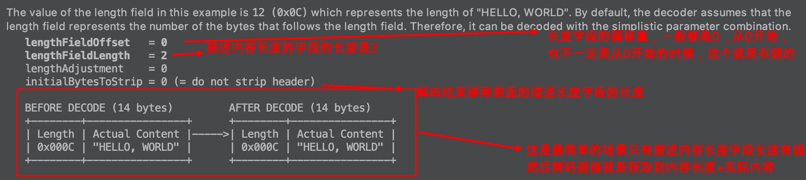
>
>   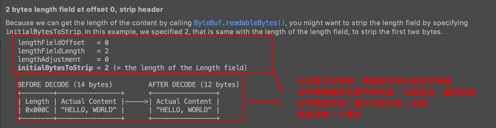
>
>   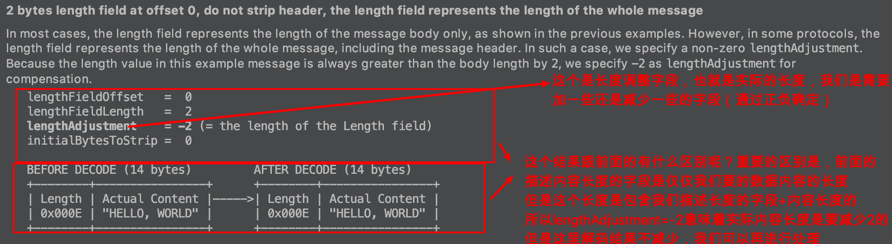
>
>   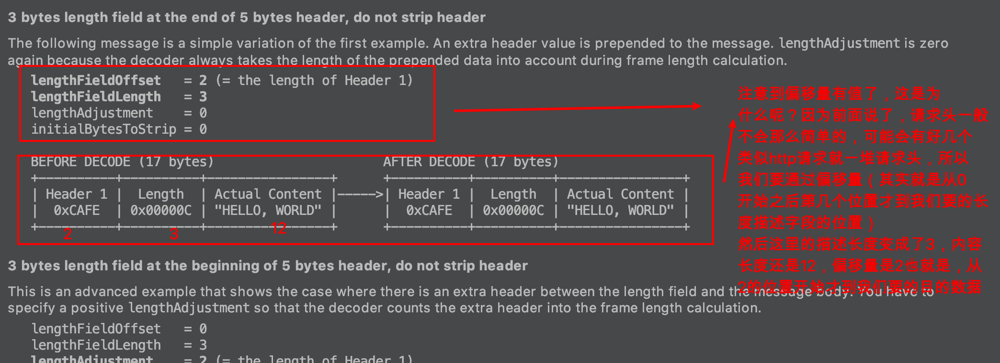
>
>   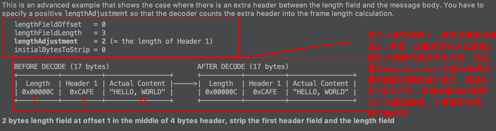
>
>   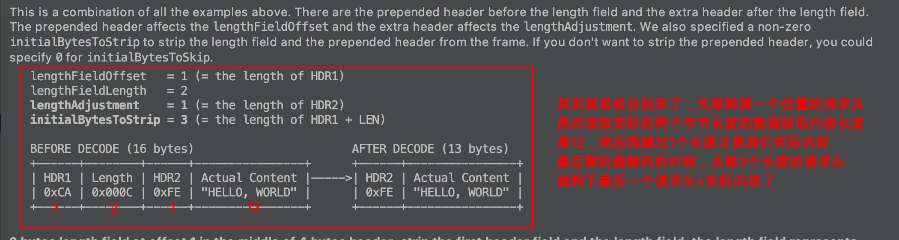
>
>   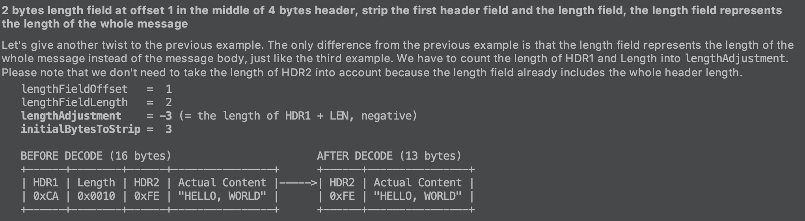
>
>   以上就是官方文档提供的基本上所有能用的场景的所有组合情况了，用好四个属性，然后将该解码器用到我们用一个长度字段描述实际内容长度的协议中基本上可以直接用了，因为四个属性基本上能够组合完了。组合后就剩下我们要的协议描述长度+实际内容，或者全部数据都保留但是能够区分我们要的内容对象了，将其解码出来。如下一个解码demo：
>
>   

更多的编解码器，根据需要的时候去看看netty内置的，喝多情况都是能够实现的了，如果想要自定义协议进行传输的话，就需要自定义编解码器，当然根据前面的*ReplyingDecoder*的一些demo就可以知道该怎么实现一个自定义协议了，主要是数据的前面几个字节存储的是协议数据的长度，然后根据定义的长度读取数据将其用我们自定义的解码器解码成对应的对象，就是这样一个过程（自定义协议这个看另一个文章：***netty自定义协议***）

### 5.netty使用的日志打印

要记住一点就是，我们运行的程序的启动过程以及执行过程做了什么，执行到哪一步，有哪些问题，以及提醒，我们都是可以在程序的日志看出来的，不要遇到问题，**一定一定一定**要先看日志，仔细看日志，不要瞎折腾瞎猜**更不要慌不要慌不要慌**，想要知道程序的整体流程以及运行细节除了可以看源码之外，还可以看程序的打印日志

对于学习netty也是一样的，我们想知道整个netty的启动过程，可以添加日志打印框架log4j引入进来，这样就可以管中窥豹看到启动过程每一步以及运行的时候每一步操作都干了啥，都是可以在日志打印出来的，不然日志有什么用呢？为什么所有好的程序都支持日志打印，都是那么的细致，为什么都说要看日志要支持日志呢？就是因为我们可以在日志中看到很多东西，看到整个程序的运行过程都干了啥，哪里出问题了，再说一次看日志能知道整个程序都干了啥，有啥问题。netty对日志的支持也是非常细致的，我们可以非常详细的看到netty都干了啥，将日志引入netyy的框架，看看整个运行过程netty的输出，引入方式如下图：(ps：以后可以抽空深入分析一下常用的几个日志打印框架)

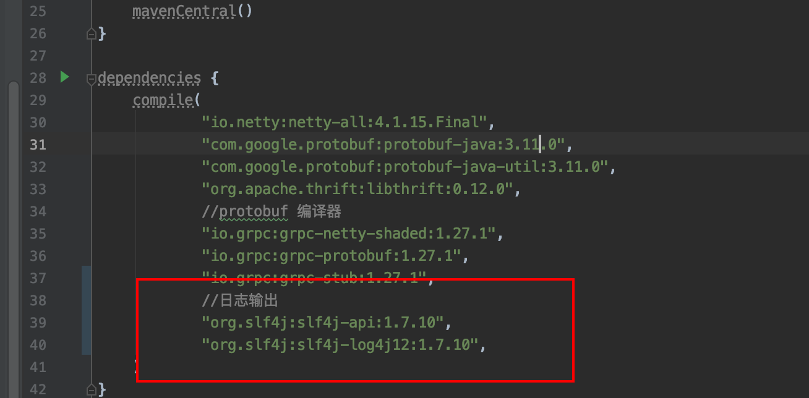

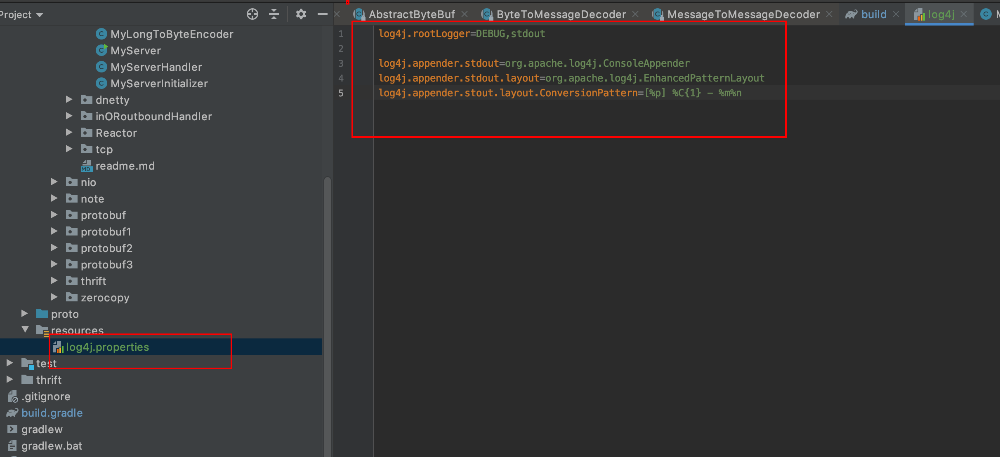

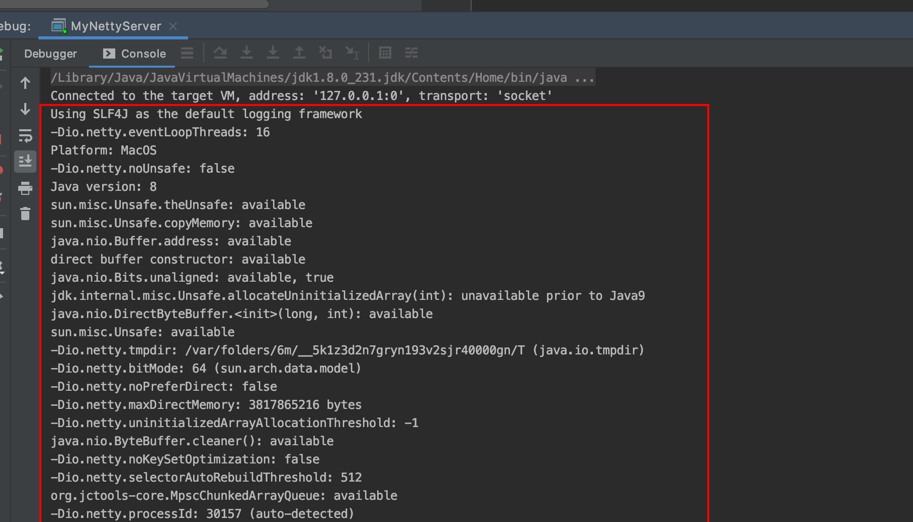

可以看到netty对日志的输出支持也是非常的友好

我们引用的*slf4j*日志框架这个可以理解为日志框架的接口层，对应的log4j是这个接口的底层实现，java日志打印框架还是有几个的，抽空系统整理一下

