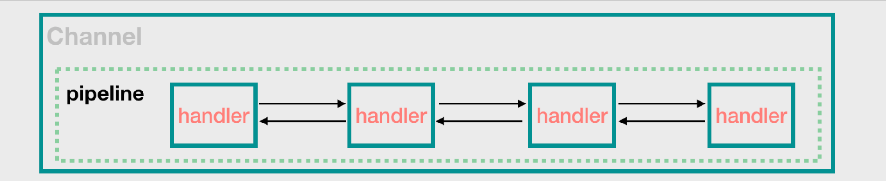
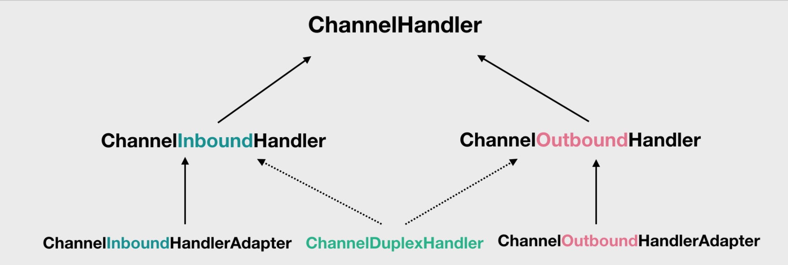
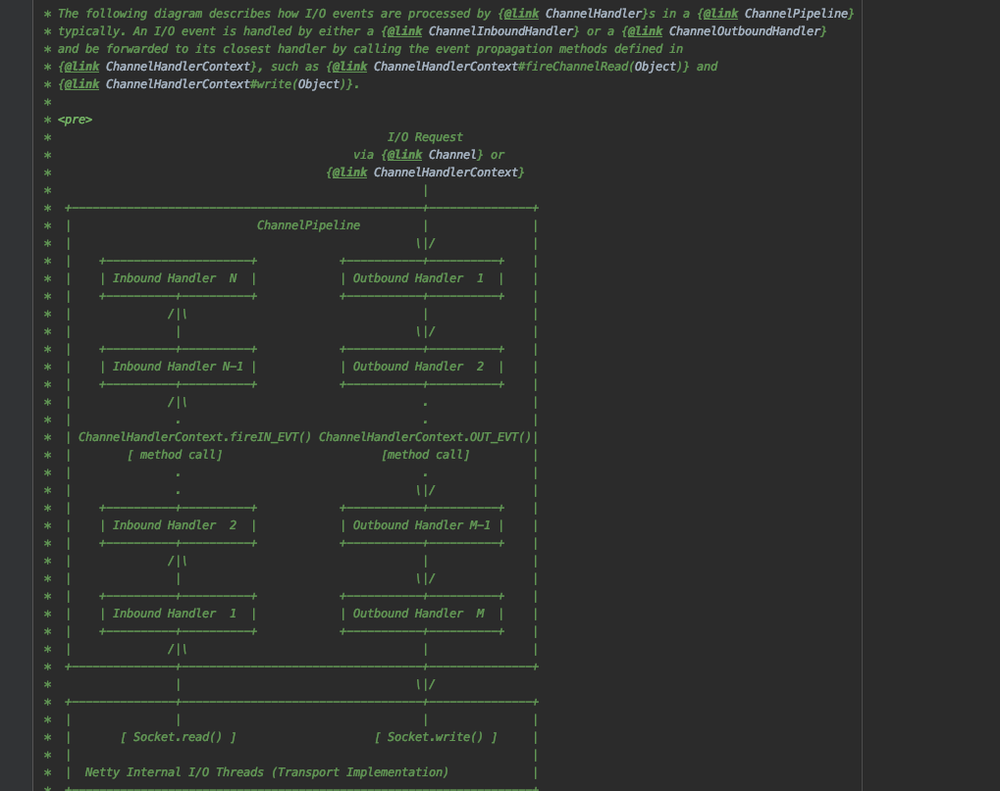
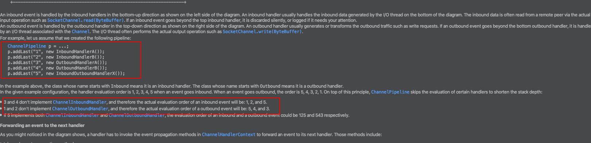
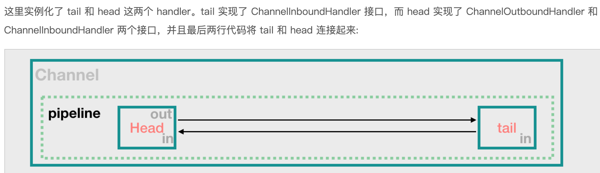

# PipeLine管道

**在netty中，pipeline组件跟也是非常重要的一个组件，类似一个管道的存在，pipeline跟channel是一致的每一个channel创建的时候也会创建一个pipeline管道，管道的使用主要是用来添加handler，然后请求进来就会经过pipeline这个类似拦截器链的对象里面的handler按照顺序执行，底层实现io.netty.channel.ChannelPipeline**



从网上这个图片可以看出，pipeline将所有的handler串联起来，然后有客户端连接进来的时候，就会经过pipeline的所有的handler进行处理

### Pipeline创建

跟入netty的客户端启动的方法ChannelFuture channelFuture = serverBootstrap.bind(7000).sync();我们可以看到在这个方法中io.netty.bootstrap.ServerBootstrap#init，有这样一个方法ChannelPipeline p = channel.pipeline();我们跟进去发现Pipeline是在创建Channel的时候，同时创建的一个通道对象。

然后我们查看ChannelPipeline的源码发现，该对象中有Channel对象的引用，然后Channel中也有Pipeline的引用，所以Pipeline跟channel是一对一的关系，并且在Channel创建的时候也会创建pipeline

还有就是pipeline在创建的时候会有两个默认的handler，一个是tail一个是head，她们在创建后就会相互指定头尾

```java
protected DefaultChannelPipeline(Channel channel) {
    this.channel = ObjectUtil.checkNotNull(channel, "channel");
    succeededFuture = new SucceededChannelFuture(channel, null);
    voidPromise =  new VoidChannelPromise(channel, true);

    tail = new TailContext(this);
    head = new HeadContext(this);

    head.next = tail;
    tail.prev = head;
}
```

### 执行顺序

从上面的图中我们可以看出来，pipeline是一个双向链表，我们加进来的handler是有一定的执行顺序的，但是执行顺序是怎么样的呢，这里就涉及来handler的设计来，所有的handler都继承一个ChannelInboundHandlerAdapter或者ChannelOutboundHandlerAdapter他们的子类，这里就会有一个概念，Inbound以及OutBound，Inbound是指请求进来的的时候进行的处理操作，Outbound是指在服务端回到客户端的过程进行触发的一系列操作



他们的继承关系都是这样的，在pipeline执行对应的handler的时候，他们在pipeline中是有一个标示的，根据入站的顺序执行入站的顺序 ，按照对应的顺序执行。但是添加出站入站handler的时候是可以混着的，看官方对象类的说明





注意添加的handler的添加顺序，以及执行顺序，添加的时候出入栈是可以同时添加的，这个也是我们需要特别注意的，这是我们使用过程相关的

### 初始化准备

我们在初始化pipeline的时候会最终来到DefaultChannelPipeline的对象，然后初始化pipeline的时候会先创建两个固定的出站入站handler

```java
protected DefaultChannelPipeline(Channel channel) {
    this.channel = ObjectUtil.checkNotNull(channel, "channel");
    succeededFuture = new SucceededChannelFuture(channel, null);
    voidPromise =  new VoidChannelPromise(channel, true);

    tail = new TailContext(this);
    head = new HeadContext(this);

    head.next = tail;
    tail.prev = head;
}
```



这样以来，所有的handler都是经过head以及tail的处理，在他们中间进行处理的，我们在项目中是通过一个ChannelInitializer重写它的initChannel()方法，这个方法是在channel注册的时候调用，获取到一个pipeline的对象，然后给pipeline添加我们自定义的活着netty原生的一系列handler

```java
public class MyClientInitializer extends ChannelInitializer<SocketChannel> {
    @Override
    protected void initChannel(SocketChannel ch) throws Exception {

        ChannelPipeline pipeline = ch.pipeline();
        pipeline.addLast(new MyClientHandler());
    }
}
```

### Pipeline事件传输

将一个事件传输到另一个方法的方式，暂时不知道咋用

```java
* <li>Inbound event propagation methods:
*     <ul>
*     <li>{@link ChannelHandlerContext#fireChannelRegistered()}</li>
*     <li>{@link ChannelHandlerContext#fireChannelActive()}</li>
*     <li>{@link ChannelHandlerContext#fireChannelRead(Object)}</li>
*     <li>{@link ChannelHandlerContext#fireChannelReadComplete()}</li>
*     <li>{@link ChannelHandlerContext#fireExceptionCaught(Throwable)}</li>
*     <li>{@link ChannelHandlerContext#fireUserEventTriggered(Object)}</li>
*     <li>{@link ChannelHandlerContext#fireChannelWritabilityChanged()}</li>
*     <li>{@link ChannelHandlerContext#fireChannelInactive()}</li>
*     <li>{@link ChannelHandlerContext#fireChannelUnregistered()}</li>
*     </ul>
* </li>
* <li>Outbound event propagation methods:
*     <ul>
*     <li>{@link ChannelHandlerContext#bind(SocketAddress, ChannelPromise)}</li>
*     <li>{@link ChannelHandlerContext#connect(SocketAddress, SocketAddress, ChannelPromise)}</li>
*     <li>{@link ChannelHandlerContext#write(Object, ChannelPromise)}</li>
*     <li>{@link ChannelHandlerContext#flush()}</li>
*     <li>{@link ChannelHandlerContext#read()}</li>
*     <li>{@link ChannelHandlerContext#disconnect(ChannelPromise)}</li>
*     <li>{@link ChannelHandlerContext#close(ChannelPromise)}</li>
*     <li>{@link ChannelHandlerContext#deregister(ChannelPromise)}</li>
*     </ul>
* </li>
* </ul>
*
* and the following example shows how the event propagation is usually done:
*
* <pre>
* public class MyInboundHandler extends {@link ChannelInboundHandlerAdapter} {
*     {@code @Override}
*     public void channelActive({@link ChannelHandlerContext} ctx) {
*         System.out.println("Connected!");
*         ctx.fireChannelActive();
*     }
* }
*
* public class MyOutboundHandler extends {@link ChannelOutboundHandlerAdapter} {
*     {@code @Override}
*     public void close({@link ChannelHandlerContext} ctx, {@link ChannelPromise} promise) {
*         System.out.println("Closing ..");
*         ctx.close(promise);
*     }
* }
```


### 使用

定义一个服务端handler

```java
public class MyServerHandler extends SimpleChannelInboundHandler<ByteBuf> {
    private int count;

    @Override
    public void exceptionCaught(ChannelHandlerContext ctx, Throwable cause) throws Exception {
        //cause.printStackTrace();
        ctx.close();
    }

    @Override
    protected void channelRead0(ChannelHandlerContext ctx, ByteBuf msg) throws Exception {

        byte[] buffer = new byte[msg.readableBytes()];
        msg.readBytes(buffer);

        //将buffer转成字符串
        String message = new String(buffer, Charset.forName("utf-8"));

        System.out.println("服务器接收到数据 " + message);
        System.out.println("服务器接收到消息量=" + (++this.count));

        //服务器回送数据给客户端, 回送一个随机id ,
        ByteBuf responseByteBuf = Unpooled.copiedBuffer(UUID.randomUUID().toString() + " ", Charset.forName("utf-8"));
        ctx.writeAndFlush(responseByteBuf);

    }
}
```

然后在初始化的ChannelInitializer对象的pipeline中添加

```java
public class MyServerInitializer extends ChannelInitializer<SocketChannel> {

    @Override
    protected void initChannel(SocketChannel ch) throws Exception {
        ChannelPipeline pipeline = ch.pipeline();

        pipeline.addLast(new MyServerHandler());
    }
}
```

当然这里是展示的一个pipeline添加的过程，实际上可以添加很多个，而且还有执行顺序的问题，入站的handler的处理是根据添加的顺序执行的，出站的handler是根据添加handler的顺序的倒序触发的，也就是越早添加越晚执行


### ChannelPipeline初始化一些补充

Pipeline使用了什么模式？

> 拦截过滤器

pipeline是线程安全？

> 是线程安全的，可以随时添加或者删除一个handler

使用业务线程组来执行耗时的io操作？

> ```java
> pipeline.addLast(group, "handler", new MyBusinessLogicHandler());
> ```
>
> 可以通过这个方法来处理io事件处理需要比较长时间的handler，我们指定EventExecutorGroup这样一个业务线程组来处理我们的业务，这样异步的方式用来处理那些io时间比较长的业务，如果短时间的类似编码解码的就没必要使用异步的方式来处理（关于怎么创建EventExecutorGroup这个可以看看接口的需求，以及这个线程组是怎么创建的），这里pipeline只是提供这种业务线程组的方式来处理长时间的io操作

Pipeline更加详细的说明以及使用

> 更加具体的用处以及使用可以看一下源码对象io.netty.channel.ChannelPipeline 的类说明，基本上用途，以及使用，以及一些比较重要的说明都有了

