# Reactor模式

### 拜读Scalable Io in java

netty的最重要的一个设计模式就是Reactor模式，其中Reactor模式的最经典的读物就是java并发包的编写者，也是全球公认的java大神，对于这个名字Doug Lea已经听说过几次，据说这个Scalable Io in Java也是Doug Lea的对Reactor模式的一种诠释

##### 1.请求组成

所有的请求的基本模式都是由以下几个部分组成的：获取到请求，解码数据，处理数据，编码数据，返回给客户端 

##### 2.传统的服务设计的模型


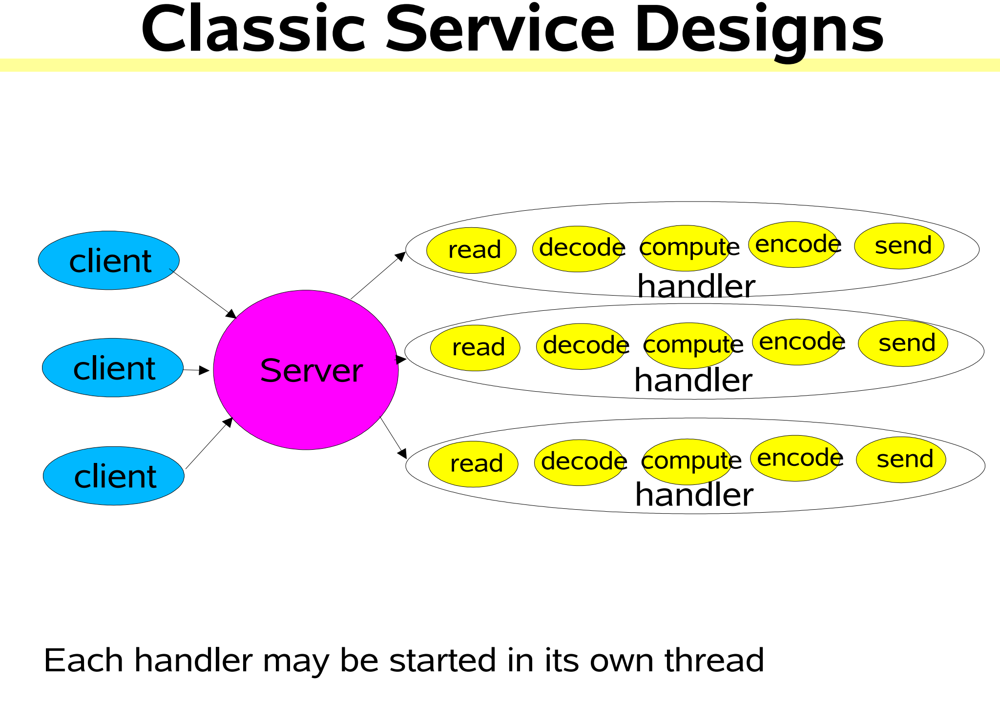

> 在传统模型中，客户端的请求请求过来服务端获取到请求事件，然后创建一个线程去处理该客户端的服务请求，代码实现有点类似使用Bio的请求模式，但是服务端处理的时候每一个请求过来都是创建一个线程去执行相关的业务操作；

##### 3.可伸缩模型的目标

	- 平和的服务降级更多的服务端的时候
	- 通过提升硬件更好的提升服务
	- 可用性以及性能的都要保持

所以分开治理（**Divide and Conquer**）是实现可伸缩这个目标的最好方式,实现这个目标可以通过非阻塞模式以及转发任务去处理我们的io事件

##### 4.事件驱动模式

事件驱动的方式去处理我们的请求，有几个特点

- 不用每一个客户端对应一个线程
- 更少的开销，线程太多执行任务需要不停切换任务，更少的lock操作
- 响应速度会慢一些
- 开发会比较复杂（对比bio的开发跟nio，明显nio更复杂）

##### 5.Reactor 模式

- Reactor 模式这个表达有点不太好说，但是这个不是所说的响应式模式，更多的是转发，或者说是分配模式，主要有用于转发的dispatching将请求转发到非阻塞的handler

- 基本Reactor模式（单线程版本）

  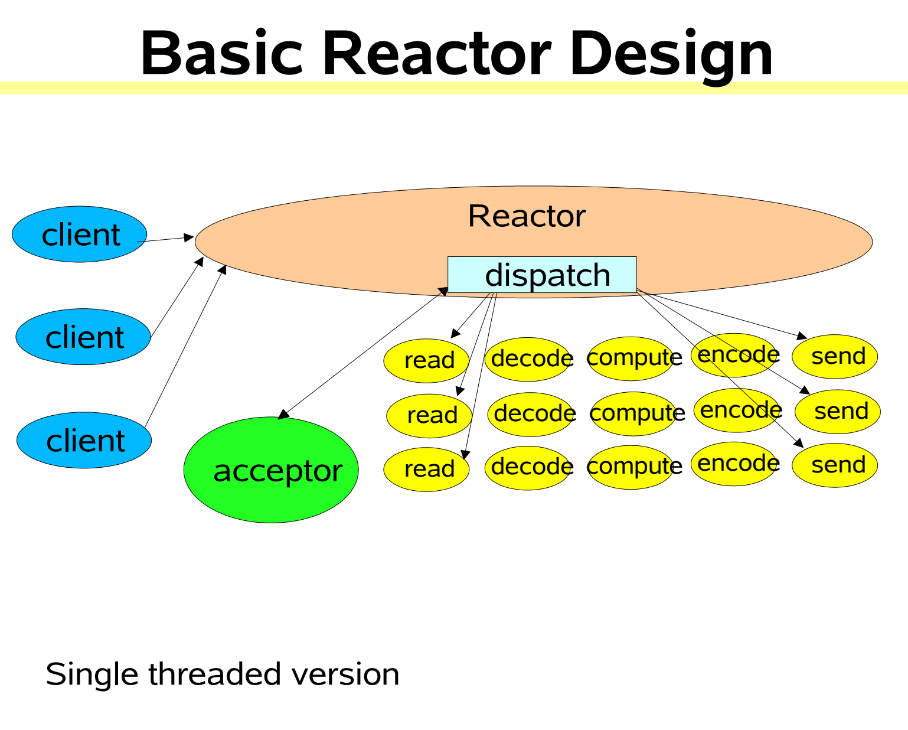

  > 简单说明一下：客户端请求进来，服务端处理根据请求类型去处理该连接类型，是创建连接还是处理业务请求，将该请求分发到一个handler中进行处理，这个处理客户单请求的是个单线程的，handler也是单线程的

- 工作线程的多线程版本

  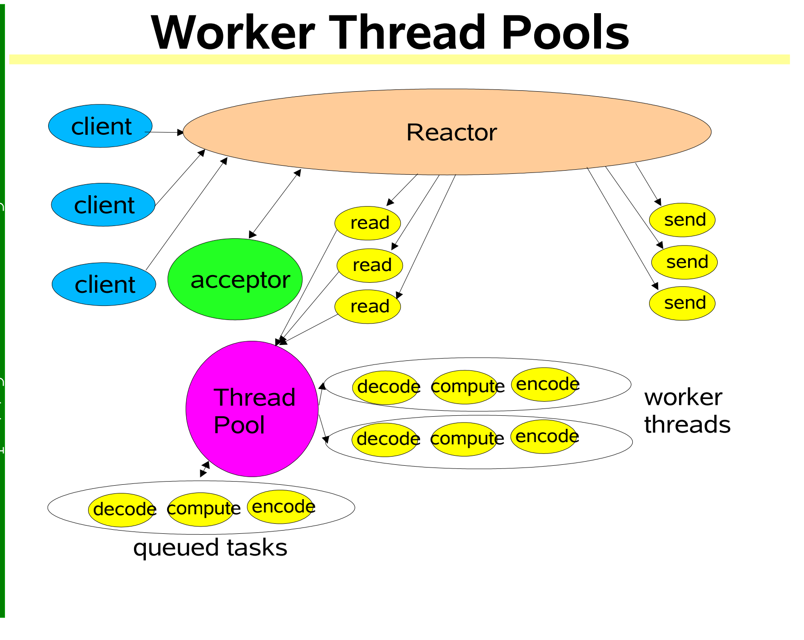

> 多线程的方式，也就是线程池模式，服务端接受到多个客户端的请求，将其分发到一个工作线程池中如果超过线程池的限度就放在对应队列中，然后通过工作线程的线程池进行调用handler来处理我们的任务，这样就会充分利用了线程池的优势，多核处理器的性能（转发可以一个，但是处理业务的handler需要多个线程处理）
>
> 处理任务都是跟事件相关的，Reactor在监听我们的请求事件，有客户端的事件发生我们就进行事件获取然后转发给work thread进行处理

- 多Reactor 线程版本

  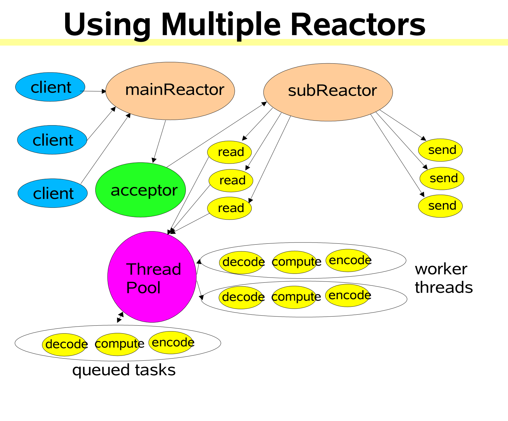

> 这个多Reactor版本，比之前的更加升级了一点，通过一个mainReactor来接受所有的客户端请求，然后将其分转发打Acceptor中，然后Acctpter再将其转发到我们的子类Reactor中，subReactor将请求转发到工作线程池中，跟单Reactor不同的是，单个的要接收所有的请求，不能做一层过滤，在一些设计中mainReactor会处理一些建立连接的请求，然后将read请求通过accrpter转发到subReactor中，然后再转到我们的work thread pool 中，这样的话对于请求的处理更加高效，更好使用cpu等硬件资源

##### 6.总结

文章的主要目的是java 的可伸缩io模式的设计，也就是我们说的Reactor模式的说明，通过java的这个可伸缩模式进行了讲解。从传统模型到Reactor模式，是怎么设计的举例说明（就是java 的nio 使用），最终引出了Reactor模式的整个模型以及我们可以基于这些模型进行一定的优化变种。

这种可伸缩模型，据说，netty中也是大量使用了这种设计模式进行开发设计出来的框架，后续学习留意一下

### 拜读reactor-siemens

**这个论文很长，我只是读了前面理论的前四页，英文差读的很艰难，总体下来大概知道一些意思，后来结合一些文章加上视频才搞懂其中理论，整个文章说了Reactor模式的理论以及它的概念**

##### 1.核心概念

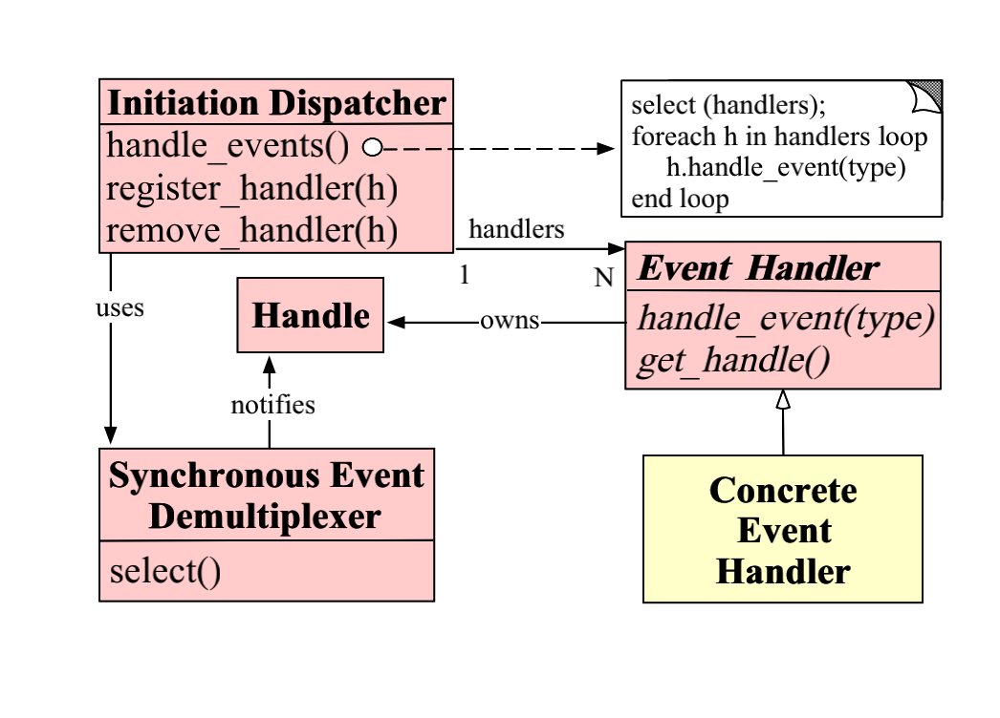

> 看一下上面的图，也是整个Reactor模式的交互流程图也是该论文的核心概念，Reactor的起源了吧，Doug Lea的Scalable Io in java 的关系图跟这个不太一样，但是理念都是一样的，只是有一些变更或者说是扩展。主要的组成都是这几个：Handle，Initiatiion Dispatcher ,Event Handler,Syschronous Event Demultiplexer, Concrete Event Handler

##### 2.构成角色

**Handle：** 这个是系统的资源事件，是操作系统的所有的事件，包括但不限于文件操作，连接操作，接受数据，处理数据，定时器，总之解释操作系统的所有动作主动或者被动接受的，也就是所有事件的发源地。在我们的Reactor模式中，handle通常是指：连接事件，断开连接，接受数据，发送数据等，具体的话在netty中比较常用的都在ChannelInboundHandler或者ChannelOutboundHandler这两个对象的子类的回调方法中。

**Synchronous Event Demultiplexer:** 这个是阻塞等待客户端的连接的同步事件多路并发器，这个操作是需要系统提供支持的，需要系统支持多路并发器才能实现阻塞等待事件，我们代码中只是调用系统的提供的功能；系统提供的系统级别的支持类似linux系统的I/O多路复用机制，例如：select，poll，epoll；在我们的代码中类似NIO的Seletor.select()，阻塞等待事件的到来的操作；

**Initiation Dispatchcer ：** 初始化的分发器，就是我们Recator模式的核心，Dispatcher的用途是用来注册事件，移除事件，还有转发事件的一个组件，经过_Demultuplexer_的等待获取到对应的事件之后，如果是新连接的就将其注册到Dispatcher中，如果是读写事件就根据事件类型通知对应的之前注册的时候创建的对应的事件处理器

**Event Handler：** 特定的接口钩子，用于定义一些（多个）通用的事件的方法定义，然后在发生具体的事件的时候就利用对应的事件的具体方法来处理该事件，就是不同事件的回调方法的接口定义，最终的实现类还是_Concrete Event Handler_ ，在nio中是没有该角色的，需要我们自己根据请求的事件进行判断然后进行处理，在netty中就封装了该方法_ChannelInboundHandlerAdapter_这些对象的子类

**Concrete Event Handler :**  事件处理器的具体实现方法，是_Event Handler_ 的实现类。发生具体的事件的时候，_Dispatcher_ 就会将该事件分发到具体的事件处理器触发该事件的方法的回调业务处理

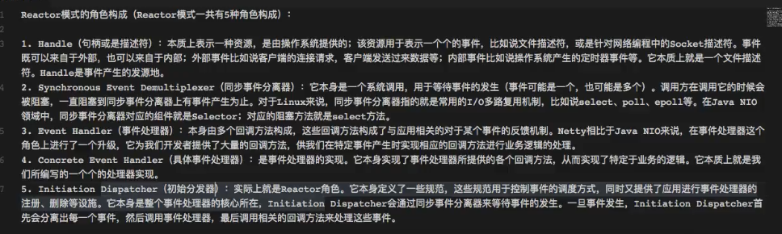

##### 3.处理流程

**通用模型：**

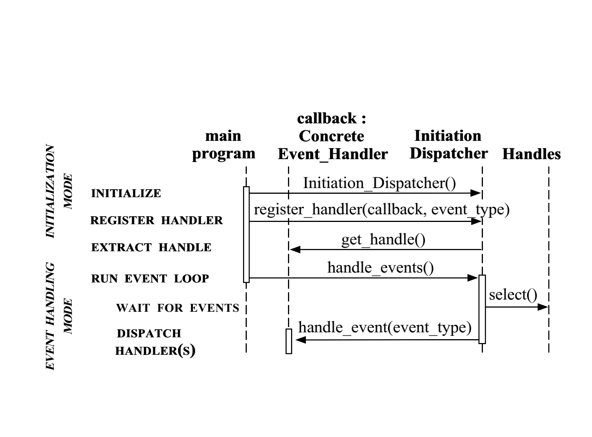

> 1.初始化_Dispatcher_,系统启动的时候启动Dispatcher
>
> 2.将我们的现有的事件处理器根据不同事件的类型注册到dispatcher中，这样的话有事件进入dispatcher的时候可以根据事件的类型定位到不同的event_handler进行回调，等于将对应的handler的关注的事件注册到dispatcher中
>
> 3.dispatcher获取所有的事件处理器的关注的handle，并且将其串联起来，内部具体如何串联的怎么提高效率的每个实现有自己的想法
>
> 4.调用handle_event方法启动Dispatcher的事件循环，等待事件到来，如果有事件发生了，也就是有对应的handle的状态编程ready了，就会通知我们的dispatcher来进行处理
>
> 5.dispatcher根据不同的事件(handle)的类型，调用不用的事件处理器，或者调用对应的事件的对应处理器的不同的回调方法进行相关的业务处理（这个handler可以是我们自己写的也可以是类似netty的内置的方法），最后将结果返回
>
> 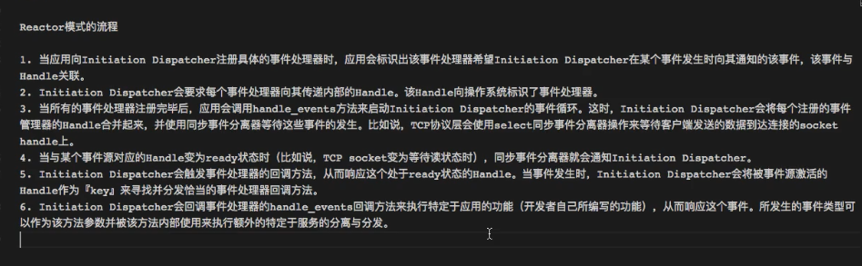

**_展示一些具体的协作场景_**

**客户端第一次连接的过程**

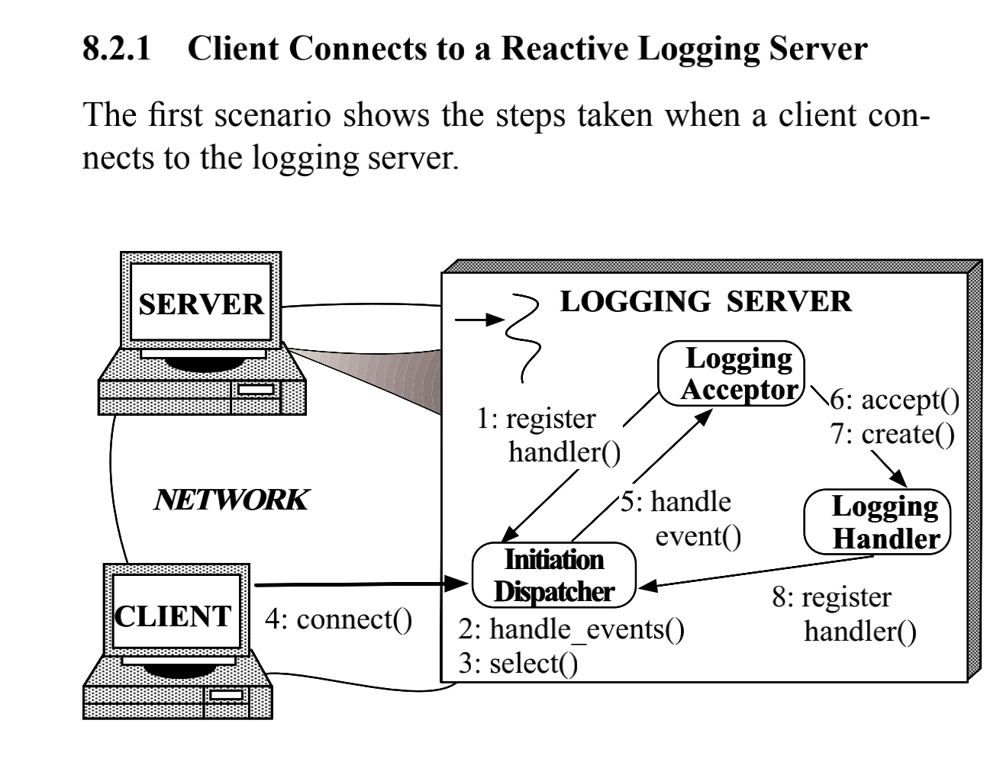

> _其实这个流程就是前面的流程的具体化，前面的理论，理论跟实际实现会有一点点区别的，这里通过这个建立连接以及处理流程将前面的通用模型具体化_ 
>
> 1.服务端将Acceptor注册到Dispatcher中，Acceptor用来处理连接Dispatcher获取的客户端连接请求
>
> 2.通过handle_event()方法初始化启动Dispatcher
>
> 3.Dispatcher通过系统提供的多路并发的方法select()阻塞等到客户端的请求到来
>
> 4.客户端发起第一个请求
>
> 5.Dispatcher通过select()方法获取到客户端的请求，然后经过Dispatcher的判断之后发现是第一次连接然后将其转发到达Acceptor，Acceptor创建对应的handler()（ps：不一定是一个方法，应该是一个channel一个跟客户端对应的通道）
>
> 6.然后在Dispatcher中将该客户端跟关联的handler（channel）关联起来，也就是将客户端channel跟客户端注册到Dispatcher，至此，客户端跟对应的服务端处理的方法或者说对应的处理器（一个或者多个）对应了起来，在nio中就是客户端请求服务端，然后服务端创建了一个对应的SocketChannel，然后将该SocketChannel注册到Selector中，这样下次该客户端请求到来的时候，如果不是连接事件的话，就会获取当前的对应的客户端的socketChannel，然后进行相关业务处理之后，通过该channel返回给客户端；如果在netty中的话，就是类似的，通过在回调方法中能够获取对应的请求客户端的channel，然后进行业务处理，不同的是，netty是对这些事件以及channel进行了封装更佳简化开发

**同一个客户端第二次连接的过程**

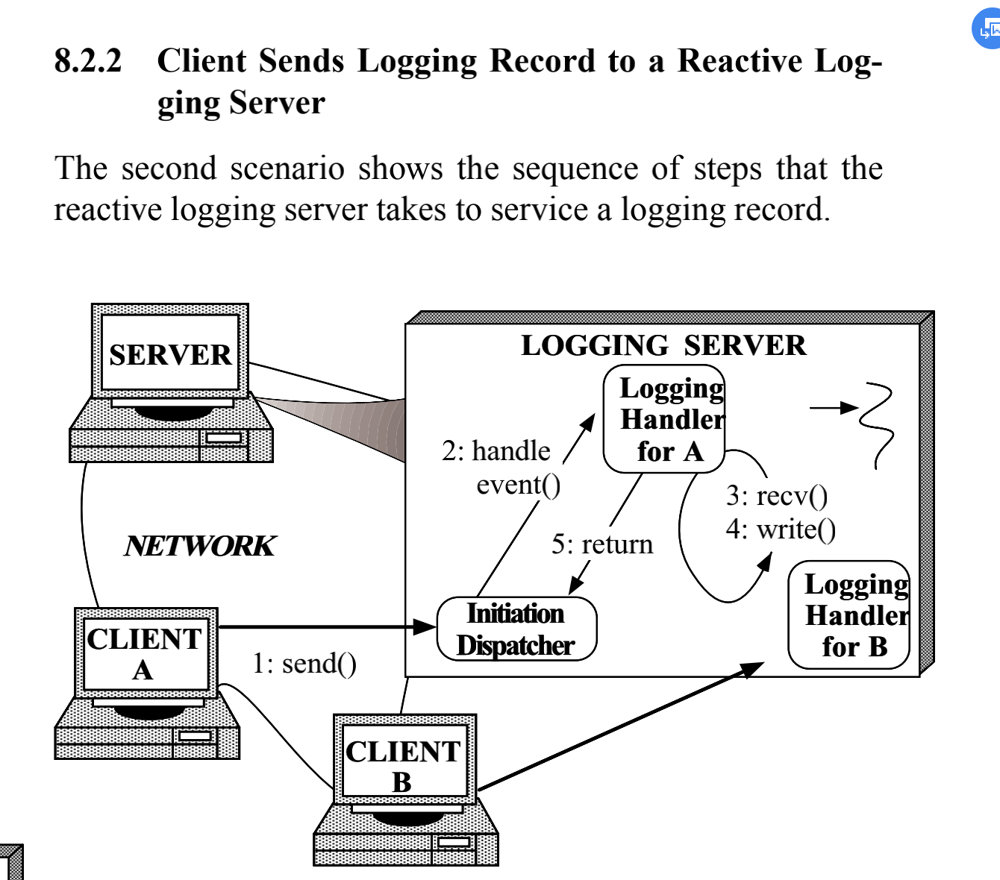

> _对于第二次请求，跟第一次有所区别，主要第一次是一个特殊的事件，是一个连接事件，但是二次请求是一个具体的处理业务的事件，基于原来已经创建的channel进行相关的业务处理_
>
> 1.客户端发起业务相关的请求，对于服务端来说就是发起了一个handle
>
> 2.客户端的Dispatcher获取到该事件之后，进行判断发现是已经注册的channel事件，就将其转发到具体的回调事件处理方法中
>
> 3.服务端跟客户端建立连接之后，就进行相关的业务操作（读取到相关数据，然后将处理结果返回去）
>
> 4.然后对应的具体处理器处理之后，将处理结果返回给Dispatcher，将处理结果通过给Dispatcher，进行回写给客户端或者一些相关的操作

**这就是整个的Reactor模式的处理流程了，这篇文章说的是整个理论的模型，从建立连接到，业务处理的流程；还有说了一下对比传统模型的有点，传统模型就是一个客户端对应一个一个服务端线程这样到一定数量之后反而会成为瓶颈了，所以使用Reactor模式就是将客户端的请求的连接关系都在Reactor管理起来，然后等待客户端的连接，如果有请求就是调用对应的服务端的方法，这样就是不用开特别多的线程了，由事件进行驱动，使用线程池进行管理，提升效率。为什么别人会设计这样一个模式呢？主要是传统模型，单个线程无法处理大并发，然后有了每个客户端对应一个线程，但是这样在数量大的时候也会比较低效，所以就有将连接管理起来，有事件发生采取调用对应的处理，这样保持了并发数量还不用太多的资源消耗，有需求才去启用 **

### Reactor的认识总结

##### 1.Reactor 模式流程

- Reactor模式是由传统的单线程处理模式发展而来的，单线程处理无法满足更多更快的客户端请求了，所以就发展成服务端每一个线程对应一个客户端，最后发展成现在的比较灵活的Reactor模式

- Recator模式比较好的地方在于，它是事件驱动的，然后在Reactor中保存了客户端更对应的handler的关系，只有事件发生服务端检测到之后，才会唤起客户端对应的handler去处理

- 这样一来，我们不需要每一个客户端对应一个服务端的线程，可以一个线程处理多个客户端的请求，如果事件没有发生，服务端的EventLoop在循环等待

- Reactor对比传统模式，在线程数量达到一定数量的时候，更高效，更低能耗，更加解耦，但是使用会更佳复杂，不方便调试，需要一些系统级别的支持，类似linux的I/O多路复用

- 在前面两篇文章中描述的角色有些差异，但是都是一样的原理的

  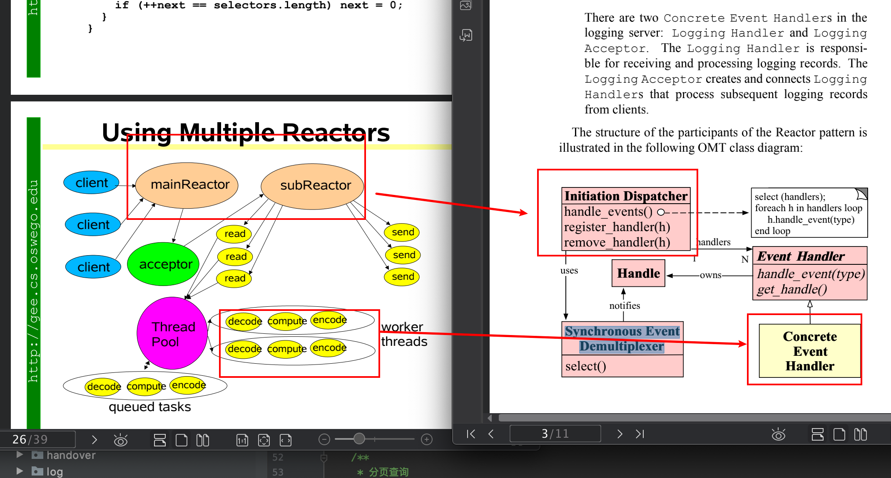

> 两个图的对应关系，看起来不太一样，实际上都是一样的，在Doug Lea中mainReactor 跟subReactor其实都是对应的Initiation Dispatcher，用来接收客户端的请求，在reactor-siemens（简称后：rs）的该途中是一种理论模型，然后Doug Lea（DL）中的进行了一些具体化，DL中所有的请求经过mainReactor之后经过Acceptor之后，就转到了subReactor中，主要是为了更高的并发，mainReactor一般是单线程主要就是处理阻塞获取请求，然后给subReactor中（一般是线程池）处理。都是用来注册客户端跟handler的关系的，第一次连接是建立关系或者初始化的时候就建立关系,还会监听对应的事件对应客户端（或者对应事件发生的时候），进行业务请求的时候就做转发给对应的handler进行处理。然后subReactor尽管是线程池了，但是也是单个线程在处理业务的，这个时候也会存在阻塞，可以再使用业务线程池处理io比较长时间的业务。rs途中的handle就是对应DL中的客户端请求，RS中的Event Handler跟实现类对应的是DL中的所有的subReactor中线程池调用的decode -compute -encode这个过程，然后RS中的Synchronous Event Demultiplexer 的select()对应mainReactor 中封装的同样的类似NIO的Selector.select()这样的方法，在netyy中这个方法也是被封装了，不需要我们自己写了。所以这样以来上面的图就对应上了

##### 2.nio中的各个对应角色

- _Handle_这个在nio中的阻塞获取事件的时候SelectionKey里面的一个方法返回值，但是我们nio操作的时候只是做了两种情况的判断，是不是Accepto以及是不是read两种方式

- ```java
  SelectionKey next = keyIterator.next();
  
  //当前的SelectionKey如果是连接事件，注意Acceptable是指连接事件，read是读取事件，write是写入事件
  if (next.isAcceptable()) {}
  //如果是读取的事件
  if (next.isReadable()) {}
  ```

- _Synchronous Event Demultiplexer_ 这个对应nio的Selector.select()这个方法，阻塞等待客户端的事件发生

- _initiation Dispatcher_ 这个在nio中是Selector的存在，我们的服务端的会根据客户端的请求进行创建对应的socketChannel然后注册在selector中，客户端进行业务请求的时候，selector根据对应的类型，获取到对应客户端channel进行数据业务的交互；

- _Event Handler_ 这个在nio中也是没有的，nio中没有抽象的对应的回调方法的接口，但是在netty中就完全根据这个方式进行了封装

- _Concrete Event Handler_ 这个在nio的代码中也是没有对应的组件抽象的，我们是根据事件类型，然后进行对应的处理方式，要么创建连接要么就是读物数据处理

##### 3.Netty中各个对应组件

- _Handle_就是客户端请求的事件，各种事件，连接，超时，注册，活跃...

- _initiation Dispatcher_ 这个主要就是对应了netty的主线程跟工作线程，更多的是根据扩展后的Doug Lea的模型图的方式mainReactor跟subReactor

  ```java
  EventLoopGroup bossGroup = new NioEventLoopGroup(1);
  EventLoopGroup workerGroup = new NioEventLoopGroup();
  ```

- _Synchronous Event Demultiplexer_ 这个的话，在netty中也是在服务端启动的时候调用bind()方法中就已经启动了，在阻塞等待客户端的事件到来，除此之外bind()的时候还会初始化了Acceptor()，等用来处理客户端的请求的方法
- _Event Handler_ 这个在netty中就有比较具体的实现了，我们自定义或者netty中定义的各种handler都是ChannelInboundHandlerAdapter 或者 ChannelOutboundHandlerAdapter的子类，这个接口或者他们的父接口就是对应Event Handler的存在
- _Concrete Event Handler_ （具体的事件处理器）这个的话，就是一个个我们ChannelInboundHandlerAdapter 或者 ChannelOutboundHandlerAdapter的实现类了，我们自定义的各种实现，会将其加在我们的处理链pipeline中

**netty是Reactor模式的具体实现，整个框架都是基于Reactor的理论进行实践的，所以需要理解该模式理论才能更好的了解netty的设计以及为何这样设计，理解了设计方向才能知道为什么这样做，以及这样做有什么好处，不然没法了解框架的原理**

具体的学习参考了一下这篇文章 [reactor模式详解](http://www.blogjava.net/DLevin/archive/2015/09/02/427045.html)，更多的是张龙的视频，以及前面的两篇文章


