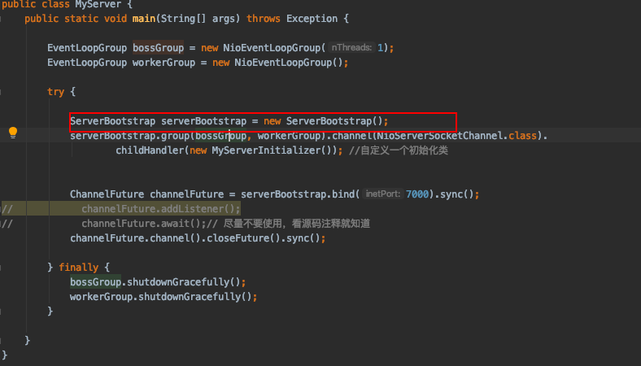
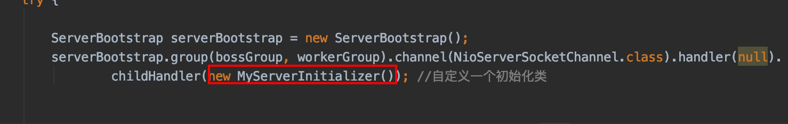

# ServerBootstrap

**类对象的描述就已经非常清晰了，是Bootstrap的相似类用于引导启动ServerChannel，提供的方法就是用来方便启动ServerChannel的，其提供了很多启动相关的方法**



### ServerBootstrap实例化

```java
ServerBootstrap serverBootstrap = new ServerBootstrap();
```

ServerBootstrap的实例化做的事情非常简单，就是简单实例化

### ServerBootstrap.group()

```java
serverBootstrap.group(bossGroup, workerGroup).channel(NioServerSocketChannel.class).
        childHandler(new MyServerInitializer()); //自定义一个初始化类
```

看一下这个编程方式，是现在比较多程序实现的方式“链式编程”，每个方法操作之后返回当前类对象，这样通过当前对象可以再去执行下一个类方法；

说回group()方法，这个方法也是比较简单，将前面的EventLoopGroup初始化的对象boosGroup赋值给AbstractBootstrap的变量参数，将workGroup赋值给ServerBootstrap对象，然后用于后面的调用

### ServerBootstrap.channel()

channel()方法是ServerBootstrap的父类AbstractBootstrap定义的方法，这个方法的目的是：通过反射的方式创建一个NioServerSocketChannel的线程工厂，然后初始化在AbstractBootstrap的变量中，然后后面想要使用NioServerSocketChannel的对象的时候，通过ChannelFactory的子类的newChannel()方法即可获取到NioServerSocketChannel对象

需要说一下的是，这里通过反射方式来创建NioServerSocketChannel对象，然后这里需要我们去了解一下NioServerSocketChannel的无参构造方法，该构造方法是在反射的时候创建对象使用


从这个无参构造方法得知，NioServerSocketChannel的构造方法是通过这个方法SelectorProvider.provider().openServerSocketChannel()来创建了一个ServerSocketChannel，有没有很熟悉，这个就是我们使用nio创建服务的时候，服务端的channel

```java
/**
 * Create a new instance using the given {@link ServerSocketChannel}.
 */
public NioServerSocketChannel(ServerSocketChannel channel) {
    super(null, channel, SelectionKey.OP_ACCEPT);//注意这里
    config = new NioServerSocketChannelConfig(this, javaChannel().socket());
}
```

这里深入进去，就是对nio的ServerSocketChannel的注册，深入进去就是将这里创建的NioServerSocketChannel注册到Selector中，而且是“SelectionKey.OP_ACCEPT”这种方式，也就是服务端接受请求的channel，对比下图的nio的服务端接受连接的注册事件


上面的这些注册相关的变量准备，都在io.netty.channel.nio.AbstractNioChannel这个对象中来，后面通过该对象的方法调用io.netty.channel.nio.AbstractNioChannel#doRegister方法来进行注册到Selector中，调用这个注册方法的地方在io.netty.channel.AbstractChannel.AbstractUnsafe#register0中，这个后面留意一下在什么时候触发的方法

### serverBootstrap.childHandler()/handler()

```java
serverBootstrap.group(bossGroup, workerGroup).channel(NioServerSocketChannel.class).handler(null).
        childHandler(new MyServerInitializer());
```

前面准备了那么多，这里继续为启动做准备，跟进去这个方法可以得知，这里也是给ServerBootstrap的变量ChannelHandler赋值（io.netty.bootstrap.ServerBootstrap#childHandler(io.netty.channel.ChannelHandler)），这里是ChannelInitializer的子类，用来获取ChannelPipeline然后添加我们自定义的Handler的，ChannelInitializer其实也是一个Handler同样是入栈ChannelInboundHandlerAdapter的子类，这个在启动时候就添加，然后再用来添加我们自定义的handler。

除了可以使用childHandler()方法添加处理器，还可以使用handler()添加父类处理器，这个都是类似的做法，给对应的对象赋值，只是childHandler的是给工作线程也就是workGroup添加的，handler是个bossGroup接收线程添加的，handler的handler添加在AbstractBootstrap这个对象中。

根据前面的一些方法变量赋值，大概可以知道，boss线程的变量值都是赋给AbstractBootstrap的，而工作线程的值是赋给ServerBootstrap的；

关于这个处理器的初始化对象类，后面应该还会继续单独或者结合启动等，进行一下说明，这个是在bind()启动的时候会初始化一个默认的handler，然后去添加我们的自定义handler



## serverBootstrap.bind()服务端启动

**这个特意用二级标题标示一下，因为这个方法是netty的启动方法，里面会使用我们前面准备的那些参数，那些对象的变量赋值，都是为了这一步启动做的准备**

```java
final ChannelFuture initAndRegister() {
    Channel channel = null;
    try {
        channel = channelFactory.newChannel();//前面的channel(NioServerSocketChannel.class)初始化的一个NioServerSocketChannel反射生成工厂，创建对应的实例
        init(channel);//进行一系列的初始化channel工作
    } catch (Throwable t) {
        if (channel != null) {
            // channel can be null if newChannel crashed (eg SocketException("too many open files"))
            channel.unsafe().closeForcibly();
        }
        // as the Channel is not registered yet we need to force the usage of the GlobalEventExecutor
        return new DefaultChannelPromise(channel, GlobalEventExecutor.INSTANCE).setFailure(t);
    }
          ChannelFuture regFuture = config().group().register(channel);
        if (regFuture.cause() != null) {
            if (channel.isRegistered()) {
                channel.close();
            } else {
                channel.unsafe().closeForcibly();
            }
        }

// ....
        return regFuture;
    }
```

上面的init(channel)方法，实际调用的是SeverBootstrap.java的init方法，主要做的工作是初始化我们接收线程的一系列初始化方法，类似设置对应的channelOption的相关属性，之前准备的一些相关的属性等，但是这都是比较次要的最主要的是创建了一个ChannelPipeline对象，这个对象是在channel中获取的，然后在该pipeline管道中我们创建一个ChannelInitializer对象（这个实际就是一个ChannelInboundHandlerAdapter），将之前准备的给boss线程处理的handler加载进来如果有的话，然后给该boss线程的管道pipeline添加一个服务接收器ServerBootstrapAcceptor，主要目的是用来接收客户端的请求，然后通过childHandler，以及workEventLoopGroup去处理请求；服务端的boss线程会自动创建一个ChannelInitializer来处理添加的handler，工作线程的需要我们手动写一个初始化ChannelInitializer对象，然后重写initChannel()方法，该方法会在注册的时候被调用，然后返回一个当前的实例

 ChannelFuture regFuture = config().group().register(channel);然后到这里将channel注册到EventLoop中，返回一个future的字对象，异步获取注册结果；

#### ChannelPipeline创建

在上面ServerBootstrap对象中创建Pipeline对象的时候，创建的对象是：DefaultChannelPipeline，我们进去DefaultChannelPipeline对象中看看

```java
protected DefaultChannelPipeline(Channel channel) {
    this.channel = ObjectUtil.checkNotNull(channel, "channel");
    succeededFuture = new SucceededChannelFuture(channel, null);
    voidPromise =  new VoidChannelPromise(channel, true);

    tail = new TailContext(this);
    head = new HeadContext(this);

    head.next = tail;
    tail.prev = head;
}
```

这里的tail其实是一个ChannelInboundHandlerAdapter的子类，head是ChannelOutboundHandler, ChannelInboundHandler的子类，所以这里会处理我们pipeline添加的handler的入站以及出站的相关处理；

