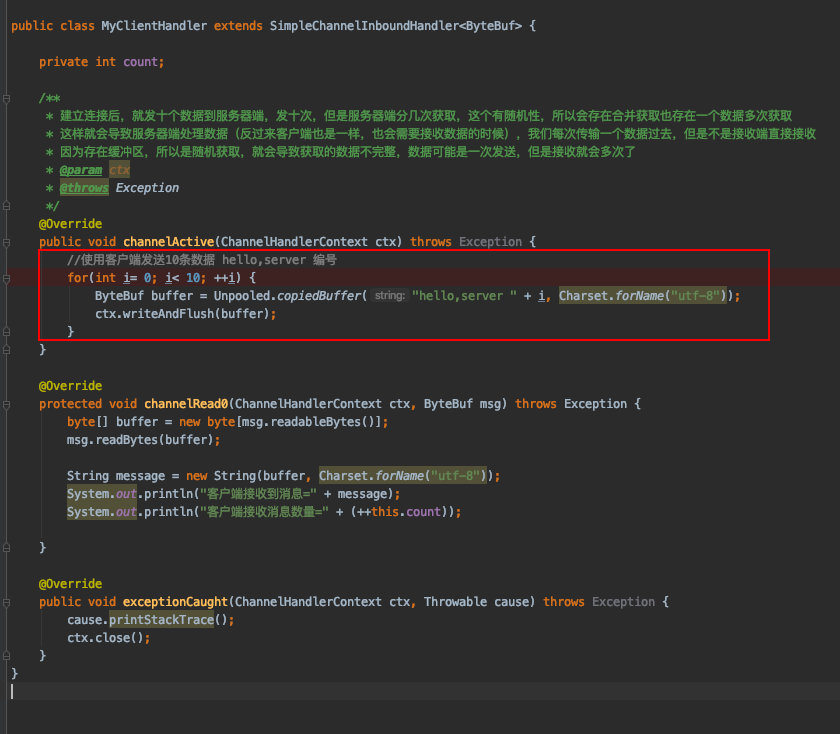
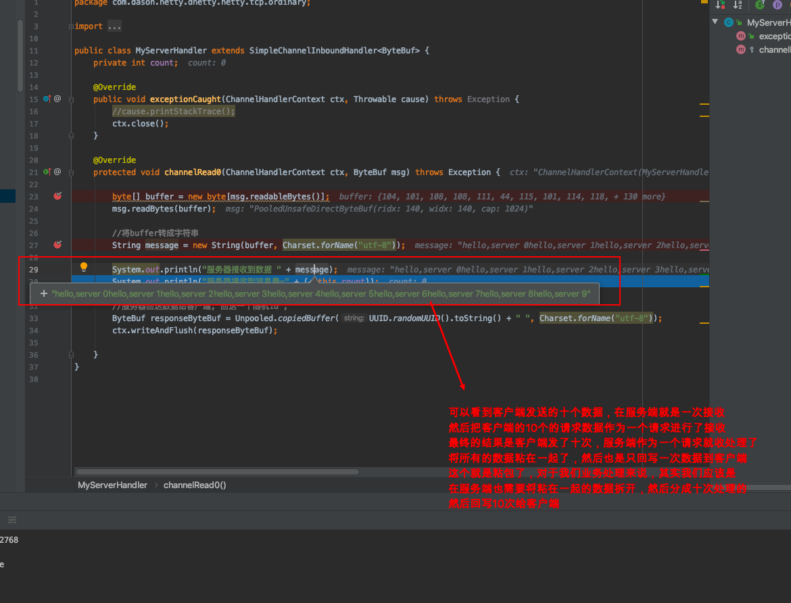

# netty自定义协议

## 一.自定义协议demo

**其实应该是自定义协议+编解码器的，因为自定义的传输协议少不了也不能少了对应的协议的编解码器**

这里举例说明的是一个非常简单的例子，跟实际上的自定义协议区别很大，不仅是协议内容还是协议的各种条件的判断，这里的demo只是说明自定义协议，没有过多的严谨性的处理。更多的是对自定义协议的了解，知道这样一件事，以及是怎么实现了，例如：自定义的协议对象是怎么样的？请求的时候一次请求是怎么组装一个协议对象的？我们应该怎么定义编解码器对自定义进行处理？以及在实际中是怎么使用的？

### 1.netty服务器以及客户端创建

```java
/**
 * 自定义协议服务端服务
 *
 * @author chendecheng
 * @since 2020-05-02 11:42
 */
public class ProtocolServer {

    public static void main(String[] args) {
        EventLoopGroup bossGroup = new NioEventLoopGroup(1);
        EventLoopGroup workGroup = new NioEventLoopGroup();

        try {
            ServerBootstrap serverBootstrap = new ServerBootstrap();
            serverBootstrap.group(bossGroup, workGroup).channel(NioServerSocketChannel.class).
                    childHandler(new ProtocolServerInitializer());
            ChannelFuture channelFuture = serverBootstrap.bind(8080).sync();
        } catch (InterruptedException e) {
            bossGroup.shutdownGracefully();
            workGroup.shutdownGracefully();
        }
    }

}
```

```java
/**
 * 自定义协议客户端
 *
 * @author chendecheng
 * @since 2020-05-02 11:42
 */
public class ProtocolClient {

    public static void main(String[] args) {
        EventLoopGroup group = new NioEventLoopGroup();

        try {
            Bootstrap bootstrap = new Bootstrap();
            bootstrap.group(group).channel(NioSocketChannel.class).handler(new ProtocolClientInitializer());
            ChannelFuture channelFuture = bootstrap.connect("localhost", 8080).sync();
            channelFuture.channel().closeFuture().sync();
        } catch (InterruptedException e) {
            group.shutdownGracefully();
        }
    }

}
```

### 2.处理器添加进handler

```java
/**
 * 客户端handler添加初始化对象
 *
 * @author chendecheng
 * @since 2020-05-02 11:43
 */
public class ProtocolClientInitializer extends ChannelInitializer<SocketChannel> {

    @Override
    protected void initChannel(SocketChannel ch) throws Exception {
        ChannelPipeline pipeline = ch.pipeline();
        pipeline.addLast(new ProtocolDecoder());
//        pipeline.addLast(new ProtocolClientHandler());
        pipeline.addLast(new ProtocolEncoder());
        pipeline.addLast(new ProtocolClientHandler()); //这里再次验证了一点就是，将其放在最后，是不可行的，也就是pipeline的
        // 最后一个添加的handler必须是入栈处理器，就像将其pipeline.addLast(new ProtocolEncoder()); 前面的话是无法执行的，整个链路就出问题了
    }

}
```

```java
/**
 * 服务端handler添加初始化对象
 *
 * @author chendecheng
 * @since 2020-05-02 11:44
 */
public class ProtocolServerInitializer extends ChannelInitializer<SocketChannel> {

    @Override
    protected void initChannel(SocketChannel ch) throws Exception {
        ChannelPipeline pipeline = ch.pipeline();
        pipeline.addLast(new ProtocolDecoder());
        pipeline.addLast(new ProtocolEncoder());
        pipeline.addLast(new ProtocolServerHandler());
    }

}
```

### 3.自定义协议对象

```java
/**
 * 自定义的协议对象
 *
 * @author chendecheng
 * @since 2020-05-02 11:19
 */
//@Data
public class MyProtocol {

    private int contentLength;

    private String body;

    public int getContentLength() {
        return contentLength;
    }

    public void setContentLength(int contentLength) {
        this.contentLength = contentLength;
    }

    public String getBody() {
        return body;
    }

    public void setBody(String body) {
        this.body = body;
    }
}
```

### 4.编解码器实现

```java
/**
 * 协议解码器
 *
 * @author chendecheng
 * @since 2020-05-02 11:40
 */
public class ProtocolDecoder extends ByteToMessageDecoder {
    @Override
    protected void decode(ChannelHandlerContext ctx, ByteBuf in, List<Object> out) throws Exception {
        //解码数据，但是这里其实是最简单的情况，只有两个数据前面是数据长度，后面内容是数据，实际上的解码，请求头等会有一系列的标识的
        //不会这么简单的，而且还有一点就是，这里获取到ByteBuf直接读取数据了，实际上不能这样的，这样太不严谨了，很容易出错的
        //应该有一系列的判断，判断长度够不够，标识对不对，进行数据读取的时候有很多业务强壮型的判断才合理，这里都没有
        int contentLength = in.readInt();
        CharSequence body = in.readCharSequence(contentLength, Charset.forName("utf-8"));

        MyProtocol myProtocol = new MyProtocol();
        myProtocol.setBody(body.toString());
        myProtocol.setContentLength(contentLength);
        out.add(myProtocol);
    }
}
```

```java
/**
 * 协议编码器
 *
 * @author chendecheng
 * @since 2020-05-02 11:41
 */
public class ProtocolEncoder extends MessageToByteEncoder<MyProtocol> {
    @Override
    protected void encode(ChannelHandlerContext ctx, MyProtocol msg, ByteBuf out) throws Exception {
        out.writeInt(msg.getContentLength());
        out.writeCharSequence(msg.getBody(), Charset.forName("utf-8"));
    }
}
```

### 5.简单的服务端以及客户端的handler

```java
/**
 * 客户端处理器
 *
 * @author chendecheng
 * @since 2020-05-02 12:31
 */
public class ProtocolClientHandler extends SimpleChannelInboundHandler<MyProtocol> {

    /**
     * 客户端跟服务端建立连接后触发的方法
     * @param ctx
     * @throws Exception
     */
    @Override
    public void channelActive(ChannelHandlerContext ctx) throws Exception {
        MyProtocol myProtocol = new MyProtocol();
        myProtocol.setBody("zhagnzhen");
        myProtocol.setContentLength(myProtocol.getBody().length());
        ctx.writeAndFlush(myProtocol);
    }

    @Override
    protected void channelRead0(ChannelHandlerContext ctx, MyProtocol msg) throws Exception {
        System.out.println("获取的协议的长度是：" + msg.getContentLength());
        System.out.println(msg.getBody());
    }

    @Override
    public void exceptionCaught(ChannelHandlerContext ctx, Throwable cause) throws Exception {
        cause.printStackTrace();
        ctx.close();
    }
}
```

```java
/**
 * 服务端处理器
 *
 * @author chendecheng
 * @since 2020-05-02 12:32
 */
public class ProtocolServerHandler extends SimpleChannelInboundHandler<MyProtocol> {
    @Override
    protected void channelRead0(ChannelHandlerContext ctx, MyProtocol msg) throws Exception {
        System.out.println("获取的协议的长度是：" + msg.getContentLength());
        System.out.println(msg.getBody());
        ctx.writeAndFlush(msg);
    }

    @Override
    public void exceptionCaught(ChannelHandlerContext ctx, Throwable cause) throws Exception {
        cause.printStackTrace();
        ctx.close();
    }
}
```

## 二.自定义协议的粘包拆包

这个粘包拆包问题在netty中是一定会出现的，如果我们使用自定义协议进行处理我们的相关业务的话甚至一些既有的通讯协议也可能需要我们处理这个问题，因为netty是一个比较底层的框架，不像springMVC以及struts2这些框架一样是一个高层次的的封装框架，所以网络传输会出现的问题netty中其实也不可避免的会出现，这个不是netty的问题而是网络通信会出现的问题（netty目的就是通讯，性能很高扩展性很强，所以那些无关的封装判断netty就没有处理，需要我们手动处理）

### 1.粘包拆包问题展示

问题具体表现：

> 就是客户端多次发送的数据会随机的组合成一次或者多次被服务端接受，例如客户端是发送了10个*i love you* 到了服务端，可能接接收的的是：*i love you i love you i love you i love you i love you i love you*作为一次接收，服务端不能区分到底是几次发送的然后就分几次处理，这个就是粘包了

因为netty的请求的的整个框架都是一样的，就不都全粘贴代码出来了，就粘贴能展示问题的客户端跟服务端的handler好了，因为剩下的几个类都是基本上一样的都是netty的框架结构代码

客户端发送数据handler，图片是客户端跟服务端建立连接后遍历发送了10个数据，然后服务端接收到数据后，没接收带一个数据就回写一个消息channelread0()方法进行接收



服务端的handler代码，将十次请求合成一次进行了处理，粘包就是这样，所以我们要将十个请求的数据拆成10次业务在服务端进行处理然后相应给客户端，这就是拆包



### 2.粘包拆包处理方式

思路：关于处理TCP粘包跟拆包的问题处理，这个其实可以参考一下netty支持的那些默认的那些传输的类型的实现的，就像之前的一个使用自定义编解码器来编解码Long类型的数据传输的时候，我们就不需要关心这个粘包跟拆包的问题，为什么呢？因为就算一次接收的数据对象是10次发送的，每次都是只能读取8个字节的长度因为*readLong()*方法每次只能读取8个字节，然后ByteToMessageDecoder对象在往解码结果的List添加对象的时候会对当前接收的数据的字节进行判断是否已经读取完，没有的话会继续调用*decode()*解码方法进行解码一直循环到解码完成，这个就不会出现粘包的问题了，因为每次读取的数据的长度都是固定的8个字节，一直读取到结束。

后果：与之相反的是字符串类型的，如果我们编解码字符串类型的，就会出现问题了，因为字符串不属于基本对象类型，而且读取的长度是可变的，很可能服务器一次读取了十次客户端的数据，

方向：所以我们可以根据前面的思路，要么每次发送数据的长度是固定的，要么每次发送的数据通过自定义协议，先来一个整数确定之后要读取的数据的长度，然后读取固定长度，然后判断是否还有，还有的话就再读一个整数确定后面内容长度之后读取内容一直到读取完成所有的数据

所以粘包拆包的解决方案就是：**通过自定义协议来进行数据的传输，每个传输的数据都有一个请求头用来表示该次传输的数据的长度，其实就是使用自定义协议对传输的数据进行一层封装**

代码如下：

自定义协议对象：主要两个字段，一个是要传输的内容的长度，一个是实际传输的内容字节数组

```java
//协议包

/**
 * 主要的用处是封装一下传输的数据，传输的数据除了，每一个之外加上了改数据的长度属性也记录下来
 * 也就是客户端发送数据的时候进行一下编码，将传输的数据进行封装，不直接传输字节流对象，传输这个对象，加上每一个完整数据的大小
 * 然后服务器端获取到这个数据的时候，根据这个字节长度对该数据进行解码，获取的数据每一次都是完整的，简单来说就是进行数据编码解码
 * 保持数据完整性
 */
public class MessageProtocol {
    private int len; //关键
    private byte[] content;

    public int getLen() {
        return len;
    }

    public void setLen(int len) {
        this.len = len;
    }

    public byte[] getContent() {
        return content;
    }

    public void setContent(byte[] content) {
        this.content = content;
    }
}
```

客户端Handler类，主要就是进行我们传输数据封装成我们自定义的协议对象，然后将其传输到编码器中，然后还有就是读取客户端返回的数据

```java
public class MyClientHandler extends SimpleChannelInboundHandler<MessageProtocol> {

    private int count;

    /**
     * 这个方法就是客户端连接服务端成功的时候，就会触发的方法
     * 这里产生的数据，会被封装成一个对象，也就是这个对象除了我们需要传输的数据还加上了数据的长度
     * 这里的通道传输的写入通道的是我们封装对象，这是传输的java对象，但是不是直接序列化封装对象，这里这是将这个对象
     * 放在管道，然后在下一步实际传输钱还会进行编码，也就是MyMessageEncoder编码过程就是将我们的数据，写到ByteBuf中
     */
    @Override
    public void channelActive(ChannelHandlerContext ctx) throws Exception {
        //使用客户端发送10条数据 "今天天气冷，吃火锅" 编号
        for(int i = 0; i< 5; i++) {
            String mes = "今天天气冷，吃火锅";
            byte[] content = mes.getBytes(Charset.forName("utf-8"));
            int length = mes.getBytes(Charset.forName("utf-8")).length;

            //创建协议包对象
            MessageProtocol messageProtocol = new MessageProtocol();
            messageProtocol.setLen(length);
            messageProtocol.setContent(content);
            ctx.writeAndFlush(messageProtocol);
        }
    }

    @Override
    protected void channelRead0(ChannelHandlerContext ctx, MessageProtocol msg) throws Exception {
        int len = msg.getLen();
        byte[] content = msg.getContent();

        System.out.println("客户端接收到消息如下");
        System.out.println("长度=" + len);
        System.out.println("内容=" + new String(content, Charset.forName("utf-8")));
        System.out.println("客户端接收消息数量=" + (++this.count));
    }

    @Override
    public void exceptionCaught(ChannelHandlerContext ctx, Throwable cause) throws Exception {
        System.out.println("异常消息=" + cause.getMessage());
        ctx.close();
    }
}
```

编码器实现：很简单，将我们的协议对象字段分别写入ByteBuf中，也就是构建成ByteBuf对象之后，使得下一步socket方式可以传输，这里注意一下，我们只是组装好一个ByteBuf对象，就好了，毕竟这个编码方法还有其他的相关的逻辑是父类进行了操作，这个主要就是获取赋值后的ByteBuf对象

```java
public class MyMessageEncoder extends MessageToByteEncoder<MessageProtocol> {
    @Override
    protected void encode(ChannelHandlerContext ctx, MessageProtocol msg, ByteBuf out) throws Exception {
        System.out.println("MyMessageEncoder encode 方法被调用");
        out.writeInt(msg.getLen());
        out.writeBytes(msg.getContent());
    }
}
```

解码器实现：注意一下，对于服务端或者客户端，解码器是进入业务Handler操作的前的Handler，主要的目的就是解码。在这里为什么说假如客户端发了5次请求，在服务端接收将其当作一个请求来处理，然后这里为什么就是进行一次解码而不是获取到接收的数据**先进行获取一个整数知道第一次内容的长度然后读取对应长度的内容**，然后判断是否还有数据，有的话继续进行上一步的操作，一直到所有的请求数据读取完毕呢？为啥这里接收了五次请求的数据，只进行一次的解码？--别忘了前面说的，尽管一次进入5次请求的数据，但是这边继承的解码器对象的父类ByteToMessageDecoder会在out.add()方法后进行相关的业务handler调用，然后判断当前处理的数据长度是否等同于传递过来的数据长度，如果小于也就是说明没有处理完的话，会继续循环调用相关的解码方法操作然后调用*decode()*方法，一直到所有的解码操作都完成，所以这里是解码一次，但是实际上会被多次调用

```java
public class MyMessageDecoder extends ReplayingDecoder<Void> {
    @Override
    protected void decode(ChannelHandlerContext ctx, ByteBuf in, List<Object> out) throws Exception {
        System.out.println("MyMessageDecoder decode 被调用");
        //需要将得到二进制字节码-> MessageProtocol 数据包(对象)
        int length = in.readInt();

        byte[] content = new byte[length];
        in.readBytes(content);

        //封装成 MessageProtocol 对象，放入 out， 传递下一个handler业务处理
        MessageProtocol messageProtocol = new MessageProtocol();
        messageProtocol.setLen(length);
        messageProtocol.setContent(content);

        out.add(messageProtocol);

    }
}
```

服务端的Handler实现：这个实现很简单，其实就是将解码后的协议对象，获取到然后进行相关的业务操作，这里只是将获取到数据长度以及数据内容转换回String类型打印出来，最后将一个uuid字符串同样以自定义协议的方式回写客户端

```java
//处理业务的handler
public class MyServerHandler extends SimpleChannelInboundHandler<MessageProtocol> {
    private int count;

    /**
     * 这里尽管是接收客户端传过来的数据，但是这里的数据是经过解码对象MyMessageDecoder进行解码
     * 也就是将ByteBuf的数据转换成我们要的封装的对象，然后这样一来，我们每一个数据过来的都是一个
     * MessageProtocol
     */
    @Override
    protected void channelRead0(ChannelHandlerContext ctx, MessageProtocol msg) throws Exception {

        //接收到数据，并处理
        int len = msg.getLen();
        byte[] content = msg.getContent();
        System.out.println("服务器接收到信息如下");
        System.out.println("长度=" + len);
        System.out.println("内容=" + new String(content, Charset.forName("utf-8")));
        System.out.println("服务器接收到消息包数量=" + (++this.count));

        //回复消息
        String responseContent = UUID.randomUUID().toString();
        int responseLen = responseContent.getBytes("utf-8").length;
        byte[]  responseContent2 = responseContent.getBytes("utf-8");
        //构建一个协议包
        MessageProtocol messageProtocol = new MessageProtocol();
        messageProtocol.setLen(responseLen);
        messageProtocol.setContent(responseContent2);
        ctx.writeAndFlush(messageProtocol);
    }

    @Override
    public void exceptionCaught(ChannelHandlerContext ctx, Throwable cause) throws Exception {
        //cause.printStackTrace();
        ctx.close();
    }

}
```

主要的操作类就是上面几个类，关于netty的框架使用的四个类代码如下：

```java
public class MyServer {
    public static void main(String[] args) throws Exception{

        EventLoopGroup bossGroup = new NioEventLoopGroup(1);
        EventLoopGroup workerGroup = new NioEventLoopGroup();

        try {

            ServerBootstrap serverBootstrap = new ServerBootstrap();
            serverBootstrap.group(bossGroup,workerGroup).channel(NioServerSocketChannel.class).childHandler(new MyServerInitializer()); //自定义一个初始化类


            ChannelFuture channelFuture = serverBootstrap.bind(7000).sync();
            channelFuture.channel().closeFuture().sync();

        }finally {
            bossGroup.shutdownGracefully();
            workerGroup.shutdownGracefully();
        }

    }
}
```

```java
public class MyClient {
    public static void main(String[] args)  throws  Exception{

        EventLoopGroup group = new NioEventLoopGroup();

        try {

            Bootstrap bootstrap = new Bootstrap();
            bootstrap.group(group).channel(NioSocketChannel.class)
                    .handler(new MyClientInitializer()); //自定义一个初始化类

            ChannelFuture channelFuture = bootstrap.connect("localhost", 7000).sync();

            channelFuture.channel().closeFuture().sync();

        }finally {
            group.shutdownGracefully();
        }
    }
}
```

```java
public class MyServerInitializer extends ChannelInitializer<SocketChannel> {

    @Override
    protected void initChannel(SocketChannel ch) throws Exception {
        ChannelPipeline pipeline = ch.pipeline();

        pipeline.addLast(new MyMessageDecoder());//解码器
        pipeline.addLast(new MyMessageEncoder());//编码器
        pipeline.addLast(new MyServerHandler());
    }
}
```

```java
public class MyClientInitializer extends ChannelInitializer<SocketChannel> {
    @Override
    protected void initChannel(SocketChannel ch) throws Exception {

        ChannelPipeline pipeline = ch.pipeline();
        pipeline.addLast(new MyMessageEncoder()); //加入编码器
        pipeline.addLast(new MyMessageDecoder()); //加入解码器
        pipeline.addLast(new MyClientHandler());
    }
}
```

关于netty处理粘包拆包的方案就是这样了，其实就是跟自定义协议一个意思，明白了自定义协议也就是明白了这样处理粘包拆包的问题了，粘包就是多次请求服务端一次获取，拆包就是将一次获取的数据分割成对应的请求次数分别处理每一次请求的数据

