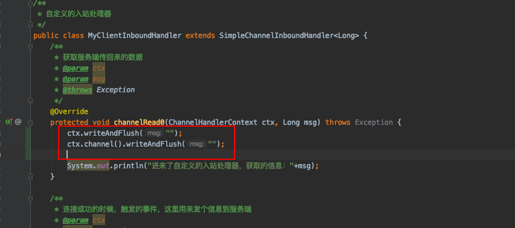
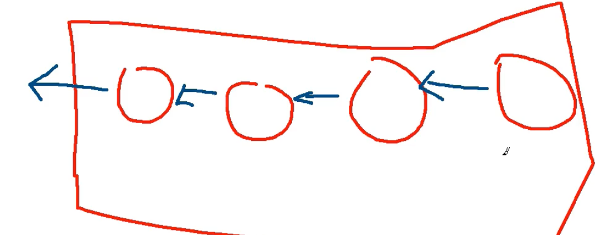
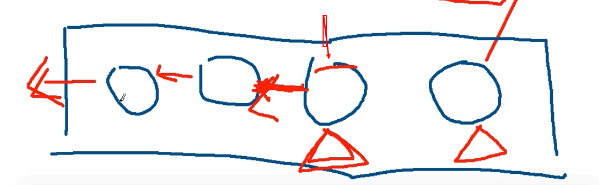
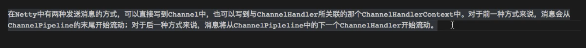
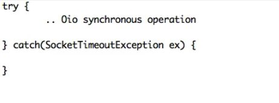
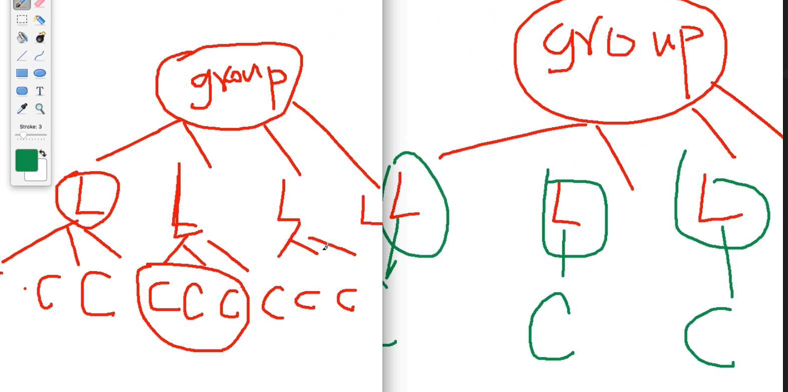
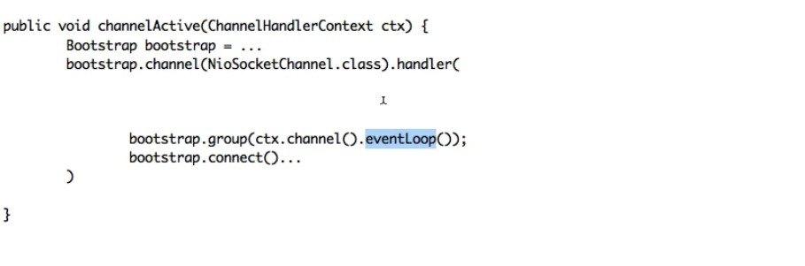
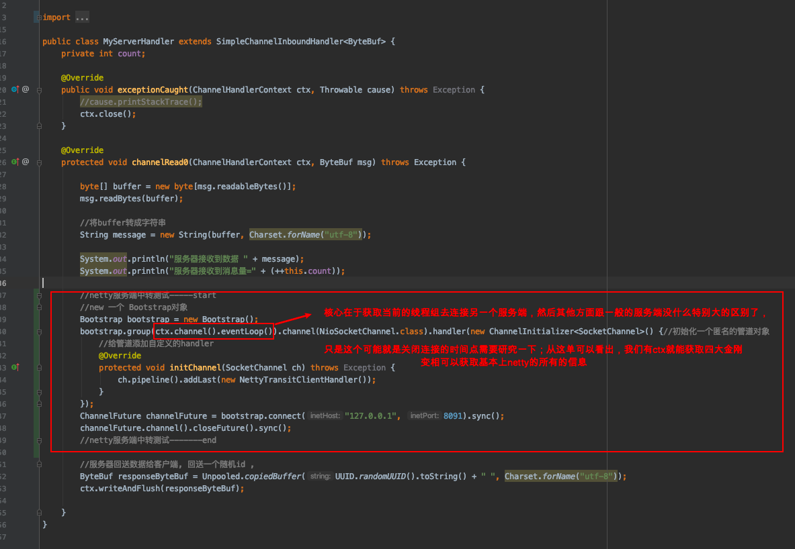

# netty开发过程中注意事项

**一些开发中需要注意的点，比较常用的，跟开发直接相关的一些点**

### 1.ChannelHandlerContext跟Channel中同名方法



> 在netty的ChannelHandlerContext跟Channel通道有一些名称一样的方法，在ChannelHandlerContext中的是实现的出栈ChannelOutboundInvoker接口的方法，里面很多跟Channel同名的方法，而且作用也是一样的，类似图中的就是输出数据到客户端。但是这两者有什么不一样的呢？
>
> 假设整个请求顺序是：A>B>C>D>E使用ChannelHandlerContext的方法就是，从当前Handler开始往下经过在pipeline链路的后面的方法一直到处理结束发送出去，就是这个`writeAndFlush()`方法是在C调用的话,这个方法就会经过D>E>发送，但是用用Channel的话就是会从头开始，从A>B>C>D>E经过pipeline的整个handler链路
>
> 
>
> 

至于实际开发的情况下要调用哪个方法呢？如果这个结果不需要从新经过每一个hanedler就用ctx，需要的话就用channel的，因为减少经过handler加快执行速度，根据实际需要



### 2.在netty中NIO跟OIO使用一套抽象API的原理

这个的话，没有说到很细的，整体而言，使用NIO的时候就是使用Reactor模式，使用OIO的话就是每一个线程对应一个客户端，请求业务进行处理的时候，如果超时了就抛异常捕捉到异常之后就继续执行该BIO的方法，一直循环到该业务处理完成





### 3.如何使用netty做一个中继转发服务器

*中继服务器就是，A>B>C，A发起请求经过B处理之后再去请求C，这个时候B应该怎么对请求进行处理？*

这个要结合我们所理解的，每一个请求跟服务器创建一个Channel，然后对应一个ChannelHandlerContext，对应一个Pipeline，最终在一个线程中执行（但是这个线程不只有这一个连接），在这个前提下，如果一个请求到了B经过处理后，要作为一个客户端对C发起请求的话，就是在B作为服务端的handler中对C发起连接请求，使用当前Channel做客客户端对C发起连接，连接成功后就跟普通的客户端一样，经过一系列的Pipeline的Handler处理后请求C



实战：

> 这里是在服务端获取到客户端的数据的时候对另一个服务端建立连接



```java
public class MyServerHandler extends SimpleChannelInboundHandler<ByteBuf> {
    private int count;

    @Override
    public void exceptionCaught(ChannelHandlerContext ctx, Throwable cause) throws Exception {
        //cause.printStackTrace();
        ctx.close();
    }

    @Override
    protected void channelRead0(ChannelHandlerContext ctx, ByteBuf msg) throws Exception {

        byte[] buffer = new byte[msg.readableBytes()];
        msg.readBytes(buffer);

        //将buffer转成字符串
        String message = new String(buffer, Charset.forName("utf-8"));

        System.out.println("服务器接收到数据 " + message);
        System.out.println("服务器接收到消息量=" + (++this.count));

        //netty服务端中转测试-----start
        //new 一个 Bootstrap对象
        Bootstrap bootstrap = new Bootstrap();
        bootstrap.group(ctx.channel().eventLoop()).channel(NioSocketChannel.class).handler(new ChannelInitializer<SocketChannel>() {//初始化一个匿名的管道对象
            //给管道添加自定义的handler
            @Override
            protected void initChannel(SocketChannel ch) throws Exception {
                ch.pipeline().addLast(new NettyTransitClientHandler());
            }
        });
        ChannelFuture channelFuture = bootstrap.connect("127.0.0.1", 8091).sync();
        channelFuture.channel().closeFuture().sync();
        //netty服务端中转测试-------end

        //服务器回送数据给客户端, 回送一个随机id ,
        ByteBuf responseByteBuf = Unpooled.copiedBuffer(UUID.randomUUID().toString() + " ", Charset.forName("utf-8"));
        ctx.writeAndFlush(responseByteBuf);

    }
}
```