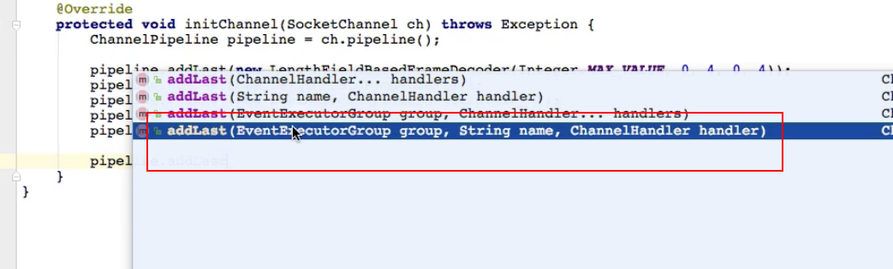

# 服务注册

**netty的服务端注册是在bind()方法中的，我们跟进去之后，进行init（）相关方法之后就进入正式的注册操作，我们来分析一下该注册方法做了什么事情：io.netty.bootstrap.AbstractBootstrap#initAndRegister 的`ChannelFuture regFuture = config().group().register(channel)`**

### 服务端服务注册流程

跟着bind()方法进入到源码，最后注册的方法调用是在io.netty.bootstrap.AbstractBootstrap#initAndRegister的这段代码`ChannelFuture regFuture = config().group().register(channel);` 然后分析，config()实际上获取的是`ServerBootstrapConfig`,随后的`.group()`获取的就是我们`io.netty.bootstrap.AbstractBootstrap`这个类的`EventLoopGroup`属性对象，该对象其实是我们前面创建的NioEventLoopGroup对象，也就是我们一开始将bossGroup注入的对象，调用的`register（）`方法就是继承的父类的注册方法，实际上调用的就是`io.netty.channel.MultithreadEventLoopGroup#register(io.netty.channel.Channel)`的方法；

```java
@Override
public ChannelFuture register(Channel channel) {
    return next().register(channel);
}
```

进入`next()`方法里面，发现这是一个一个`io.netty.util.concurrent.EventExecutorChooserFactory`工厂的一个内部接口的`EventExecutorChooser`的next()方法了，该接口的实现类`io.netty.util.concurrent.DefaultEventExecutorChooserFactory`就是一个**round-robin**算法，其实就是一个常规的轮询算法的实现，样本足够大的时候实际上的效果跟随机算法一样的


通过事件执行器工厂获取到对应的事件执行器之后，调用`EventLoopGroup`的接口方法，实际上调用的接口实现类的方法是一个单线程事件执行器组`io.netty.channel.SingleThreadEventLoop#register(io.netty.channel.Channel)`的方法，所以实际上就是将对应的当前的服务端的生成的`Channel`对象赋值给一个单线程的线程组，其实就是一个线程，因为最后的结果是每一个Channel对象就是对应一个EventLoop对象的，当然一个EventLoop可以有多个Channel，对于Channel来说只有一个对应的线程，就是一个对应的事件执行组而且需要是单线程的（尽管这个事件执行组是多线程的，但是在注册的时候会提取出一个单线程组来给注册）

在单线程事件执行组的register()方法中：

```java
@Override
public ChannelFuture register(Channel channel) {
    return register(new DefaultChannelPromise(channel, this));
}
```

会将Channel封装成一个ChannelPromise对象的一个属性，然后调用注册方法：

```java
@Override
public ChannelFuture register(final ChannelPromise promise) {
    ObjectUtil.checkNotNull(promise, "promise");
    promise.channel().unsafe().register(this, promise);
    return promise;
}
```

到了这一步就是到了一个比较敏感的方法了，我们从Promise对象中又获取之前穿进去的Channel对象（之前穿进去就是为了创建一个Promise对象而已）然后获取Channel中的Unsafe对象，调用register方法。需要注意的是，Unsafe对象都是不建议我们使用的，都是netty底层的方法，设计到一些比较底层的操作（跟internal包的一样都是不建议我们调用的），找到对应的实现方法：`io.netty.channel.AbstractChannel.AbstractUnsafe#register`


实际上注册都是调用的下面的register0方法，我们回头再讨论为什么需要做`eventLoop.inEventLoop()`判断。着重先看一下那个判断

```java
if (eventLoop.inEventLoop()) { //为什么治理需要判断一下？
    register0(promise);
} else {
    try {
        eventLoop.execute(new Runnable() { //将任务加进去对应的事件执行器中
            @Override
            public void run() {
                register0(promise);
            }
        });
    } catch (Throwable t) {
       //省略。。。
    }
}
```

对于这个`eventLoop.inEventLoop()`实际上后面的实现就是判断当前执行的线程是不是等于我们对应的事件执行器组（实际上是单线程）里面的那个线程，如果当前线程是我们对应的当前的`SingleThreadEventExecutor`的线程的话，就直接执行注册，将Channel注册到NioEventLoop对象的属性Selector中（所以就是一个NioEventLoop对应一个Selector）实际上的跟进去的注册底层就是NIO的注册。为什么这里要区分是不是当前线程等于注册线程呢？这里就涉及到这几个组件之间的关系，详情看下面的**几个重要组件之间的关系**


再跟进去注册方法：`io.netty.channel.nio.AbstractNioChannel#doRegister`，在调用完doRegister方法之后，就再通过pipeline进行各种回调

```java
@Override
protected void doRegister() throws Exception {
    boolean selected = false;
    for (;;) {
        try {
          //非常明显了吧，这里就是调用的Nio的注册方法
          //先是javaChannel获取到SelectableChannel对象，也就是所有Channel的父类
          //最终调用的是java的NIO的 `java.nio.channels.SelectableChannel#register(java.nio.channels.Selector, int, java.lang.Object)`方法，也就是我们前面的NIO注册的方法
          //就这样一路下来，将我们的Channel注册到了唯一对应的事件循环组的单个线程的Selector中，也就是当前时间循环组的一个Selector中，这样需要避免多线程并发的注册问，这里就是前面的做控制了，如果调用注册的线程不等于我们事件执行组的线程就开个任务给对应的线程执行，获取的是当前的线程的NioEventLoop获取Selector，跟进去NioEventLoop中可以发现其中包含了一个Selector属性，所以就是一个线程一个NioEventLoop对应一个Selctor对应多个Channel
            selectionKey = javaChannel().register(eventLoop().unwrappedSelector(), 0, this);
            return;
        } catch (CancelledKeyException e) {
            if (!selected) {
                eventLoop().selectNow();
                selected = true;
            } else {
                throw e;
            }
        }
    }
}
```


### 几个重要组件之间的关系

- 一个EventLoopGroup会包含一个或者多个EventLoop
- 一个EventLoop在其生命周期中只跟一个线程Thread绑定
- 所有的EventLoop的I/O操作都是在其关联的对应的线程中处理
- 一个Channel在它的生命周期中只会注册到一个线程中（也就是只会绑定一个EventLoop）
- 同理，一个EventLoop在运行的时候会被分配一个或者多个Channel
- 还有就是一个Channel对应一个Pipeline，所以一线Channel中的Pipeline的容器中的所有的Handler都是一个线程处理的，他们之间不会出现线程并发的问题，也是netty的设计精妙之处（正因为这样，尤其要注意的一点就是，我们不能在Handler中处理耗时操作，因为所有的Handler都是用一个线程的，一旦在一个Handler中进行耗时操作，就会影响了所有的Handler，同时更严重的是影响所有的注册到统一EventLoop的所有的线程Channel，也即是说影响所有注册到该线程的所有的客户端的响应，导致效率非常低，所以任何耗时的操作都不要直接在Handler中直接执行，要通过子线程或者一个业务线程池来进行Handler中的耗时操作，然后通过Future的Listenter返回通知结果。同理补充一下：我们在Handler中使用ChannelFuture的添加监听器的方式等待执行结果通知的监听器进行业务处理也一样，里面的监听器处理业务是将我们IO线程传进去的，如果获取结果之后监听器里面有耗时操作也要通过子线程或者业务线程池处理，不然也是影响IO处理效率，影响的不是当前的客户端，而是所有注册到该EventLoop对象的客户端线程）

明白上面几个组件的关系之后，就可以知道为什么上面的注册流程中，其中一个判断`if(eventLoop.inEventLoop()`了，这里是避免并发问题，多个不同的线程进来这里注册，如果将A线程的Channel注册到B中的情况就会出现，所以判断一下当前线程是不是等于我们想要注册的执行器中的线程，如果是直接执行注册，不是的话就添加到对应执行器的线程任务中，这样就可以保证注册的Channel在对应的EventLoop中

### 关于bind().sync()


我们都知道，netty说了所有里面的方法都是异步的，为什么这里绑定端口最后还是同步方法呢？

>正因为netty中的所有的操作基本上都是异步的，所以可能bind()方法的相关绑定操作还没有完成，就继续往下走了，可能会出现问题，这里同步就是为了等待bind()事件完成之后，才进行下面的关闭事件注册，也是同理关闭事件我们也可以进行相关的操作的，也是等到完成

### 强调几点

- 一定不要在Handler的回调方法中直接进行耗时操作，耗时操作使用子线程或者线程池来操作。当然耗时操作这个定义根据具体系统要求，有些事1s也有些事0.1s以上，根据系统业务需求。如果使用不当，netty这么一个高效的框架就变成低效的了。同时还要强调的是，在ChannelFuture中添加监听器的业务处理也是一样，操作完成的之后调用监听器的业务默认也是我们IO线程，所以跟Handler中一样不能进行耗时操作；

- Netty中，我们的Handler对象处理业务都是按顺序执行的，也就是我们在Pipeline添加的Handler执行都是有顺序的，不然有些前后依赖的Handler结果会出问题的，需要注意一下添加到Pipeline的Handler添加顺序

- netty中不会出现多线程的安全问题，因为同一个Channel对应的一个Pipeline都是最终调用的一个EventLoop也就是自始至终都是一个线程在处理一个客户端的任务，当然这个线程同时会处理多个客户端的Channel，但是对应Channel来说只是一个线程来处理，而且在添加绑定的时候netty就会处理了多线程的问题，就像注册的时候就会先判断这个情况

- 如果我们在Handler中需要处理耗时操作怎么办？

  > 方案一：我们创建一个线程池工具类，获取一个子线程将耗时任务提交给子线程进行处理
  >
  > 
  >
  > 方案二：我们在Pipeline的添加Handler方法中，就考虑到了这个问题，所以Netty也会提供了耗时任务的处理方法，就是我们addLast()的时候，入参多一个事件执行组，这个事件执行组自己创建，然后传进去
  >
  > 
  >
  > 综上所述，第一种方式相对简单些，但是整体都是差不多的。同理的我们在监听器的耗时操作也要通过子线程的方式进行

