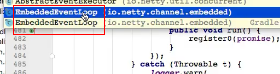

# 部分设计模式

**netty作为一个比较经典的框架，自然在源码中会使用不少的设计模式，还有就是我们都知道netty其实主要就是Reactor模式的应用，除此之外还有异步读写的思想**

### 异步读写思想

_在netty中基本上所有的方法都是异步执行设计的，最重要的实现就是重写java的concurrent包的Future接口，进行了改造。我们无法立刻知道方法调用的结果是成功还是失败，提供netty异步方法执行的结果对象ChannelFuture，通过netty提供的回调方法一个个监听器的方法（执行完成出发对应的监听器）_

我们使用java并发包的Future接口的对象获取执行结果，这个是有问题的，执行过程的是不需要阻塞的，但是获取执行结果是阻塞的，还会有一个问题，这个结果需要主动调用，这个调用时间也难以确定，所以netty进行了继承优化，所以在netty中的执行结果一般都是ChannelFuture对象，我们可以给ChannelFuture对象添加执行完成监听器，一旦执行完成就会触发该监听器方法，这里使用的是观察者模式进行的实现，然后分析了具体的该监听器的实现（**就是观察者模式的实现**），之前也在Future中说过，我们获取执行结果的几种情况的判断方法（具体看ChannelFuture的类或者实现类的的说明）

需要再强调一下的，异步结果的类`ChannelPromise`这个接口的父接口Promise也是concurrent包的子接口，不过这个更加特殊是支持可读写的接口，我们可以将执行结果往ChannelPromise中写入，其实这一点也是很重要的，我们在ChannelFuture中是怎么知道操作是否完成的呢，其实就是执行完毕的时候会网Promise中写入结果，然后就会触发对应的监听器然后将结果通知给ChannelFuture。这个也可以在ChannelPromise的setSuccess()方法中可以看到，方法描述说明提到的，只可以赋值一次，然后再赋值抛异常，而且赋值的时候会通知对应的回调方法（**而且顾名思义，Promise是执行结果的‘承诺’，这个承诺可能是执行之后会被赋值的，然后Future是‘未来’所以可以会承诺中获取到我们要的结果**）

同时还有一点就是，netty的ChannelFuture对象的添加监听器，这个监听器的对象的操作完成触发的方法operationCmplete()方法，里面的操作完成的业务操作也是由channel的线程（也就是对应的EventLoop线程）执行的，同理handler一样，其中不能写耗时的操作，不然会阻塞整个的线程。这也是非常重要的一个点，不然会影响整个效率（因为观察者模式的时候，我们调用对应的监听器是通过传递我们的当前的Future对象过去的，Future对象中有Channel对象，就可以调用我们的回调方法了）

对于具体比较细节的，ChannelFuture是怎么通过Promise获取到执行结果的通知？然后将自身传递到对应的Listener的呢？

> 参考这个地址[Channel如何从Promise中获取结果通知](https://blog.csdn.net/lirenzuo/article/details/85309854)

### 观察者模式

_在上面的ChannelFuture对象获取结果方式就是通过观察者模式来进行实现的，所以整个实现的细节是怎么样的呢？_

//todo

### 适配器模式

_对于ChannelInboundHandlerAdapter这个类是继承ChannelHandlerAdapter实现了ChannelInboundHandler，里面的方法直接就是调用ChannelHandlerContext中的方法，其中原理就是使用了**适配器模式**（一个接口的实现类必须实现所有的方法，但是我们并不需要，所以就产生了适配器的模式，只需要实现我们需要的方法，其他的就是走默认的或者说啥都不干）_

在我们netty的出入栈的接口中，我们都是需要实现ChannelInboundHandler接口的所有的方法的，但是netty这里使用适配器模式：接口ChannelInboundHandler定义很多回调方法，我们的ChannelInboundHandlerAdapter实现类就全部继承实现了，不过这个实现就是获取对应的Channel中的ChannelHandlerContext的调用下一个Handler的对应回调方法的方式，这样以来我们可以继承ChannelInboundHandlerAdapter这个实现类，然后不需要全部实现ChannelInboundHandler定义的接口方法，只是挑我们感兴趣的去重写即可，如果不重写的直接调用pipeline中的下一个Handler的对应的回调方法

> 说明一下ChannelHandlerContext中的下面图中的方法都是直接将上下文传递给下一个Handler对象，等于当前的Handler不操作，直接传递给下一个
>
> 

### 模版方法模式

_对于模版方法模式，在netty中SimpleChannelInboundHandler就是很好应用了，就是ChannelInboundHandlerAdapter的一个特殊实现，就是SimpleChannelInboundHandler它是对于其中几个由指定类型的方法进行了泛型对象的指定，如果是ChannelInboundHandlerAdapter的话，回调方法的channelRead0的方法就是一个Object对象，进行处理的话需要我们进行类型转换，如果使用了SimpleChannelInboundHandler的话，我们可以执行对应的类型，这样channelRead0()方法就直接是封装了这个类型的返回结果了(**这里很好应用了模版方法设计模式，我们直接使用ChannelInboundHandlerAdapter的时候channelRead方法的获取客户端传过来的信息就是一个Object对象，但是我们使用SimpleChannelInboundHandler的泛型指定之后，就会帮我们默认在SimpleChannelInboundHandler将Object转换成我们想要的结果，根据不同的传参类型返回不同的结果**)，简化我们每一次的类型转换的工作_

这个例子也将我们的channelRead方法变成了channelRead0给对应的子类使用了，真实有点秒，所以子类的对应这个读取方法就不需要再转型了，有点妙啊，同时还是可以构造方法入参指定释放释放默认的那个Object的入参对象的，减少内存占用，所以也要注意一点，我们不应该保存传进来的数据的引用，因为会被释放掉了，只会使用我我们转换后的对应的变量 

一般而言我们会选择SimpleChannelInboundHandler使用，方便开发但是实际上不挑，看个人选择（使用SimpleChannelInboundHandler的时候可能会存在一个问题就是，我们重写的实现方法的时候，获取接收的数据进行处理例如回写客户端的时候，因为回写这个步骤是异步的，所以有可能还没有写完回去就会被释放了，所以可能需要注意一下，实际使用的是那个），看下图

> 我们的构造参数的，创建后可以调用那个release()方法进行被释放，如果我们想传递到下一个handler使用就需要调用retain方法（其实就是会帮我们获取数据之后删除掉ByteBuf中占用的资源，ChannelInboundHandlerAdapter中不会帮我们释放，因为没有调用ReferenceCountUtil.release(msg);这个方法）通过这个重写方法就比较明显了，就是可以使用ReferenceCountUtil.*release*(msg);来 释放原来的构造方法的参数，不然可能会一直在缓存中，如果想保留就要retain()方法，因为会将其强制转换成我们要的对应的泛型的类型

### 一个netty的命名习惯

在netty中Embedded开头的对象，都是用来单元测试的，方便在没有网络的情况下进行测试，就是单机测试的对象

