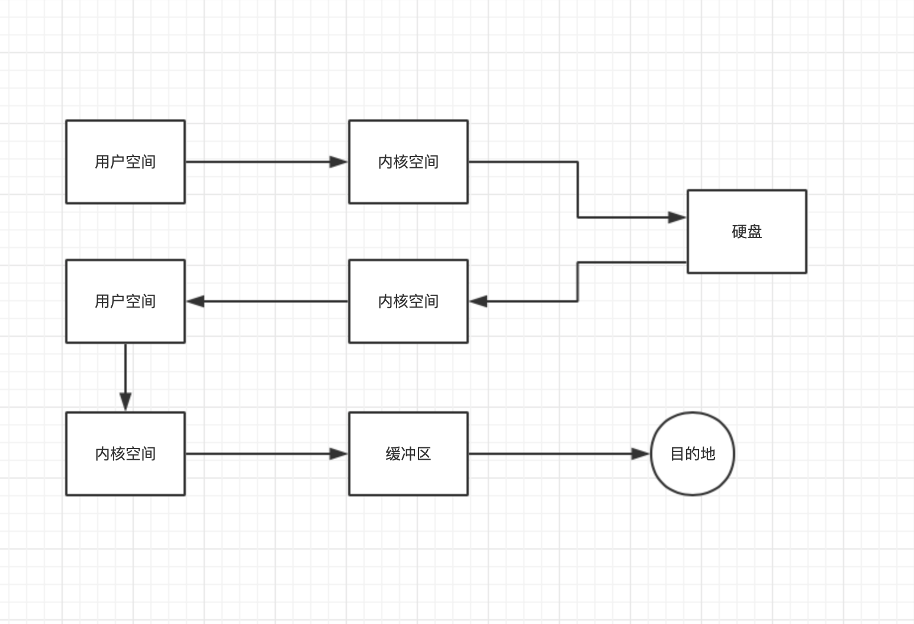
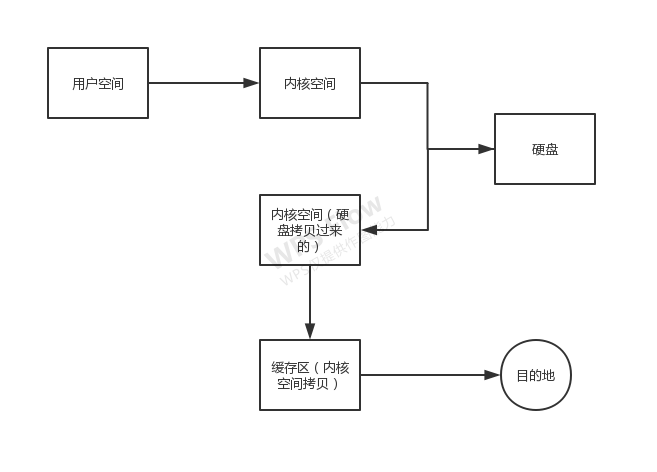
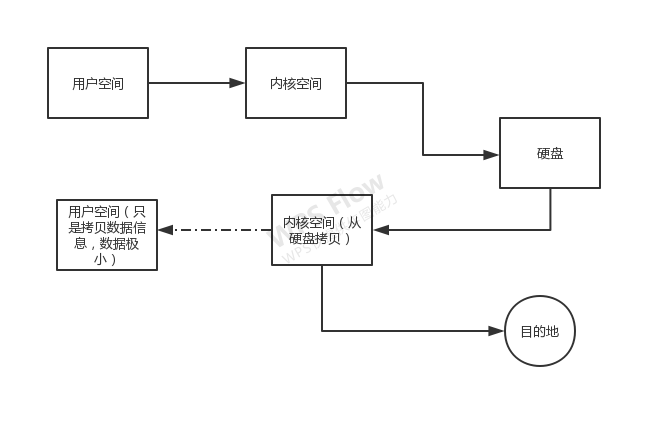

### 关于零拷贝，以及nio的零拷贝实现使用

## 传统方式
调用获取文件io的方法（用户空间发起请求）-> 内核的文件获取操作（kernel space 底层的操作）—> 访问硬盘获取数据 ->
内核空间缓存（数据从硬盘复制到内核缓存） -> 用户空间（内核空间将数据复制到 ） -> 内核空间（将数据复制到内核空间）-> 
用户空间（也就是复制到对应的要操作的socket的buffer缓存中，复制到另一个操作中用来保存还是用来发送给另一个服务端/或者保存到硬盘中，暂时不考虑这个）
ps：这里整个过程有4次拷贝，还有3次的用户空间（状态）切换，很多都是没有必要的复制，只是数据传输

## 传统流程优化（非完全零拷贝，使用mmap优化）
调用获取文件io的方法（用户空间发起请求）-> 内核的文件获取操作（kernel space 底层的操作）—> 访问硬盘获取数据 ->
内核空间缓存（数据从硬盘复制到内核缓存） -> 目标bytebuffer（将内核空间的数据复制到目标类似Socket的buffer中）->
目标系统（从缓冲中复制到传输系统）
ps：这里有2次拷贝，硬盘到内核，内核到缓存，缓存到目的系统，用户空间（状态）切换的话还是3次

## 真正的零拷贝
调用获取文件io的方法（用户空间发起请求）-> 内核的文件获取操作（kernel space 底层的操作）—> 访问硬盘获取数据 ->
内核空间缓存（数据从硬盘复制到内核缓存）-> 将内核空间的数据的描述存到用户空间（类似索引的信息，很小数据）->
将内核的空间的数据复制到目的地，如果是网络传输就直接放到传输
ps：这里严格来说只有一次拷贝是真实拷贝，一次类似索引到用户空间的只是少量信息，然后直接将内核空间的数据之际发送使用（这次不知道算不算是拷贝）

